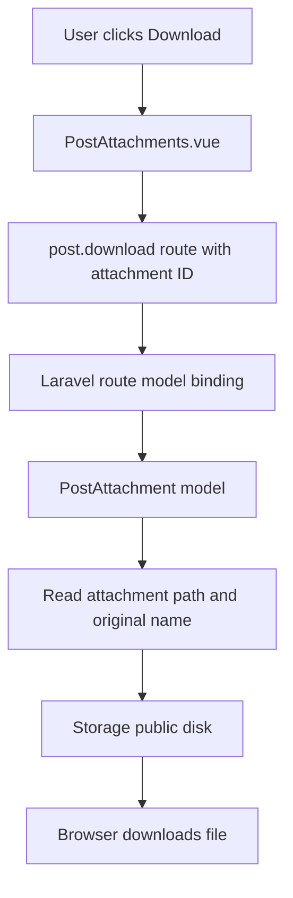

# Laravel Attachment Downloads and Route Model Binding

## Overview

Poet-Web allows authenticated users to download files attached to posts.

The download flow connects four pieces:

1. the attachment ID used in the frontend route;
2. Laravel route model binding;
3. the `PostAttachment` database record;
4. the physical file stored on Laravel's `public` disk.

---

## Route

The authenticated download route is:

```text
GET /posts/attachments/{attachment}/download
```

and is named:

```text
post.download
```

`PostAttachments.vue` generates the URL with the attachment ID:

```vue
:href="route('post.download', attachment.id)"
```

For example, attachment ID `12` produces a request for the route containing:

```text
{attachment} = 12
```

---

## Route Model Binding

The controller method receives:

```php
public function downloadAttachment(
    PostAttachment $attachment
)
```

Because the route parameter is called `{attachment}` and the controller argument is type-hinted as `PostAttachment`, Laravel resolves the numeric route value into the matching database model.

Conceptually:

```text
attachment.id = 12
        ↓
route('post.download', 12)
        ↓
GET /posts/attachments/12/download
        ↓
{attachment} = 12
        ↓
PostAttachment::findOrFail(12)
        ↓
PostAttachment $attachment
```

If the record does not exist, Laravel returns a 404 response before the controller can download anything.

---

## Database Metadata

`PostAttachment` stores metadata including:

```text
post_id
name
path
url
mime
size
created_by
```

For downloading, the two important values are:

```text
path
name
```

`path` identifies where the file is stored on disk.

`name` contains the original filename that should be offered to the user when the browser downloads it.

---

## Controller Download

`PostController::downloadAttachment()` returns the file using:

```php
return Storage::disk('public')->download(
    $attachment->path,
    $attachment->name
);
```

The complete flow is therefore:



---

## Preventing the Preview from Opening

The download button exists inside a clickable attachment preview card.

It uses:

```vue
@click.stop
```

This prevents the download click from propagating to the attachment card.

Without `.stop`, one click could both:

```text
download the file
+
open the attachment preview
```

With `.stop`, only the download action occurs.

---

## Authentication and Access

The download route is inside the authenticated route group, so the user must be logged in.

The current implementation does not add an additional attachment ownership check inside `downloadAttachment()`; access is controlled by authentication and possession of a valid attachment route.

If more restrictive attachment permissions are introduced later, authorization should be added before returning the file.

---

## Main Files

```text
routes/web.php
└── defines post.download

PostAttachments.vue
└── creates the download URL and stops click propagation

PostController.php
└── receives the bound PostAttachment and returns the file

PostAttachment.php
└── represents the attachment metadata stored in the database
```
