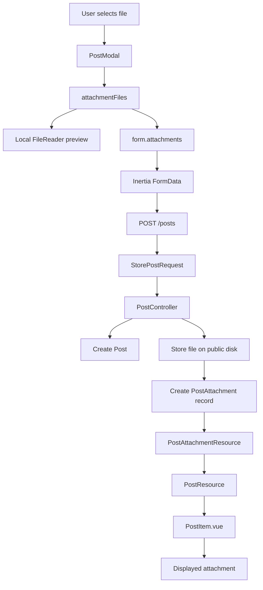
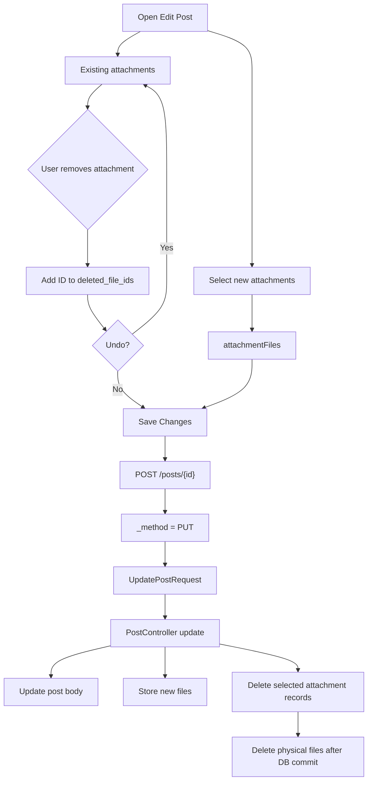

# Post attachment upload flow

## Storage

Uploaded files are stored under:

`storage/app/public/attachments/{post_id}`

The `post_attachments` database table stores metadata including the original file name, storage path, public URL, MIME type, size, uploader, and owning post.

## Editing attachments

