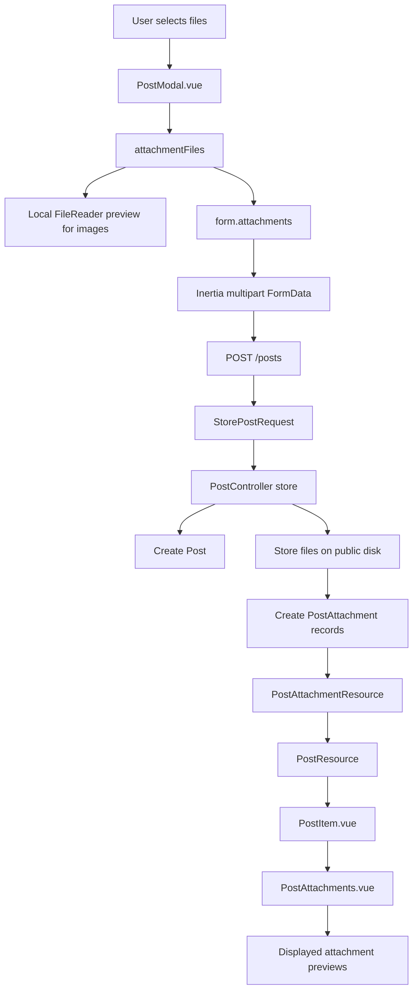

# Post Attachment Upload Flow

## Overview

Poet-Web supports uploading attachments when creating a post and adding/removing attachments when editing a post.

Uploaded files are validated by Laravel, stored on the public disk, represented by `PostAttachment` database records, serialized through resources, and finally displayed through the dedicated `PostAttachments.vue` component.

---

## Create Flow


```mermaid
flowchart TD
    A[User selects files]
    B[PostModal.vue]
    C[attachmentFiles]
    D[Local FileReader preview for images]
    E[form.attachments]
    F[Inertia multipart FormData]
    G[POST /posts]
    H[StorePostRequest]
    I[PostController store]
    J[Create Post]
    K[Store files on public disk]
    L[Create PostAttachment records]
    M[PostAttachmentResource]
    N[PostResource]
    O[PostItem.vue]
    P[PostAttachments.vue]
    Q[Displayed attachment previews]

    A --> B
    B --> C
    C --> D
    C --> E
    E --> F
    F --> G
    G --> H
    H --> I
    I --> J
    I --> K
    K --> L
    L --> M
    M --> N
    N --> O
    O --> P
    P --> Q
```

---

## Storage

Uploaded files are stored under:

```text
storage/app/public/attachments/{post_id}
```

The `post_attachments` table stores metadata including:

```text
post_id
name
path
url
mime
size
created_by
created_at
```

The `public` storage disk is used for both saving files and serving their public URLs.

---

## Local Preview Before Upload

`PostModal.vue` keeps newly selected files inside:

```text
attachmentFiles
```

Image files are read with `FileReader` so they can be previewed before the request is submitted.

Non-image files do not require a local binary preview; the modal displays their filename and attachment icon instead.

---

## Validation

Before the controller stores files, Laravel validates the attachment request.

Current application-level rules include:

```text
maximum new files per request: 10
maximum individual file size: 25 MB
maximum combined upload size: 90 MB
allowed extension list: StorePostRequest::$extensions
```

Create and update requests share the same allowed extension list.

See:

- [Attachment validation flow](attachment-validation-flow.md)
- [Attachment size validation](attachment-size-validation.md)

---

## Editing Attachments

When editing a post, the modal combines:

```text
existing attachments
+
newly selected attachmentFiles
```

Existing attachments can be marked for deletion without immediately removing them from storage.

Their IDs are stored in:

```text
deleted_file_ids
```

The user can undo that pending deletion before saving.

### Update Flow

```mermaid
flowchart TD
    A[Open Edit Post]
    B[Load existing attachments]
    C[Select new files]
    D{Mark existing attachment for deletion?}
    E[Add ID to deleted_file_ids]
    F{Undo deletion?}
    G[Remove ID from deleted_file_ids]
    H[Save changes]
    I[POST /posts/{post}]
    J[_method = PUT]
    K[UpdatePostRequest]
    L[PostController update]
    M[Update post body]
    N[Store new files]
    O[Delete selected attachment records]
    P[Commit DB transaction]
    Q[Delete selected physical files]

    A --> B
    A --> C
    B --> D
    D -- Yes --> E
    E --> F
    F -- Yes --> G
    G --> B
    F -- No --> H
    C --> H
    H --> I
    I --> J
    J --> K
    K --> L
    L --> M
    L --> N
    L --> O
    O --> P
    P --> Q
```

The browser submits the update with `form.post()` and `_method=PUT` because the request includes multipart file data.

Laravel then routes it to the existing PUT update endpoint.

---

## Deleting Physical Files

The update operation removes selected `PostAttachment` database records inside the transaction.

After the database transaction commits successfully, the corresponding physical files are removed from the public disk.

This avoids deleting the stored file before the database update is known to have succeeded.

---

## Feed Display

`PostItem.vue` no longer contains the attachment-rendering markup directly.

It passes the post's attachment array into:

```text
PostAttachments.vue
```

The component displays at most four attachment previews in the feed and shows `+X more` on the fourth tile when more attachments exist.

The complete attachment array remains available to the preview modal.

See: [Post attachments display flow](post-attachments-flow.md)

---

## Preview and Download

Clicking a visible attachment opens the existing full-screen attachment viewer through the event chain:

```text
PostAttachments.vue
    ↓
PostItem.vue
    ↓
PostList.vue
    ↓
AttachmentPreviewModal.vue
```

Download links use the `post.download` route and Laravel route model binding.

See:

- [Attachment preview flow](attachment-preview-flow.md)
- [Attachment downloads and route model binding](attachment-download-route-model-binding.md)
