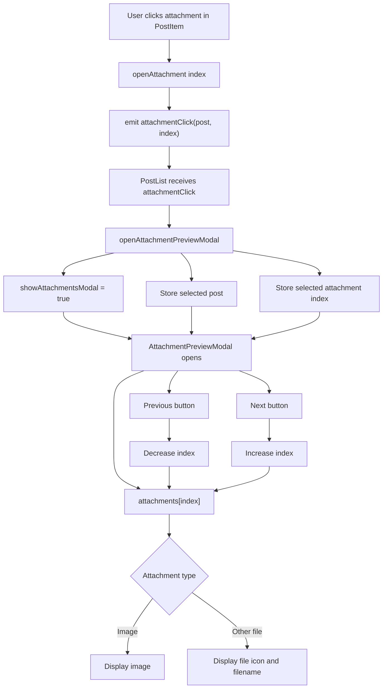

# Attachment Preview Flow

The attachment preview feature allows a user to click an attachment displayed on a post and open it in a full-screen modal.

The preview modal receives the post's complete attachment list and the index of the attachment that was clicked. This allows the user to move between attachments without closing the modal.

## Component flow



## Event flow

`PostItem.vue` does not open the preview modal itself.

Instead, it tells its parent that an attachment was clicked:

```js
function openAttachment(index) {
    emit(
        'attachmentClick',
        props.post,
        index
    );
}
```

For example, clicking the second attachment sends:

```text
post = selected post
index = 1
```

JavaScript arrays start from zero:

```text
0 = first attachment
1 = second attachment
2 = third attachment
```

`PostList.vue` listens for the event:

```vue
<PostItem
    :post="post"
    @attachmentClick="openAttachmentPreviewModal"
/>
```

The parent then stores the selected post and attachment index:

```js
function openAttachmentPreviewModal(post, index) {
    previewAttachmentsPost.value = {
        post,
        index
    };

    showAttachmentsModal.value = true;
}
```

## Preview modal data

`AttachmentPreviewModal.vue` receives:

```text
attachments
index
modelValue
```

`attachments` contains all attachments belonging to the selected post.

`index` identifies which attachment should currently be displayed.

`modelValue` controls whether the modal is open.

The current attachment is calculated from the array:

```js
const attachment = computed(() => {
    return props.attachments[currentIndex.value] ?? null;
});
```

For example:

```text
attachments = [
    image1,
    image2,
    image3
]

currentIndex = 1
```

results in:

```text
attachment = image2
```

## Two-way index binding

`PostList.vue` connects the preview index using:

```vue
v-model:index="previewAttachmentsPost.index"
```

Inside `AttachmentPreviewModal.vue`, the index is wrapped in a computed property:

```js
const currentIndex = computed({
    get: () => props.index,

    set: (value) => {
        emit('update:index', value);
    }
});
```

This provides two-way communication:

```text
PostList index
      ↕
AttachmentPreviewModal currentIndex
```

When the preview modal changes:

```js
currentIndex.value++;
```

it emits:

```text
update:index
```

and the value in `PostList.vue` is updated as well.

The same system is used to control whether the modal is open:

```vue
v-model="showAttachmentsModal"
```

which connects to the modal's `modelValue`.

## Previous and next navigation

The previous button decreases the index:

```js
function prev() {
    if (currentIndex.value <= 0) {
        return;
    }

    currentIndex.value--;
}
```

The next button increases it:

```js
function next() {
    if (
        currentIndex.value >=
        props.attachments.length - 1
    ) {
        return;
    }

    currentIndex.value++;
}
```

The boundary checks prevent the index from going outside the attachment array.

```text
First attachment
← disabled

Middle attachment
← available
→ available

Last attachment
→ disabled
```

## Attachment rendering

Images are detected with the shared `isImage()` helper.

Image attachments display the stored attachment URL:

```vue

```

Other attachment types currently display a file icon and their original filename.

## Download interaction

The download link exists inside the clickable attachment card.

The download link uses:

```vue
@click.stop
```

to prevent the click event from reaching the parent attachment card.

Without `.stop`, clicking Download could perform both actions:

```text
Download file
+
Open preview modal
```

With `.stop`:

```text
Download button clicked
        ↓
download starts
        ↓
click propagation stops
        ↓
preview does not open
```

## Overall architecture

```text
PostItem.vue
    │
    │ attachmentClick(post, index)
    ▼
PostList.vue
    │
    ├── selected post
    ├── selected index
    └── modal visibility
            │
            ▼
AttachmentPreviewModal.vue
    │
    ├── current attachment
    ├── previous
    ├── next
    └── close
```

This keeps responsibilities separated:

* `PostItem.vue` displays a post and reports attachment clicks.
* `PostList.vue` coordinates which post and attachment are being previewed.
* `AttachmentPreviewModal.vue` handles the full-screen preview and navigation.
