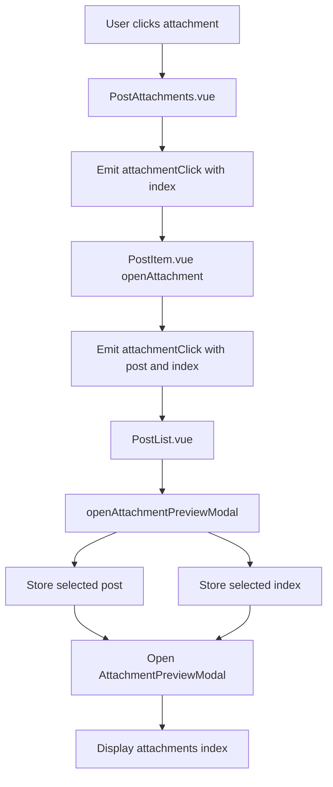

# Attachment Preview Flow

## Overview

Poet-Web allows users to click an attachment preview on a post and open the post's full attachment collection in a full-screen modal.

Only the first four attachments are shown directly in the post feed, but the preview modal receives the complete attachment array. This means users can continue navigating to attachments that are not shown in the compact feed preview.

---

## Component Flow

Attachment rendering is handled by `PostAttachments.vue` rather than directly inside `PostItem.vue`.

The current event flow is:


```mermaid
flowchart TD
    A[User clicks attachment]
    B[PostAttachments.vue]
    C[Emit attachmentClick with index]
    D[PostItem.vue openAttachment]
    E[Emit attachmentClick with post and index]
    F[PostList.vue]
    G[openAttachmentPreviewModal]
    H[Store selected post]
    I[Store selected index]
    J[Open AttachmentPreviewModal]
    K[Display attachments index]

    A --> B
    B --> C
    C --> D
    D --> E
    E --> F
    F --> G
    G --> H
    G --> I
    H --> J
    I --> J
    J --> K
```

---

## Step 1: PostAttachments Emits the Index

`PostItem.vue` passes the complete attachment array into:

```vue
<PostAttachments
    :attachments="post.attachments"
    @attachmentClick="openAttachment"
/>
```

`PostAttachments.vue` renders up to four attachment cards:

```js
attachments.slice(0, 4)
```

When one is clicked, it emits the visible attachment index:

```text
attachmentClick(index)
```

For example:

```text
0 = first attachment
1 = second attachment
2 = third attachment
3 = fourth attachment
```

---

## Step 2: PostItem Adds the Post Context

`PostItem.vue` receives the index and forwards both the post and index:

```js
function openAttachment(index) {
    emit(
        'attachmentClick',
        props.post,
        index
    );
}
```

`PostItem.vue` therefore acts as the bridge between the attachment component and the post list.

---

## Step 3: PostList Opens the Preview

`PostList.vue` listens for the event:

```vue
<PostItem
    :post="post"
    @attachmentClick="openAttachmentPreviewModal"
/>
```

The selected post and attachment index are stored in:

```js
const previewAttachmentsPost = ref({
    post: null,
    index: 0
});
```

When an attachment is clicked:

```js
function openAttachmentPreviewModal(
    post,
    index
) {
    previewAttachmentsPost.value = {
        post,
        index
    };

    showAttachmentsModal.value = true;
}
```

---

## Preview Modal Data

`AttachmentPreviewModal.vue` receives:

```text
attachments
index
modelValue
```

`PostList.vue` passes the complete attachment collection:

```vue
<AttachmentPreviewModal
    :attachments="
        previewAttachmentsPost.post?.attachments ?? []
    "
    v-model:index="previewAttachmentsPost.index"
    v-model="showAttachmentsModal"
/>
```

This is important because `PostAttachments.vue` displays only the first four attachments, while the modal can navigate through all attachments belonging to the post.

---

## Current Attachment

The modal calculates the selected attachment from the supplied array:

```js
const attachment = computed(() => {
    return props.attachments[currentIndex.value] ?? null;
});
```

Example:

```text
attachments = [image1, image2, file3]
currentIndex = 1
```

results in:

```text
attachment = image2
```

---

## Two-Way Index Binding

The preview index is connected with:

```vue
v-model:index="previewAttachmentsPost.index"
```

Inside `AttachmentPreviewModal.vue`:

```js
const currentIndex = computed({
    get: () => props.index,

    set: (value) => {
        emit('update:index', value);
    }
});
```

This creates two-way communication:

```text
PostList.vue index
        ↕
AttachmentPreviewModal.vue currentIndex
```

When the modal moves to another attachment, the parent index changes too.

---

## Previous and Next Navigation

The modal prevents the index from moving outside the attachment array.

Previous:

```js
function prev() {
    if (currentIndex.value <= 0) {
        return;
    }

    currentIndex.value--;
}
```

Next:

```js
function next() {
    if (
        currentIndex.value >=
        props.attachments.length - 1
    ) {
        return;
    }

    currentIndex.value++;
}
```

The UI only renders navigation controls when movement in that direction is possible.

---

## Attachment Rendering

Images are identified using the shared `isImage()` helper.

Image attachments display their stored URL:

```vue

```

Non-image attachments display a file icon and original filename.

---

## Download Interaction

Visible attachment cards include a download button.

The download action uses:

```vue
@click.stop
```

This stops the click from reaching the attachment card itself.

Without `.stop`:

```text
Download
+
Open preview
```

could happen from one click.

With `.stop`, only the download action occurs.

---

## Overall Architecture

```text
PostAttachments.vue
    │
    │ attachmentClick(index)
    ▼
PostItem.vue
    │
    │ attachmentClick(post, index)
    ▼
PostList.vue
    │
    ├── selected post
    ├── selected index
    └── modal visibility
            │
            ▼
AttachmentPreviewModal.vue
    │
    ├── current attachment
    ├── previous
    ├── next
    └── close
```

Responsibilities are separated so that:

- `PostAttachments.vue` renders the compact attachment grid and reports which visible attachment was clicked;
- `PostItem.vue` supplies the surrounding post context;
- `PostList.vue` coordinates preview state;
- `AttachmentPreviewModal.vue` displays and navigates the complete attachment collection.
