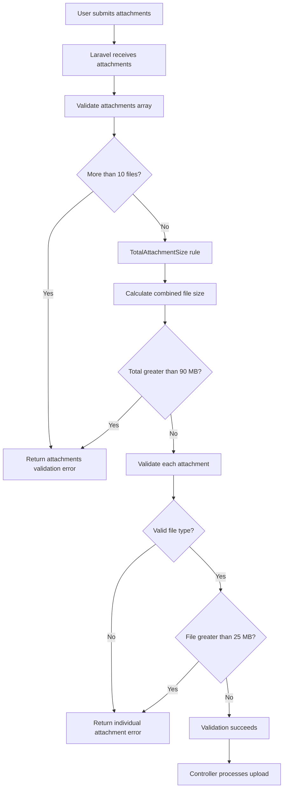

# Attachment Size Validation

Poet-Web validates attachment uploads at both the individual-file level and the complete-request level.

The validation is shared between post creation and post editing so both operations follow the same upload restrictions.

## Validation limits

Current application limits:

```text
Maximum attachments:       10
Maximum individual size:   25 MB
Maximum combined size:     90 MB
```

These are application-level Laravel restrictions.

The development PHP environment currently allows larger individual uploads and a `100M` POST request, so the 90 MB application limit stays below the PHP request limit.

## Validation structure



## Shared validation rule

Combined attachment size validation is implemented using:

```text
app/Rules/TotalAttachmentSize.php
```

Instead of copying the same validation closure into multiple Form Requests, the rule contains the shared logic once.

Conceptually:

```php
new TotalAttachmentSize(90)
```

means:

> The files contained in this field may have a maximum combined size of 90 MB.

The rule receives the attachment array, calculates the size of all uploaded files, converts the configured megabyte limit to bytes, and fails validation when the calculated size exceeds the limit.

## Why a custom rule is used

Both post creation and post editing accept new attachments.

Without a shared rule, the same calculation would need to exist separately inside:

```text
StorePostRequest
UpdatePostRequest
```

That would create duplicated code.

The shared design is:

```text
                    TotalAttachmentSize
                           │
                  combined size <= 90 MB
                           │
              ┌────────────┴────────────┐
              │                         │
     StorePostRequest          UpdatePostRequest
       create post                edit post
```

If the combined-size calculation changes later, only the validation rule needs to be updated.

## StorePostRequest

Post creation applies validation to the complete attachment array:

```php
'attachments' => [
    'nullable',
    'array',
    'max:10',
    new TotalAttachmentSize(90),
],
```

The rules have separate responsibilities:

```text
nullable
└── attachments are optional

array
└── attachments must be submitted as an array

max:10
└── maximum of 10 attachments

TotalAttachmentSize(90)
└── maximum combined upload size of 90 MB
```

Each individual attachment is then validated separately:

```php
'attachments.*' => [
    'file',

    File::types(self::$extensions)
        ->max('25mb')
],
```

This checks that each item is a real uploaded file, uses an allowed file type, and does not exceed 25 MB.

## UpdatePostRequest

`UpdatePostRequest` uses the same combined-size rule:

```php
'attachments' => [
    'nullable',
    'array',
    'max:10',
    new TotalAttachmentSize(90),
],
```

This keeps create and edit behaviour consistent.

For an update request, the combined-size rule applies to the **new files uploaded in that request**.

Existing attachments already stored for the post are not uploaded again and therefore are not included in this calculation.

## Individual and combined limits

Individual and global validation solve different problems.

For example:

```text
File A = 24 MB
File B = 24 MB
File C = 24 MB
```

Every individual file satisfies:

```text
24 MB <= 25 MB
```

Their combined size is:

```text
24 + 24 + 24 = 72 MB
```

so the request also satisfies:

```text
72 MB <= 90 MB
```

However:

```text
File A = 24 MB
File B = 24 MB
File C = 24 MB
File D = 24 MB
```

produces:

```text
96 MB > 90 MB
```

Although all four files are individually valid, the complete request is rejected by `TotalAttachmentSize`.

## Validation errors

Individual-file errors are returned using keys such as:

```text
attachments.0
attachments.1
attachments.2
```

These can be displayed beside the corresponding file in `PostModal.vue`.

The combined-size error belongs to the entire attachment array:

```text
attachments
```

The modal already displays this through Inertia's form errors:

```vue
<div
    v-if="form.errors.attachments"
    class="mt-2 text-sm text-red-500"
>
    {{ form.errors.attachments }}
</div>
```

Therefore, no separate frontend error state is required for the combined-size rule.

## PHP and Laravel limits

Upload limits exist at two different levels:

```text
Browser
   ↓
PHP / server limits
   ↓
Laravel validation
   ↓
PostController
```

PHP controls whether the request is accepted by the server at all.

Laravel controls what Poet-Web considers valid.

The development environment currently uses approximately:

```text
upload_max_filesize = 100M
post_max_size = 100M
max_file_uploads = 20
```

Poet-Web intentionally uses a lower combined Laravel limit:

```text
90 MB
```

This gives Laravel room to receive the request and return a readable application validation error before reaching PHP's 100 MB request ceiling.

## Responsibility separation

```text
TotalAttachmentSize.php
└── validates combined size of uploaded files

StorePostRequest.php
├── maximum attachment count
├── shared total-size validation
├── individual file size
└── file type validation

UpdatePostRequest.php
├── authorization
├── maximum attachment count
├── shared total-size validation
├── individual file size
└── file type validation

PostModal.vue
└── displays returned validation errors
```

This keeps attachment validation reusable, consistent, and easier to maintain.
