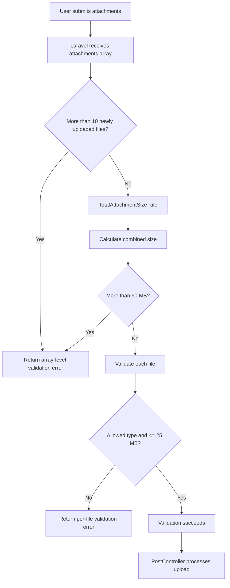

# Attachment Size Validation

## Overview

Poet-Web validates attachment uploads at both the individual-file level and the request level.

The same rules are used for post creation and post editing.

---

## Application Limits

The current Laravel validation rules are:

```text
Maximum newly uploaded files per request: 10
Maximum size of one uploaded file:        25 MB
Maximum combined size per request:        90 MB
```

These limits apply to the files contained in the current request.

During post editing, attachments that are already stored in the database are not uploaded again and therefore are not included in the request-level count or combined-size calculation.

This means a post can theoretically end up containing more than ten stored attachments across multiple edit operations, because `max:10` limits only the new `attachments` array submitted in one request.

---

## Validation Flow


```mermaid
flowchart TD
    A[User submits attachments]
    B[Laravel receives attachments array]
    C{More than 10 newly uploaded files?}
    D[Return array-level validation error]
    E[TotalAttachmentSize rule]
    F[Calculate combined size]
    G{More than 90 MB?}
    H[Validate each file]
    I{Allowed type and <= 25 MB?}
    J[Return per-file validation error]
    K[Validation succeeds]
    L[PostController processes upload]

    A --> B
    B --> C
    C -- Yes --> D
    C -- No --> E
    E --> F
    F --> G
    G -- Yes --> D
    G -- No --> H
    H --> I
    I -- No --> J
    I -- Yes --> K
    K --> L
```

---

## Shared Combined-Size Rule

Combined attachment size validation is implemented in:

```text
app/Rules/TotalAttachmentSize.php
```

Both form requests use:

```php
new TotalAttachmentSize(90)
```

The rule:

1. receives the uploaded attachment array;
2. sums the byte size of all `UploadedFile` instances;
3. converts the configured megabyte limit to bytes;
4. fails validation when the total exceeds the limit.

This avoids duplicating the calculation between create and update validation.

---

## StorePostRequest

Post creation validates:

```php
'attachments' => [
    'nullable',
    'array',
    'max:10',
    new TotalAttachmentSize(90),
],
```

The rules mean:

```text
nullable
└── attachments are optional

array
└── submitted attachments must form an array

max:10
└── no more than 10 new files in this request

TotalAttachmentSize(90)
└── those uploaded files may total at most 90 MB
```

Each item is also validated separately:

```php
'attachments.*' => [
    'file',

    File::types(self::$extensions)
        ->max('25mb')
],
```

This ensures every uploaded item is a file, uses an allowed type, and is at most 25 MB.

---

## UpdatePostRequest

Post editing uses the same attachment rules:

```php
'attachments' => [
    'nullable',
    'array',
    'max:10',
    new TotalAttachmentSize(90),
],
```

and:

```php
'attachments.*' => [
    'file',

    File::types(
        StorePostRequest::$extensions
    )->max('25mb')
],
```

Only newly selected files are present in `attachments` during an update.

Existing attachment records remain separate and are controlled through `deleted_file_ids` when the user chooses to remove them.

---

## Example

Three new files:

```text
24 MB + 24 MB + 24 MB = 72 MB
```

Each file is below 25 MB and the total is below 90 MB, so the size checks pass.

Four new files:

```text
24 MB + 24 MB + 24 MB + 24 MB = 96 MB
```

Each file is individually valid, but the request fails because:

```text
96 MB > 90 MB
```

---

## Validation Errors

Per-file errors use keys such as:

```text
attachments.0
attachments.1
attachments.2
```

`PostModal.vue` maps these errors back to the corresponding newly selected file so it can show a red border and message beside that file.

Array-level errors use:

```text
attachments
```

Examples include:

- too many newly uploaded files in one request;
- combined uploaded size greater than 90 MB.

The modal displays these through:

```vue
<div
    v-if="form.errors.attachments"
    class="mt-2 text-sm text-red-500"
>
    {{ form.errors.attachments }}
</div>
```

---

## PHP and Laravel Limits

The application-level rules described above are committed in the Poet-Web source code.

PHP also has server-level upload settings such as:

```text
upload_max_filesize
post_max_size
max_file_uploads
```

Those values belong to the runtime environment rather than this repository's validation code and may differ between development and deployment environments.

PHP must allow a request to reach Laravel before Laravel can return its own validation errors.

---

## Responsibility Separation

```text
TotalAttachmentSize.php
└── validates combined size of newly uploaded files

StorePostRequest.php
├── upload count per create request
├── combined size
├── individual size
└── file type

UpdatePostRequest.php
├── post ownership authorization
├── upload count per edit request
├── combined size
├── individual size
└── file type

PostModal.vue
└── displays array-level and per-file validation errors
```

This keeps the backend validation reusable while making the frontend errors understandable to the user.
