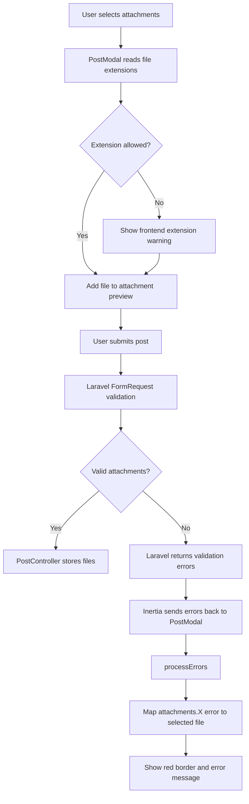

# Attachment Validation Flow

The post attachment validation system checks uploaded files on both the frontend and backend.

Frontend validation gives users immediate feedback, while Laravel performs the authoritative validation before any file is stored.

## Validation flow



## Shared allowed extensions

Allowed attachment extensions are defined in one place inside `StorePostRequest`:

```php
public static array $extensions = [
    'jpg',
    'jpeg',
    'png',
    'gif',
    'webp',

    'mp3',
    'wav',
    'mp4',

    'doc',
    'docx',
    'pdf',
    'csv',
    'xls',
    'xlsx',
    'zip',
];
```

The create request uses:

```php
File::types(self::$extensions)
    ->max('25mb')
```

The update request reuses the same list:

```php
File::types(
    StorePostRequest::$extensions
)->max('25mb')
```

This avoids maintaining two separate attachment-type lists.

```text
StorePostRequest::$extensions
            │
            ├── Create post validation
            │
            └── Update post validation
```

## Inertia shared property

`HandleInertiaRequests` exposes the backend extension list to Vue:

```php
'attachmentExtensions' =>
    StorePostRequest::$extensions,
```

`PostModal.vue` receives it using:

```js
const attachmentExtensions =
    usePage().props.attachmentExtensions ?? [];
```

This allows the frontend and backend to use the same allowed extension list.

```text
StorePostRequest
      ↓
HandleInertiaRequests
      ↓
Inertia shared props
      ↓
PostModal.vue
```

## Frontend extension check

When a file is selected, `PostModal.vue` extracts its extension:

```js
const parts = file.name.split('.');

const extension =
    parts.length > 1
        ? parts.pop().toLowerCase()
        : '';
```

For example:

```text
poem.pdf
```

becomes:

```text
pdf
```

The extension is checked using:

```js
attachmentExtensions.includes(extension)
```

If it is not allowed:

```js
showExtensionsText.value = true;
```

The user immediately sees the supported file extensions.

This frontend check is only for user feedback. Laravel validation is still required because frontend checks can be bypassed.

## Backend validation

Laravel validates:

```text
maximum number of attachments
file validity
allowed file type
maximum file size
```

The attachment array is limited to 10 files.

Each individual attachment is limited to 25 MB.

If validation fails, Laravel sends the errors back through Inertia instead of calling the controller.

For example:

```text
attachments.0
attachments.1
attachments.2
```

represent validation errors for individual uploaded files.

## Processing validation errors

`PostModal.vue` processes the returned errors using:

```js
function processErrors(errors) {
    attachmentErrors.value = [];

    for (const key in errors) {

        if (!key.startsWith('attachments.')) {
            continue;
        }

        const parts = key.split('.');
        const index = Number(parts[1]);

        if (!Number.isNaN(index)) {
            attachmentErrors.value[index] =
                errors[key];
        }
    }
}
```

For example:

```js
{
    'attachments.0':
        'This file type is not allowed.',

    'attachments.2':
        'Each attachment must be 25 MB or smaller.'
}
```

is mapped approximately to:

```js
[
    'This file type is not allowed.',
    undefined,
    'Each attachment must be 25 MB or smaller.'
]
```

## Existing and newly uploaded attachments

When editing a post, the modal displays both:

```text
existing database attachments
+
newly selected attachments
```

However, Laravel validation indexes only the newly uploaded files.

Because of this, the visual attachment index cannot be used directly.

The helper:

```js
function getAttachmentError(myFile) {

    if (!myFile.file) {
        return null;
    }

    const index =
        attachmentFiles.value.indexOf(myFile);

    return attachmentErrors.value[index] ?? null;
}
```

checks whether an attachment is newly selected.

Existing attachments do not contain:

```text
myFile.file
```

so they do not receive upload validation errors.

New attachments are searched inside `attachmentFiles`, which matches Laravel's attachment indexing.

## Per-file error display

Each displayed attachment has an outer wrapper.

Inside it is the visual attachment card:

```text
Attachment wrapper
│
├── Attachment card
│   ├── image or file icon
│   ├── filename
│   ├── delete button
│   └── deletion status
│
└── validation error
```

If an attachment has an error, the card receives a red border:

```vue
:class="
    getAttachmentError(myFile)
        ? 'border-red-500'
        : 'border-transparent'
"
```

The validation message is shown underneath:

```vue
<small
    v-if="getAttachmentError(myFile)"
    class="text-red-500"
>
    {{ getAttachmentError(myFile) }}
</small>
```

## Array-level errors

Some errors apply to the entire attachment array instead of one file.

For example, uploading more than 10 attachments produces an error on:

```text
attachments
```

rather than:

```text
attachments.0
```

This is displayed using:

```vue
<div
    v-if="form.errors.attachments"
    class="mt-2 text-sm text-red-500"
>
    {{ form.errors.attachments }}
</div>
```

## Error reset

Attachment errors and warnings are cleared when the modal is reopened or closed:

```js
attachmentFiles.value = [];
attachmentErrors.value = [];
showExtensionsText.value = false;
```

They are also cleared before another submission.

This prevents errors from a previous create or edit attempt from appearing on another post.

## Responsibility separation

```text
StorePostRequest
├── allowed extension list
├── create validation
└── validation messages

UpdatePostRequest
├── update authorization
├── attachment validation
└── validation messages

HandleInertiaRequests
└── shares allowed extensions with Vue

PostModal.vue
├── frontend extension warning
├── displays Laravel errors
├── maps errors to new attachments
└── highlights invalid files

PostController
└── only receives attachments after validation succeeds
```

This keeps Laravel responsible for trusted validation while Vue provides immediate and readable feedback to the user.
