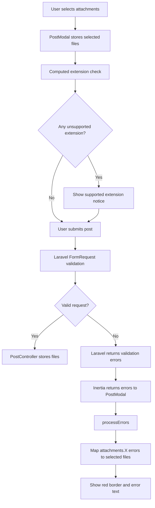

# Attachment Validation Flow

## Overview

Poet-Web validates uploaded post attachments on both the frontend and backend.

Vue provides immediate feedback about unsupported filename extensions, while Laravel performs the authoritative validation before the controller stores any file.

---

## Validation Flow


```mermaid
flowchart TD
    A[User selects attachments]
    B[PostModal stores selected files]
    C[Computed extension check]
    D{Any unsupported extension?}
    E[Show supported extension notice]
    F[User submits post]
    G[Laravel FormRequest validation]
    H{Valid request?}
    I[PostController stores files]
    J[Laravel returns validation errors]
    K[Inertia returns errors to PostModal]
    L[processErrors]
    M[Map attachments.X errors to selected files]
    N[Show red border and error text]

    A --> B
    B --> C
    C --> D
    D -- Yes --> E
    D -- No --> F
    E --> F
    F --> G
    G --> H
    H -- Yes --> I
    H -- No --> J
    J --> K
    K --> L
    L --> M
    M --> N
```

---

## Shared Allowed Extensions

Allowed extensions are defined once in `StorePostRequest`:

```php
public static array $extensions = [
    'jpg',
    'jpeg',
    'png',
    'gif',
    'webp',

    'mp3',
    'wav',
    'mp4',

    'doc',
    'docx',
    'pdf',
    'csv',
    'xls',
    'xlsx',
    'zip',
];
```

Post creation uses:

```php
File::types(self::$extensions)
    ->max('25mb')
```

Post editing reuses the same list:

```php
File::types(
    StorePostRequest::$extensions
)->max('25mb')
```

This keeps the create and update rules synchronized.

---

## Inertia Shared Property

`HandleInertiaRequests` exposes the backend list to Vue:

```php
'attachmentExtensions' =>
    StorePostRequest::$extensions,
```

`PostModal.vue` receives it with:

```js
const attachmentExtensions =
    usePage().props.attachmentExtensions ?? [];
```

The data flow is:

```text
StorePostRequest::$extensions
        ↓
HandleInertiaRequests
        ↓
Inertia shared props
        ↓
PostModal.vue
```

This prevents the frontend from maintaining a separate hard-coded list.

---

## Frontend Extension Check

`showExtensionsText` is a computed property.

It loops through the newly selected attachment files and derives whether any selected file has an unsupported extension.

Conceptually:

```js
const showExtensionsText = computed(() => {
    for (const myFile of attachmentFiles.value) {
        const file = myFile.file;
        const parts = file.name.split('.');

        const extension =
            parts.length > 1
                ? parts.pop().toLowerCase()
                : '';

        if (!attachmentExtensions.includes(extension)) {
            return true;
        }
    }

    return false;
});
```

For example:

```text
poem.pdf
```

becomes:

```text
pdf
```

If at least one selected file has an unsupported extension, the computed value becomes `true` and the modal displays the supported extension list.

There is no manual assignment such as:

```text
showExtensionsText.value = true
```

because the value is derived from `attachmentFiles` automatically.

This check improves the user experience but is not a security boundary. Laravel still performs the trusted validation.

---

## Backend Validation

Laravel validates:

```text
attachment array type
maximum 10 newly uploaded files per request
maximum combined size of 90 MB per request
file validity
allowed file type
maximum individual size of 25 MB
```

If validation fails, the controller is not called.

Laravel returns validation errors through Inertia instead.

---

## Processing Per-File Errors

Individual file errors use keys such as:

```text
attachments.0
attachments.1
attachments.2
```

`PostModal.vue` maps them into `attachmentErrors`:

```js
function processErrors(errors) {
    attachmentErrors.value = [];

    for (const key in errors) {

        if (!key.startsWith('attachments.')) {
            continue;
        }

        const parts = key.split('.');
        const index = Number(parts[1]);

        if (!Number.isNaN(index)) {
            attachmentErrors.value[index] =
                errors[key];
        }
    }
}
```

Example response:

```js
{
    'attachments.0':
        'This file type is not allowed.',

    'attachments.2':
        'Each attachment must be 25 MB or smaller.'
}
```

becomes approximately:

```js
[
    'This file type is not allowed.',
    undefined,
    'Each attachment must be 25 MB or smaller.'
]
```

---

## Existing and New Attachments During Editing

When editing a post, the modal combines:

```text
existing database attachments
+
newly selected attachmentFiles
```

through `computedAttachments`.

Laravel validation indexes only the newly uploaded files in the request.

Because of that, `getAttachmentError()` first checks whether an item represents a new local file:

```js
function getAttachmentError(myFile) {
    if (!myFile.file) {
        return null;
    }

    const index =
        attachmentFiles.value.indexOf(myFile);

    return attachmentErrors.value[index] ?? null;
}
```

Existing database attachments do not contain `myFile.file`, so upload-validation errors are not incorrectly attached to them.

---

## Per-File Error Display

Each attachment preview can display an error under its card.

When `getAttachmentError(myFile)` returns a message, the preview receives a red border and the message is displayed below it.

This makes it clear which newly selected file failed backend validation.

---

## Array-Level Errors

Some errors belong to the entire `attachments` field rather than one file.

Examples include:

- more than 10 newly uploaded files in one request;
- combined upload size above 90 MB.

These errors are displayed using:

```vue
<div
    v-if="form.errors.attachments"
    class="mt-2 text-sm text-red-500"
>
    {{ form.errors.attachments }}
</div>
```

---

## Reset Behavior

When the modal opens for another post or is closed, the local attachment state is reset:

```js
attachmentFiles.value = [];
attachmentErrors.value = [];
```

Because `showExtensionsText` is computed from `attachmentFiles`, its warning disappears automatically when the selected files are cleared.

The errors are also cleared before another submit attempt.

---

## Responsibility Separation

```text
StorePostRequest
├── allowed extension list
├── create validation
└── validation messages

UpdatePostRequest
├── ownership authorization
├── update validation
└── reuses StorePostRequest extensions

TotalAttachmentSize
└── validates combined size of new uploads

HandleInertiaRequests
└── shares allowed extensions with Vue

PostModal.vue
├── computed frontend extension warning
├── maps backend per-file errors
├── displays array-level errors
└── highlights invalid new files

PostController
└── receives files only after validation succeeds
```

Laravel remains the authoritative validator while Vue provides immediate and readable feedback.
