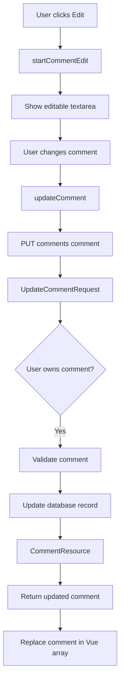
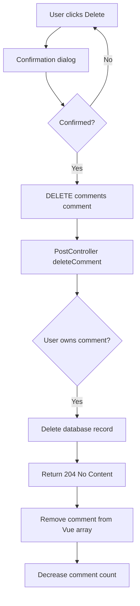

# Comment Update and Delete Flow

## Overview

Poet-Web allows users to edit and delete comments that they created.

Comment ownership is checked both in the frontend and backend:

- the frontend only displays Edit and Delete controls for the authenticated user's own comments;
- Laravel verifies ownership again before allowing a comment to be modified or deleted.

This prevents users from modifying comments that belong to other users.

---

## Reusable Edit/Delete Dropdown

The `EditDeleteDropdown.vue` component provides a reusable menu containing:

- Edit;
- Delete.

The component receives a `user` object and compares its ID with the authenticated user's ID.

```text
Authenticated user
        ↓
user.id === authUser.id?
        ↓
      Yes
        ↓
Display Edit/Delete menu
```

The component is reused for both:

- posts;
- comments.

This removes duplicated dropdown markup from `PostItem.vue`.

---

## Updating a Comment

When the user chooses Edit, `PostItem.vue` stores the selected comment in `editingComment`.

```text
Comment
   ↓
Edit
   ↓
startCommentEdit()
   ↓
editingComment
   ↓
Textarea displayed
```

The comment text can then be modified directly inside the post's comment section.

When Update is pressed, Vue sends:

```text
PUT /comments/{comment}
```

with the updated comment text.

### Request flow



---

## Update Authorization

`UpdateCommentRequest` handles authorization before the controller performs the update.

The comment is obtained through Laravel route model binding.

The authenticated user's ID is compared with the comment's `user_id`.

```text
comment.user_id === authenticatedUser.id
```

If the user does not own the comment, Laravel rejects the request.

---

## Update Validation

Updated comments must:

- be present;
- contain a string;
- contain no more than 2000 characters.

The frontend also prevents an empty comment from being submitted.

---

## Immediate Update in Vue

After Laravel updates the comment, `CommentResource` returns the updated comment object.

Vue replaces the old comment inside:

```text
post.comments
```

without reloading the page.

Conceptually:

```text
old comments
     ↓
find matching comment ID
     ↓
replace with server response
     ↓
updated comment appears immediately
```

---

## Deleting a Comment

Users can also delete their own comments.

Before the delete request is sent, the frontend displays a confirmation dialog.

If confirmed, Vue sends:

```text
DELETE /comments/{comment}
```

### Delete flow



---

## Delete Authorization

Deletion authorization is also checked on the server.

The controller compares:

```text
comment.user_id
```

with the authenticated user's ID.

If they do not match, Laravel returns HTTP status:

```text
403 Forbidden
```

The frontend ownership check therefore improves the interface, while the backend check provides the actual security protection.

---

## Preventing Repeated Requests