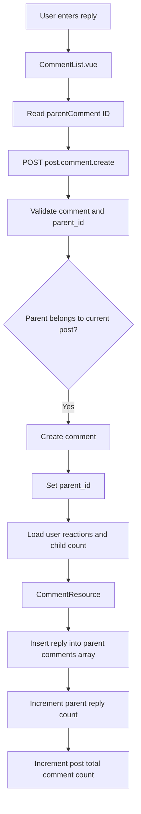
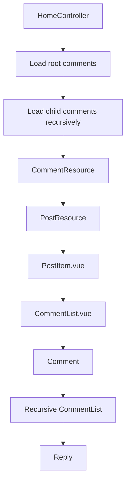

# Recursive Comment Replies Flow

## Overview

Poet-Web supports threaded comments by allowing a comment to belong either directly to a post or to another comment.

This makes structures such as the following possible:

```text
Post
└── Comment
    ├── Reply
    │   └── Reply to reply
    └── Reply
```

The system uses the nullable `parent_id` column in the `comments` table to distinguish top-level comments from replies.

Top-level comments have:

```text
parent_id = null
```

Replies contain the ID of their parent comment:

```text
parent_id = parent comment ID
```

The frontend renders these comments recursively through the reusable:

```text
CommentList.vue
```

component.

---

## Database Structure

The `comments` table contains:

```text
id
parent_id
post_id
comment
user_id
created_at
updated_at
```

`parent_id` is a nullable self-referencing foreign key.

Conceptually:

```text
comments.id
    ↑
    │
comments.parent_id
```

For example:

```text
Comment 5
id = 5
parent_id = null

Reply 8
id = 8
parent_id = 5

Reply 12
id = 12
parent_id = 8
```

produces:

```text
Comment 5
└── Reply 8
    └── Reply 12
```

The foreign key uses cascade deletion.

Therefore, deleting a parent comment also deletes replies that depend on it.

---

## Comment Model Relationships

The `Comment` model contains a child relationship:

```php
public function comments(): HasMany
{
    return $this->hasMany(
        self::class,
        'parent_id'
    );
}
```

This returns comments whose:

```text
parent_id = current comment ID
```

The reverse relationship can be represented using:

```php
public function parent(): BelongsTo
{
    return $this->belongsTo(
        self::class,
        'parent_id'
    );
}
```

This creates the following model structure:

```text
Comment
├── parent()
└── comments()
```

`parent_id` is also included in `$fillable` so Laravel can assign it when creating a reply.

---

## Loading Top-Level Comments

The post itself only loads comments where:

```text
parent_id IS NULL
```

This prevents replies from also appearing as normal top-level comments.

Conceptually:

```text
Post
│
├── Comment A
│   └── Reply A1
│
└── Comment B
    └── Reply B1
```

Without the `parent_id IS NULL` restriction, the initial post comment collection could contain:

```text
Comment A
Reply A1
Comment B
Reply B1
```

which would duplicate replies in the interface.

Therefore `HomeController` starts from root comments and loads descendants through each comment's `comments()` relationship.

---

## Recursive Loading

Each comment can load:

```text
user
reaction count
current user's reaction
reply count
child comments
```

The child comments load the same relationships again.

This produces a recursive structure:

```text
Post
└── comments
    └── Comment
        ├── user
        ├── reactions
        ├── comments_count
        └── comments
            └── Comment
                ├── user
                ├── reactions
                ├── comments_count
                └── comments
```

Because the same structure is repeated at every level, replies can themselves contain replies.

---

## CommentResource

`CommentResource` exposes the information required by the recursive frontend.

Important values include:

```text
id
parent_id
comment
created_at
updated_at
num_of_reactions
current_user_has_reaction
num_of_comments
comments
user
```

`num_of_comments` represents the number of direct replies belonging to that comment.

`comments` contains the nested replies themselves.

For example:

```json
{
    "id": 5,
    "parent_id": null,
    "comment": "Great poem",
    "num_of_comments": 1,
    "comments": [
        {
            "id": 8,
            "parent_id": 5,
            "comment": "I agree",
            "num_of_comments": 0,
            "comments": []
        }
    ]
}
```

---

## Creating a Top-Level Comment

A normal post comment is submitted with:

```text
parent_id = null
```

The frontend sends:

```text
POST /posts/{post}/comments
```

with approximately:

```json
{
    "comment": "Great poem",
    "parent_id": null
}
```

Laravel creates a comment containing:

```text
post_id = current post
user_id = authenticated user
parent_id = null
```

The created comment therefore becomes a root comment.

---

## Creating a Reply

When `CommentList.vue` is rendered beneath another comment, it receives that comment through:

```text
parentComment
```

A reply request contains:

```json
{
    "comment": "I agree",
    "parent_id": 5
}
```

The backend verifies that the requested parent comment exists and belongs to the same post.

This prevents a reply for one post from being attached to a comment belonging to another post.

The new comment is then created with:

```text
post_id = current post
parent_id = parent comment ID
user_id = authenticated user
```

---

## Reply Creation Flow



---

## Recursive `CommentList.vue`

Comment rendering was moved out of `PostItem.vue` into:

```text
resources/js/Components/app/CommentList.vue
```

`PostItem.vue` now only starts the comment tree:

```vue
<CommentList
    :post="post"
    :comments="post.comments ?? []"
/>
```

`CommentList.vue` renders each comment.

Inside each comment, the same component is used again for its replies:

```vue
<CommentList
    :post="post"
    :comments="comment.comments ?? []"
    :parent-comment="comment"
/>
```

This is called recursion.

The component effectively renders:

```text
CommentList
└── Comment
    └── CommentList
        └── Comment
            └── CommentList
                └── Comment
```

The same component can therefore display comments at any nesting level.

---

## Why Recursion Is Useful

Without recursion, separate components or loops would be required for:

```text
comments
replies
replies to replies
replies to replies to replies
```

That approach would duplicate code and impose a fixed nesting depth.

Using recursion means one component handles every level:

```text
CommentList.vue
```

The data determines how deeply the structure continues.

---

## Editing Comments and Replies

Editing works the same way regardless of comment depth.

The selected comment ID is sent to:

```text
PUT /comments/{comment}
```

using the route:

```text
post.comment.update
```

Laravel verifies ownership through the existing update authorization.

After updating, the returned `CommentResource` replaces the matching item in the local comment array.

Existing child comments are preserved when the edited comment is replaced.

---

## Comment Reactions

Posts and comments use the existing polymorphic reaction system.

Every nested comment can therefore independently contain:

```text
num_of_reactions
current_user_has_reaction
```

Clicking Like or Unlike sends:

```text
POST /comments/{comment}/reaction
```

through:

```text
post.comment.reaction
```

The response immediately updates the selected comment's reaction state without refreshing the page.

---

## Deleting Replies

Comment deletion uses:

```text
DELETE /comments/{comment}
```

through:

```text
post.comment.delete
```

Because `parent_id` uses a cascading foreign key, deleting a comment also removes its descendants.

For example:

```text
Comment A
└── Reply A1
    └── Reply A1.1
```

Deleting:

```text
Reply A1
```

also removes:

```text
Reply A1.1
```

The backend returns the updated post comment count so the frontend can display the real database count after cascading deletion.

---

## Comment Counts

Two different counts are used.

### Post comment count

```text
post.num_of_comments
```

represents the total number of comments belonging to the post, including replies.

### Comment reply count

```text
comment.num_of_comments
```

represents the number of direct replies belonging to that comment.

For example:

```text
Post
└── Comment A
    ├── Reply 1
    └── Reply 2
```

produces approximately:

```text
Post comment count = 3
Comment A reply count = 2
```

---

## Duplicate Request Protection

`CommentList.vue` keeps separate pending state for:

```text
comment creation
comment update
comment deletion
comment reactions
```

Examples include:

```text
commentPending
commentUpdatePending
deletingCommentId
reactingCommentId
```

These states prevent repeated clicks from sending unnecessary duplicate requests while a previous request is still being processed.

---

## Component Responsibilities

### `PostItem.vue`

Responsible for:

```text
post content
post attachments
post reactions
opening the comment section
starting the CommentList tree
```

### `CommentList.vue`

Responsible for:

```text
creating comments and replies
displaying comments
displaying nested replies
editing comments
deleting comments
comment reactions
reply disclosures
recursive rendering
```

### `Comment.php`

Responsible for:

```text
post relationship
user relationship
reaction relationship
parent relationship
child comment relationship
```

### `HomeController.php`

Responsible for:

```text
loading root comments
loading recursive reply data
loading reaction states
loading reply counts
```

### `PostController.php`

Responsible for:

```text
creating comments and replies
validating parent_id
editing comments
deleting comments
comment reactions
returning current comment counts
```

### `CommentResource.php`

Responsible for:

```text
serializing comments
serializing reaction information
serializing reply counts
serializing nested comments
```

---

## Overall Flow



---

## Result

After this feature, an authenticated user can:

1. create top-level comments;
2. reply to comments;
3. reply to existing replies;
4. view nested comment threads;
5. like and unlike comments at any depth;
6. edit their own comments or replies;
7. delete their own comments or replies;
8. see immediate frontend updates without refreshing the page.

The recursive design also removes comment-management logic from `PostItem.vue`, keeping post rendering separate from the increasingly complex comment system.