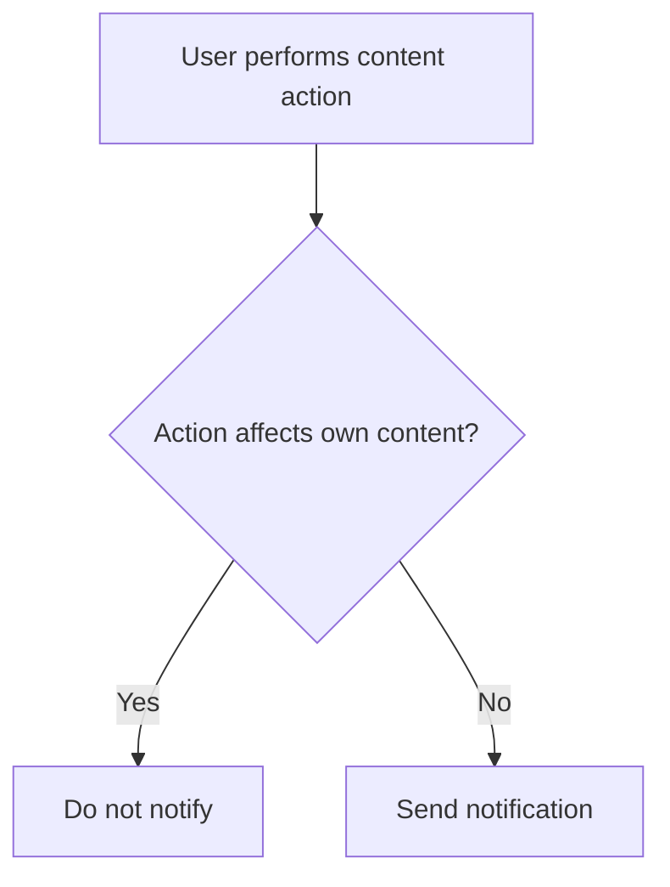
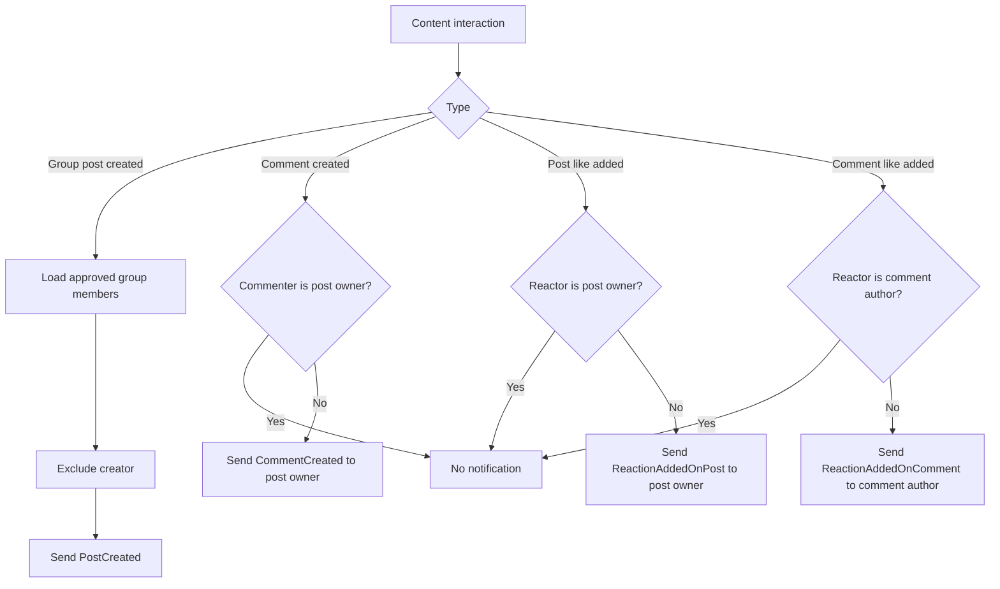

# Content Notification Flow

## Overview

Poet-Web sends email notifications for several content interactions:

```text
new group post
new comment
post like
comment like
```

The purpose is to notify the user whose content is affected, while avoiding unnecessary self-notifications.

---

## Main Files

The feature is implemented through:

```text
app/Http/Controllers/PostController.php
app/Notifications/PostCreated.php
app/Notifications/CommentCreated.php
app/Notifications/ReactionAddedOnPost.php
app/Notifications/ReactionAddedOnComment.php
routes/web.php
```

Existing post and comment models provide the relationships used to determine the affected users.

---

## Notification Cases

### New Group Post

When a post is created inside a group, Poet-Web notifies the other approved members of that group.

The creator is excluded from the recipient list.

```text
group post created
        ↓
load approved group members
        ↓
exclude post creator
        ↓
send PostCreated
```

A normal post outside a group does not send a `PostCreated` notification because there is no group audience to notify.

### New Comment

When a user comments on another user's post, the post owner receives a `CommentCreated` notification.

If the post owner comments on their own post, no notification is sent.

### Post Like

When a user adds a like to another user's post, the post owner receives a `ReactionAddedOnPost` notification.

If the post owner likes their own post, no notification is sent.

Removing an existing like does not send another notification.

### Comment Like

When a user adds a like to another user's comment, the comment author receives a `ReactionAddedOnComment` notification.

If the comment author likes their own comment, no notification is sent.

Removing an existing like does not send another notification.

---

## Recipient Rules

The current recipient rules are:

```text
Action                         Recipient
------------------------------------------------------------
New group post                 Other approved group members
Comment on another user's post Post owner
Like another user's post       Post owner
Like another user's comment    Comment author
```

Self-notifications are intentionally skipped.

---

## Group Post Notification

Group post creation is handled in `PostController::store()`.

After the post is created, its group is checked.

If the post belongs to a group, approved group members are loaded using:

```text
Group::approvedUsers()
```

The post creator is excluded with:

```text
users.id != creator id
```

The remaining users receive:

```text
PostCreated
```

The email includes the group name and a link back to the group profile.

---

## Comment Notification

Comments are created through:

```text
POST /posts/{post}/comments
```

Route name:

```text
post.comment.create
```

After the comment is stored, the controller compares:

```text
post.user_id
commenting user id
```

If they are different, the post owner receives:

```text
CommentCreated
```

The email contains a shortened version of the comment and links back to either the group feed or dashboard, depending on where the post belongs.

---

## Post Reaction Notification

Post reactions use:

```text
POST /posts/{post}/reaction
```

Route name:

```text
post.reaction
```

The current reaction behavior is toggle-based:

```text
no existing reaction
→ create like

existing reaction
→ remove like
```

A notification is sent only when a new reaction is created.

If the reacting user is not the post owner, the owner receives:

```text
ReactionAddedOnPost
```

The email identifies the reacting user's username and links back to the relevant feed.

---

## Comment Reaction Notification

Comment reactions use:

```text
POST /comments/{comment}/reaction
```

Route name:

```text
post.comment.reaction
```

Like post reactions, the behavior is toggle-based.

A notification is sent only when the like is added.

If the reacting user is not the comment author, the comment author receives:

```text
ReactionAddedOnComment
```

The email identifies the reacting user, includes a shortened version of the comment, and links back to the relevant feed.

---

## Self-Notification Protection

The application avoids notifying users about their own actions.

Conceptually:



This applies to:

```text
commenting on own post
liking own post
liking own comment
```

For group posts, the author is excluded from the approved-member recipient collection.

---

## Complete Notification Flow



---

## Notification Classes

### `PostCreated`

Recipient:

```text
other approved group members
```

Used when:

```text
a new group post is published
```

### `CommentCreated`

Recipient:

```text
post owner
```

Used when:

```text
another user comments on the post
```

### `ReactionAddedOnPost`

Recipient:

```text
post owner
```

Used when:

```text
another user likes the post
```

### `ReactionAddedOnComment`

Recipient:

```text
comment author
```

Used when:

```text
another user likes the comment
```

---

## Development Testing

During local development, notification emails can be checked in Mailpit.

Useful scenarios:

```text
User A creates group post
→ User B, an approved member, receives PostCreated
→ User A does not receive it

User B comments on User A's post
→ User A receives CommentCreated

User B likes User A's post
→ User A receives ReactionAddedOnPost

User B likes User A's comment
→ User A receives ReactionAddedOnComment
```

Also verify that self-actions do not generate emails and that removing an existing like does not generate a new notification.

---

## Result

The completed content-notification flow keeps users informed about important activity around their posts and comments without generating self-notifications.

```text
content interaction
        ↓
determine affected owner or group members
        ↓
exclude self-notifications
        ↓
send email notification
        ↓
link user back to relevant feed
```
