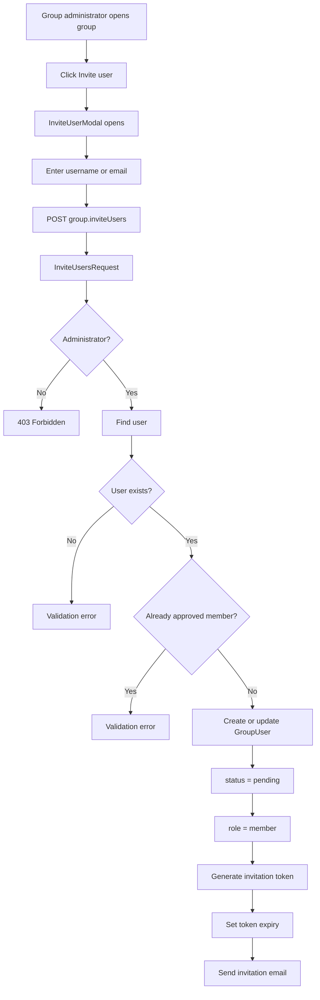
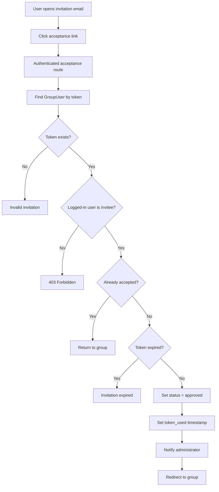

# Group Invitation Flow

## Overview

Poet-Web allows group administrators to invite registered users to join a group.

A user can be found using either their username or email address.

The invitation creates a pending `GroupUser` membership and sends the invited user an email containing a temporary acceptance link.

Only the invited account can accept the invitation.

---

## Main Files

The invitation flow is implemented through:

```text
app/Http/Controllers/GroupController.php
app/Http/Requests/InviteUsersRequest.php
app/Models/GroupUser.php
app/Notifications/InvitationInGroup.php
app/Notifications/InvitationApproved.php
resources/js/Pages/Group/InviteUserModal.vue
resources/js/Pages/Group/View.vue
routes/web.php
```

The database also enforces one membership record per user and group through:

```text
database/migrations/*_add_unique_membership_to_group_users_table.php
```

---

## Invitation Flow



---

## Invitation Validation

`InviteUsersRequest` is responsible for validating the invitation.

The request:

1. verifies that the current user is an approved group administrator;
2. accepts a username or email address;
3. verifies that the target user exists;
4. prevents an administrator from inviting themselves;
5. prevents an already approved member from being invited again.

The frontend field is called:

```text
identifier
```

because it may contain either:

```text
username
```

or:

```text
email
```

---

## Pending Membership

An invitation is represented by a `GroupUser` record.

Example state:

```text
user_id           = invited user
group_id          = target group
status            = pending
role              = member
created_by        = administrator
token             = random invitation token
token_expire_date = expiration timestamp
token_used        = null
```

`updateOrCreate()` is used so sending another invitation to the same pending user updates the existing membership rather than creating a duplicate record.

---

## Unique Membership Constraint

The `group_users` table contains a unique constraint for:

```text
user_id + group_id
```

This guarantees that a user cannot have multiple membership records for the same group.

Conceptually:

```text
User 2 + Group 1
        ↓
maximum one GroupUser row
```

---

## Invitation Email

After the pending membership is stored, Poet-Web sends an `InvitationInGroup` notification.

The email contains an acceptance link similar to:

```text
/groups/invitations/{token}/accept
```

The token is temporary and is stored with an expiration date.

During local development, emails are captured by Mailpit.

Mailpit can normally be opened at:

```text
http://localhost:8025
```

---

## Accepting an Invitation



---

## Invitation Ownership

Possession of the invitation URL alone is not enough to join a group.

The logged-in user must match:

```text
group_users.user_id
```

If another authenticated user opens the invitation link, the request is rejected.

This protects invitations if a URL is accidentally shared with another user.

---

## Invitation Expiration

Invitations are temporary.

When an invitation is created:

```php
token_expire_date = now()->addHours(24)
```

When the acceptance route is opened, Poet-Web checks whether that timestamp has passed.

Expired invitations cannot be accepted.

---

## Successful Acceptance

When the invitation is accepted, the membership changes from:

```text
status = pending
```

to:

```text
status = approved
```

and:

```text
token_used
```

is assigned the acceptance timestamp.

The user's group role remains:

```text
member
```

---

## Administrator Notification

After successful acceptance, the administrator who originally created the invitation receives an `InvitationApproved` notification.

The notification identifies:

- the user who accepted;
- the group they joined;
- a link back to the group.

---

## GroupUser Relationships

`GroupUser` defines relationships used by the invitation workflow:

```text
GroupUser
├── user
│   └── invited user
│
├── group
│   └── group being joined
│
└── adminUser
    └── user who created the invitation
```

`token_expire_date` and `token_used` are cast to datetime values so expiry and acceptance checks can use Laravel date operations.

---

## Frontend Flow

The group profile displays the invitation action only to administrators.

```text
Group/View.vue
    ↓
Admin clicks Invite user
    ↓
InviteUserModal.vue
    ↓
Enter username/email
    ↓
Inertia POST request
    ↓
Backend validates and sends invitation
```

Validation errors are returned directly to the modal.

For example:

```text
No user with that username or email exists.
```

or:

```text
This user is already a member of the group.
```

---

## Routes

The invitation functionality uses two authenticated routes.

### Send invitation

```text
POST /groups/{group:slug}/invitations
```

Route name:

```text
group.inviteUsers
```

### Accept invitation

```text
GET /groups/invitations/{token}/accept
```

Route name:

```text
group.approveInvitation
```

Both routes require authentication.

---

## Security

The invitation implementation protects group membership through several layers:

```text
Administrator authorization
        ↓
User lookup and validation
        ↓
Unique membership constraint
        ↓
Random invitation token
        ↓
Expiration timestamp
        ↓
Authenticated acceptance route
        ↓
Invitee ownership check
        ↓
Single-use token
```

This prevents unauthorized users from creating or accepting group invitations.

---

## Result

The completed flow allows a group administrator to:

```text
invite registered user
        ↓
create pending membership
        ↓
send temporary email link
        ↓
invitee accepts
        ↓
membership becomes approved
        ↓
administrator is notified
```

This provides the foundation for group membership management in Poet-Web.