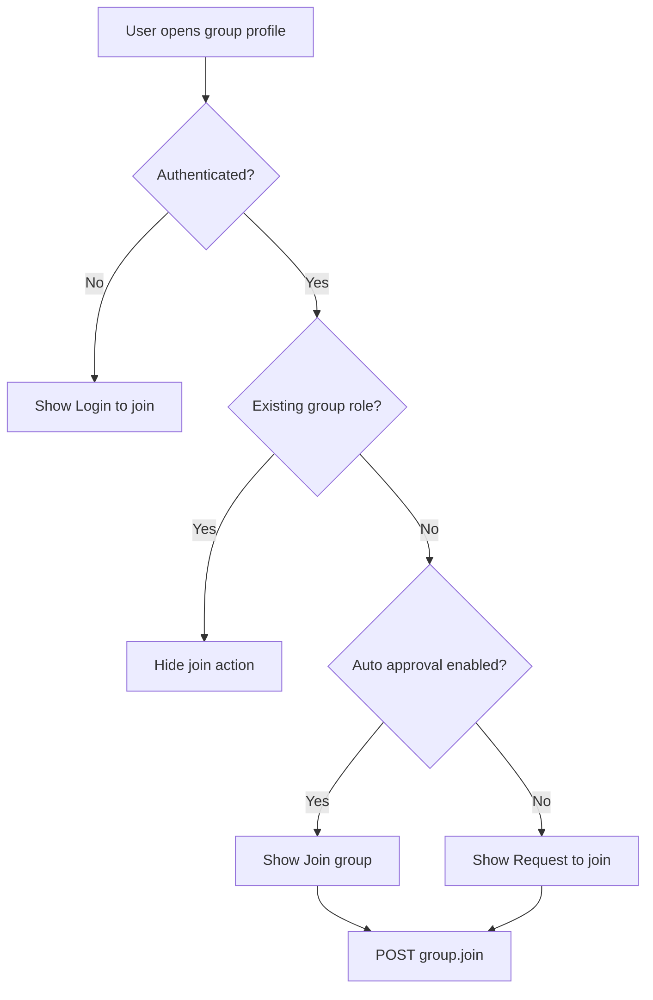
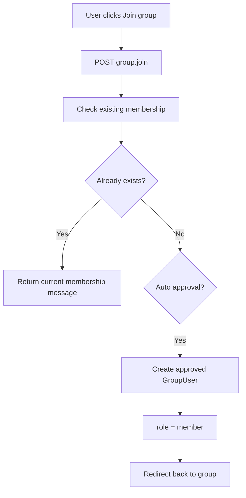
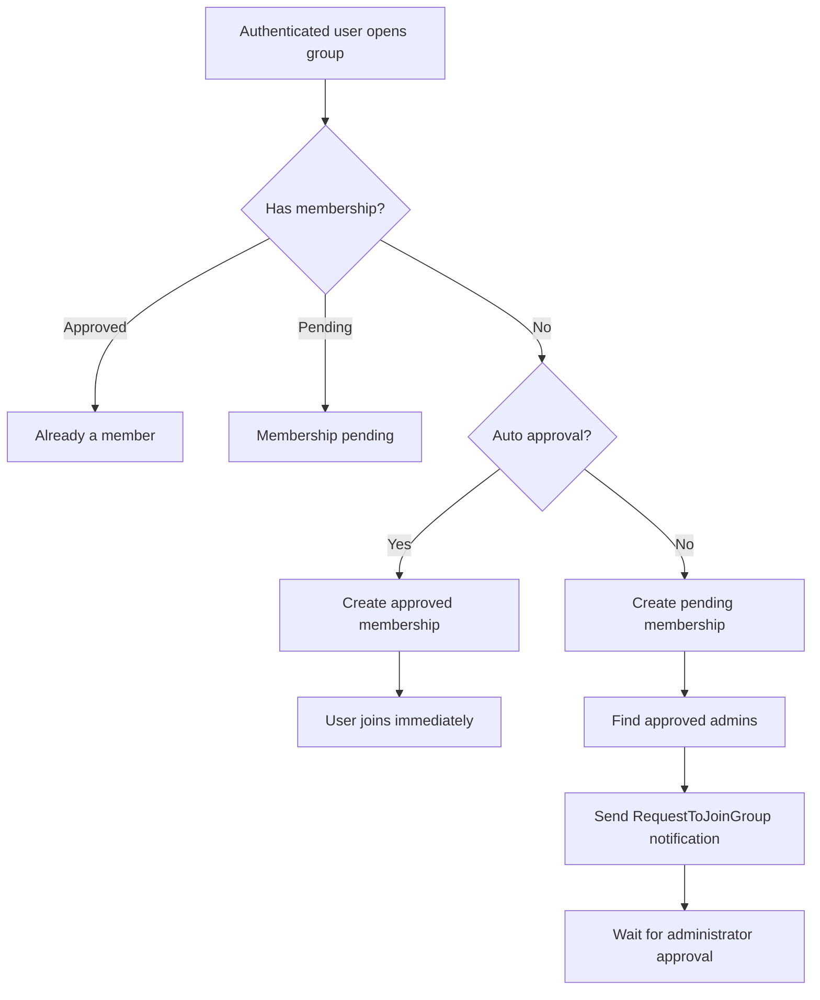

# Group Join Flow

## Overview

Poet-Web allows authenticated users to join groups.

The result depends on the group's `auto_approval` setting:

```text
auto_approval = true
        ↓
user becomes an approved member immediately

auto_approval = false
        ↓
a pending membership request is created
        ↓
group administrators are notified
```

The same backend endpoint handles both cases.

---

## Main Files

The group join flow is implemented through:

```text
app/Http/Controllers/GroupController.php
app/Models/Group.php
app/Models/GroupUser.php
app/Notifications/RequestToJoinGroup.php
resources/js/Pages/Group/View.vue
routes/web.php
```

---

## Join Route

Authenticated users send a request to:

```text
POST /groups/{group:slug}/join
```

Route name:

```text
group.join
```

The route uses the group's slug for route model binding.

---

## Frontend Flow

The group profile decides which action to display based on the current user and group membership.



The request is submitted using Inertia.

While the request is being processed, the action button is disabled to prevent duplicate submissions.

---

## Existing Membership Check

Before creating a membership, `GroupController::join()` checks whether the current user already has a `GroupUser` record for the group.

Possible existing states include:

```text
approved
pending
```

If the user is already approved, no new membership is created.

If the user already has a pending membership, another request is not created.

This also protects the unique database constraint for:

```text
user_id + group_id
```

---

## Auto Approval

When:

```text
auto_approval = true
```

the membership is created as:

```text
status     = approved
role       = member
user_id    = current user
group_id   = selected group
created_by = current user
```

The user becomes a group member immediately.



---

## Manual Approval

When:

```text
auto_approval = false
```

the membership is created as:

```text
status     = pending
role       = member
user_id    = current user
group_id   = selected group
created_by = current user
```

The user does not become an approved member immediately.

Instead, the group administrators receive a notification that a user has requested membership.

---

## Administrator Lookup

The `Group` model provides an `adminUsers()` relationship.

It returns users whose `group_users` pivot record has:

```text
role = admin
status = approved
```

Only active approved administrators receive membership request notifications.

Conceptually:

```text
Group
    ↓
group_users
    ↓
role = admin
AND
status = approved
    ↓
Administrator users
```

---

## Join Request Notification

When manual approval is required, Poet-Web sends a:

```text
RequestToJoinGroup
```

notification.

The email identifies:

- the requesting user;
- the group they want to join;
- a link to the group profile.

During local development these emails can be inspected using Mailpit:

```text
http://localhost:8025
```

---

## Membership States

A group membership can currently have states such as:

```text
pending
approved
```

### Pending

```text
status = pending
```

means that the user has requested membership but has not yet been approved.

### Approved

```text
status = approved
```

means that the user is an active member of the group.

The normal non-administrator role is:

```text
member
```

---

## Frontend Membership State

After the request completes, the group profile receives the current membership information through the group resource.

For a pending request, the interface can display:

```text
Membership pending
```

instead of allowing another request.

For an approved member, the join action is no longer displayed.

---

## Authentication

Joining a group requires authentication.

Unauthenticated visitors can still open the public group profile, but instead of receiving a join action they are presented with:

```text
Login to join
```

The actual `group.join` endpoint is inside the authenticated route group.

---

## Duplicate Membership Protection

Poet-Web protects against duplicate memberships at two levels.

### Application level

`GroupController::join()` checks whether a membership already exists before creating one.

### Database level

The `group_users` table has a unique constraint for:

```text
user_id + group_id
```

Together these prevent multiple membership records for the same user and group.

---

## Complete Flow



---

## Result

The group join system supports both open and moderated groups.

```text
Open group
    ↓
Join immediately

Moderated group
    ↓
Request membership
    ↓
Pending membership
    ↓
Notify administrators
```

This builds on the existing group membership and invitation system while keeping all membership records consistent through the shared `GroupUser` model.