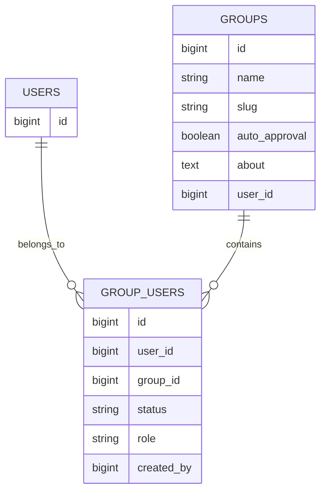
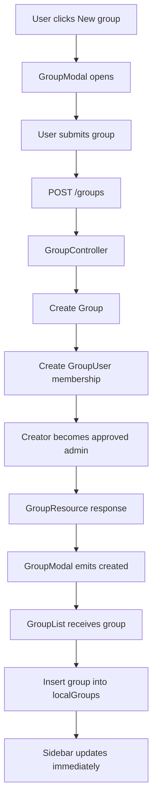

# Group Loading Flow

## Overview

Poet-Web loads groups based on the authenticated user's memberships instead of displaying hard-coded placeholder groups.

A group is shown in the user's **My Groups** section when a corresponding membership exists in the `group_users` table.

The membership also determines the user's:

- group status;
- group role.

---

## Database Relationship

Group information is stored in the `groups` table.

Membership information is stored separately in `group_users`.



This allows one user to belong to multiple groups and one group to contain multiple users.

---

## Loading Groups

When the authenticated user opens the Home page, `HomeController` loads their posts and groups.

Groups are joined with the `group_users` table.

Conceptually:

```text
Authenticated User
        ↓
group_users
        ↓
Find memberships for user_id
        ↓
groups
        ↓
Return matching groups
```

The membership query also selects:

```text
status
role
```

from `group_users`.

This means each returned group contains both normal group information and information describing the current user's membership.

---

## Group Membership State

A membership can contain statuses such as:

```text
pending
approved
```

and roles such as:

```text
admin
member
```

For example:

```text
Group: adjucas

User membership:
status = approved
role = admin
```

The frontend can therefore display information such as:

```text
adjucas     Admin
```

without performing another request.

---

## GroupResource

`GroupResource` converts each group into data suitable for Vue.

The resource contains:

```text
id
name
slug
status
role
thumbnail_url
auto_approval
about
description
user_id
created_at
updated_at
```

The `description` is generated from the group's `about` text and shortened for use in the sidebar.

If no thumbnail image exists yet, `thumbnail_url` is `null`.

The frontend can display a fallback based on the first letter of the group's name.

---

## Passing Groups to Vue

`HomeController` passes groups to the Inertia Home page:

```text
HomeController
      ↓
Inertia::render()
      ↓
Home.vue
      ↓
GroupList
      ↓
GroupListItems
      ↓
GroupItem
```

`Home.vue` receives:

```text
posts
groups
```

and passes the group array into the sidebar.

---

## GroupList

`GroupList.vue` manages the group's sidebar state.

It receives the groups loaded by Laravel and creates local reactive state.

```text
groups prop
    ↓
localGroups
```

This allows the list to be changed immediately after creating a group without reloading the entire page.

---

## Creating and Immediately Displaying a Group

When a new group is created:



The newly created group therefore appears in **My Groups** immediately.

No page refresh is required.

---

## GroupListItems

`GroupListItems.vue` no longer contains fake hard-coded groups.

Instead, it loops over the actual group collection:

```text
groups
  ↓
v-for
  ↓
GroupItem
```

If the user belongs to no groups, an empty-state message is displayed.

---

## Group Search

The My Groups search field filters groups by:

- group name;
- group description/about text.

Filtering happens in Vue and does not require another backend request.

Conceptually:

```text
search input
     ↓
lowercase search value
     ↓
compare against group name/about
     ↓
filteredGroups
     ↓
render matching GroupItems
```

---

## GroupItem

`GroupItem.vue` receives one complete group object.

It displays:

- thumbnail or fallback initial;
- group name;
- shortened description;
- Admin status when the current user is an administrator;
- Pending status when membership has not yet been approved.

The component no longer receives separate placeholder values such as:

```text
image
title
description
```

Instead it receives:

```text
group
```

which represents the actual database-backed group.

---

## Main Files

### `HomeController.php`

Loads groups belonging to the authenticated user and sends them to Inertia.

### `GroupController.php`

Returns membership status and role when a new group is created.

### `GroupResource.php`

Formats group and membership information for Vue.

### `Home.vue`

Receives the `groups` Inertia property and forwards it to `GroupList`.

### `GroupList.vue`

Maintains reactive group state and receives newly created groups.

### `GroupListItems.vue`

Filters and renders the authenticated user's real groups.

### `GroupItem.vue`

Displays one group and its membership state.

### `GroupModal.vue`

Emits the newly created group after successful creation.

---

## Result

After this feature:

1. placeholder groups are removed;
2. only groups belonging to the authenticated user are loaded;
3. membership status is available to the frontend;
4. membership role is available to the frontend;
5. administrators can be identified in the group list;
6. newly created groups appear immediately;
7. group search works using real group data;
8. refreshing the page reloads the same groups from the database.