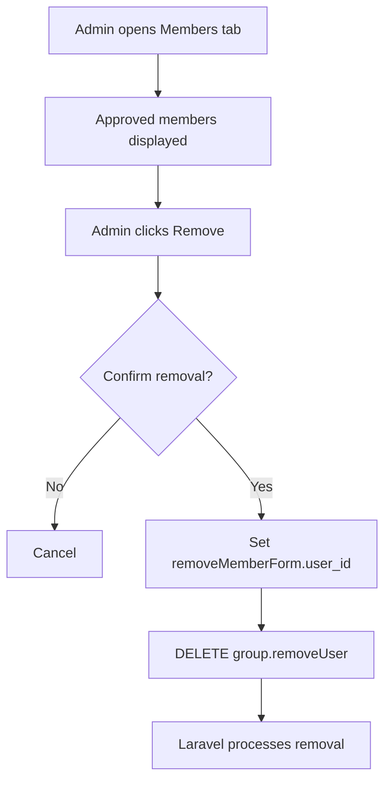
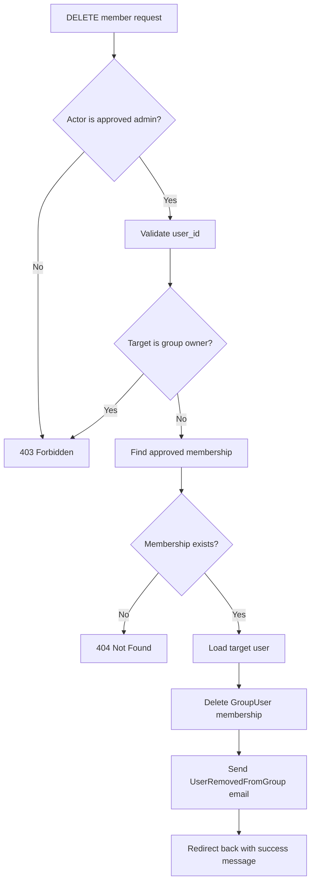

# Group Member Removal Flow

## Overview

Poet-Web allows approved group administrators to remove approved members from a group.

The removal flow includes:

```text
administrator permission check
        ↓
target user validation
        ↓
group owner protection
        ↓
approved membership lookup
        ↓
membership deletion
        ↓
email notification
        ↓
group profile reload
```

Removing a member deletes the user's `group_users` membership row for that group. The user account itself is not deleted.

---

## Main Files

The feature is implemented through:

```text
app/Http/Controllers/GroupController.php
app/Models/Group.php
app/Models/GroupUser.php
app/Notifications/UserRemovedFromGroup.php
resources/js/Components/app/UserListItem.vue
resources/js/Pages/Group/View.vue
routes/web.php
```

---

## Removal Route

Member removal uses an authenticated DELETE route:

```text
DELETE /groups/{group:slug}/members
```

Route name:

```text
group.removeUser
```

The group is resolved by its slug.

---

## Request Data

The frontend sends:

```json
{
    "user_id": 2
}
```

The backend validates `user_id` as:

```text
required
integer
existing users.id
```

This ensures the requested target refers to an existing application user.

---

## Administrator Authorization

Before removing a member, `GroupController::removeUser()` checks the authenticated user with:

```php
$group->isAdmin($actor->id)
```

The `Group::isAdmin()` helper requires the acting user to have:

```text
status = approved
role   = admin
```

An ordinary member or unrelated user receives:

```text
403 Forbidden
```

---

## Group Owner Protection

The group creator is stored in:

```text
groups.user_id
```

Before the membership is removed, the controller checks:

```php
$group->isOwner($userId)
```

If the target is the group owner, the request is rejected with:

```text
403 Forbidden
```

This prevents another administrator from removing the account that owns the group.

---

## Approved Membership Requirement

The controller only removes memberships that belong to the current group and have:

```text
status = approved
```

Conceptually:

```text
group_users
    ↓
group_id = current group
    ↓
user_id = requested user
    ↓
status = approved
```

If no matching approved membership exists, Laravel returns a not-found response through `firstOrFail()`.

Pending and rejected memberships are therefore not handled by the member-removal endpoint.

---

## Membership Deletion

After the approved membership is found, the related user is stored before the membership row is deleted.

```text
load GroupUser + user
        ↓
store affected user
        ↓
delete GroupUser
```

Only the group membership is removed.

The user's account, posts, profile, and other application data are not deleted by this action.

---

## User Notification

After removal, Poet-Web sends:

```text
UserRemovedFromGroup
```

to the removed user.

The notification is delivered by email and includes:

```text
group name
removal message
link back to the group profile
```

The email explains that the user was removed by a group administrator.

---

## Members Interface

Approved members are shown in the Members tab using:

```text
UserListItem.vue
```

For administrators, the component can expose:

```text
role management
member removal
```

The group owner is separately identified with the `Owner` label.

Pending join requests remain in their own section and continue to use only:

```text
Approve
Reject
```

actions.

---

## Frontend Removal Form

`Group/View.vue` creates a dedicated Inertia form:

```js
const removeMemberForm = useForm({
    user_id: null
});
```

When an administrator chooses Remove, the page first asks for confirmation.

If confirmed:

```text
selected user ID
        ↓
removeMemberForm.user_id
        ↓
DELETE group.removeUser
```

The request uses `preserveScroll: true`.

After the request finishes, the form is reset.

---

## Component Event Flow

`UserListItem.vue` emits:

```text
remove
```

with the selected user.

`Group/View.vue` listens using:

```vue
@remove="removeMember"
```

The complete frontend interaction is:



---

## Backend Removal Flow



---

## Effect on Group Access

Group-post access depends on approved membership.

After the `GroupUser` row is deleted, the removed user no longer passes:

```text
Group::hasApprovedUser()
```

for that group.

As a result, the user no longer has approved-member access to the group's protected post feed.

If the user later wants to join again, they must go through the normal join or invitation flow again.

---

## Interaction With Role Management

Member removal and role management are separate actions.

```text
Change role
→ keeps membership
→ updates role

Remove member
→ deletes membership
→ user leaves group
```

Both actions require an approved administrator.

The group owner is protected from both role changes and backend removal.

---

## Processing State

The approved member list combines the processing state of:

```text
roleForm.processing
removeMemberForm.processing
```

This prevents role/removal controls from being repeatedly submitted while a management request is already running.

---

## Current UI Note

The backend fully protects the group owner from removal.

In the current `UserListItem.vue` template, the owner receives the `Owner` label and the role selector is hidden. The Remove button is currently rendered outside the selector's `v-else` block, so it can still be visible on the owner row.

Attempting that action is rejected by the backend with `403 Forbidden`, so the owner cannot actually be removed.

To make the frontend match the backend rule, the role selector and Remove button should both be placed inside the same non-owner `v-else` template.

---

## Security Layers

The member-removal flow uses:

```text
authenticated route
        ↓
approved administrator check
        ↓
validated existing user ID
        ↓
group owner protection
        ↓
current-group membership lookup
        ↓
approved status requirement
        ↓
membership deletion
        ↓
removed-user notification
```

The frontend Remove button is only a user-interface control.

The actual removal permission is enforced by Laravel.

---

## Result

The feature allows approved administrators to remove active members while preserving the group owner and notifying affected users.

```text
Admin chooses member
        ↓
Confirmation
        ↓
Backend authorization
        ↓
Owner protection
        ↓
Approved membership deleted
        ↓
User notified
        ↓
Group access removed
```
