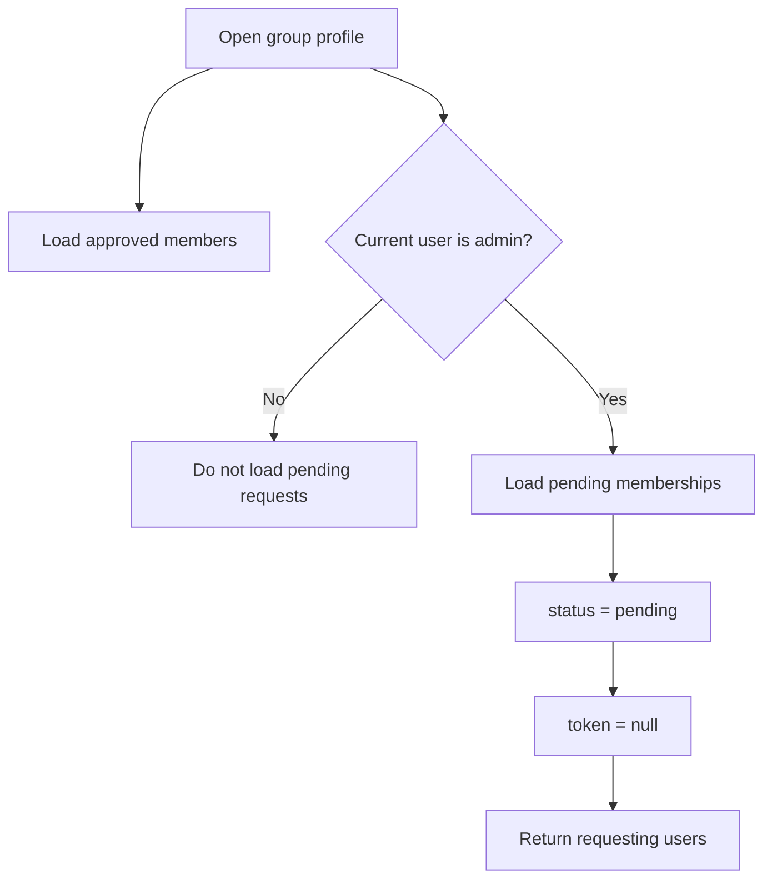
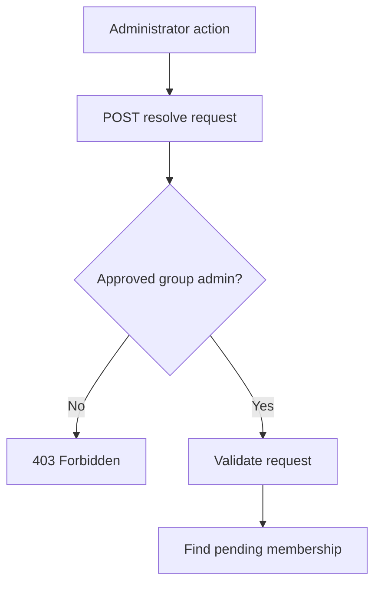
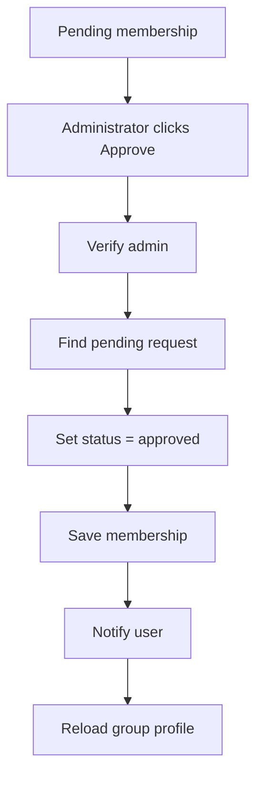
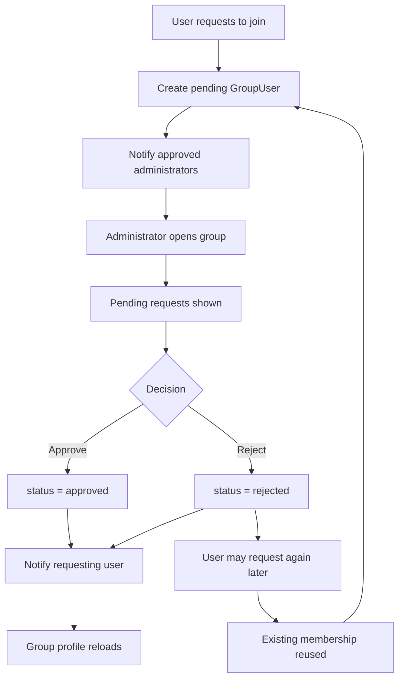

# Group Membership Approval Flow

## Overview

Poet-Web supports moderated group membership.

When a group has automatic approval disabled, an authenticated user can request to join the group.

The request creates a pending `GroupUser` membership.

Approved group administrators can then view pending requests on the group profile and either approve or reject them.

The requesting user receives an email notification after the administrator makes a decision.

---

## Main Files

The membership approval flow is implemented through:

```text
app/Enums/GroupUserStatus.php
app/Http/Controllers/GroupController.php
app/Http/Resources/UserResource.php
app/Models/Group.php
app/Models/GroupUser.php
app/Notifications/GroupJoinRequestResolved.php
resources/js/Components/app/UserListItem.vue
resources/js/Pages/Group/View.vue
routes/web.php
```

---

## Membership States

Group memberships can use the following states:

```text
pending
approved
rejected
```

### Pending

A pending membership represents a user waiting for administrator approval.

```text
status = pending
role   = member
```

### Approved

An approved membership represents an active group member.

```text
status = approved
role   = member
```

Group administrators are also approved memberships, but use:

```text
role = admin
```

### Rejected

A rejected membership represents a join request that was denied by a group administrator.

```text
status = rejected
```

The same membership record can later be reused if the user requests to join again.

---

## Join Requests and Invitations

Both group invitations and user-created join requests temporarily use:

```text
status = pending
```

They are distinguished using the invitation token.

A user-created join request has:

```text
token = null
```

An administrator-created invitation has:

```text
token = generated invitation token
```

This distinction prevents invitation recipients from appearing inside the administrator's pending join request list.

---

## Loading Members

The `Group` model provides a relationship for approved users.

Conceptually:

```text
Group
    ↓
group_users
    ↓
status = approved
    ↓
Users
```

These users are shown in the Members section of the group profile.

Approved users can be viewed by group visitors.

---

## Loading Pending Requests

Pending requests are loaded using memberships where:

```text
status = pending
token  = null
```

Only approved group administrators receive the pending request collection.



This prevents private membership-management information from being exposed to ordinary visitors.

---

## Members Tab

The group profile Members tab contains two areas for administrators:

```text
Members
├── Pending requests
│   ├── Approve
│   └── Reject
│
└── Approved members
```

Non-administrator users only see the approved member list.

Each user is rendered using:

```text
UserListItem.vue
```

The component can display the user's avatar, name, username, and optional membership-management actions.

---

## Resolving a Request

Administrators resolve membership requests through:

```text
POST /groups/{group:slug}/requests/resolve
```

Route name:

```text
group.resolveJoinRequest
```

The request contains:

```text
user_id
action
```

The supported actions are:

```text
approve
reject
```

---

## Authorization

Before resolving a request, Poet-Web checks whether the authenticated user is an approved administrator of the group.



The request cannot be resolved by ordinary group members or unrelated users.

---

## Request Validation

The backend validates:

```text
user_id
```

as an existing user ID and:

```text
action
```

as one of:

```text
approve
reject
```

The membership lookup additionally requires:

```text
group_id = current group
status   = pending
token    = null
```

The `token = null` condition ensures the endpoint only processes user-created join requests.

---

## Approving a Request

When the administrator chooses:

```text
approve
```

the membership changes from:

```text
pending
```

to:

```text
approved
```

The user then becomes an active group member.



---

## Rejecting a Request

When the administrator chooses:

```text
reject
```

the membership becomes:

```text
status = rejected
```

The record is kept instead of being deleted.

This preserves the membership history and allows the same database record to be reused if the user requests membership again later.

---

## Repeating a Request

The `group_users` table enforces a unique constraint on:

```text
user_id + group_id
```

Because rejected records remain in the database, another request cannot create a second membership row.

Instead, the existing membership is updated.

Conceptually:

```text
rejected membership
        ↓
user requests again
        ↓
update existing row
        ↓
status = pending
```

This avoids duplicate membership records and database constraint errors.

---

## Decision Notification

After approving or rejecting a request, Poet-Web sends a:

```text
GroupJoinRequestResolved
```

notification to the requesting user.

For approval, the email informs the user that their request was accepted.

For rejection, the email informs the user that their request was denied.

The notification also contains a link back to the group profile.

During local development the email can be inspected using Mailpit:

```text
http://localhost:8025
```

---

## User Resource

Group member and request data is returned through:

```text
UserResource
```

Image paths are converted into public URLs when they exist.

If a user does not have an avatar or cover image, the resource returns:

```text
null
```

rather than generating a storage URL for an empty path.

The frontend can then display its normal fallback avatar.

---

## Complete Moderated Membership Flow



---

## Security

The membership-management flow combines several protections:

```text
authenticated route
        ↓
approved administrator check
        ↓
validated user ID
        ↓
validated approve/reject action
        ↓
group-specific membership lookup
        ↓
pending status requirement
        ↓
join-request-only token check
```

This prevents unauthorized users from changing membership states or resolving invitation-based memberships.

---

## Result

The completed workflow connects the previous join-request functionality with administrator moderation.

```text
User requests membership
        ↓
Pending membership created
        ↓
Administrator sees request
        ↓
Approve or reject
        ↓
Membership state updated
        ↓
User notified
```

Groups with automatic approval can still approve users immediately, while moderated groups now have a complete request-management workflow.