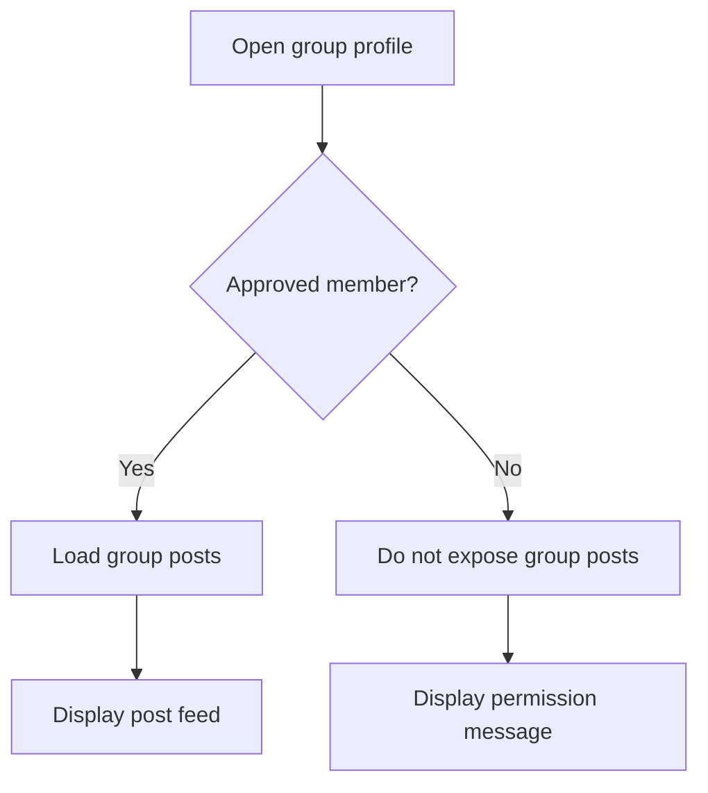
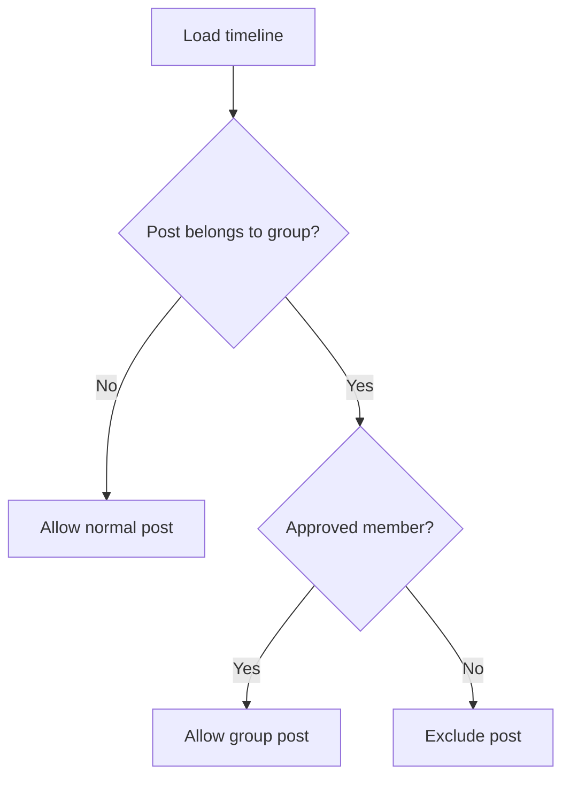
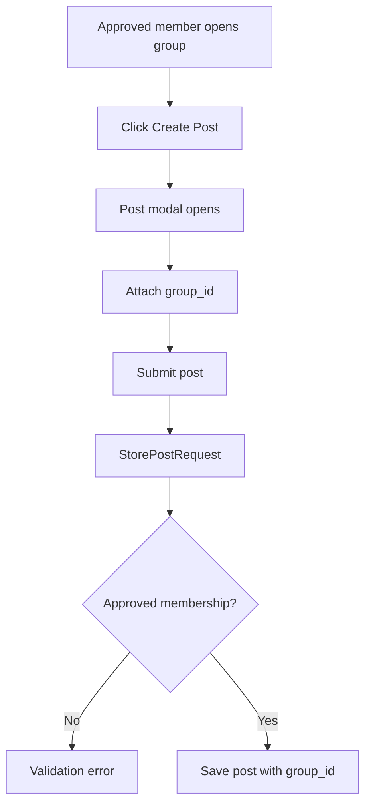
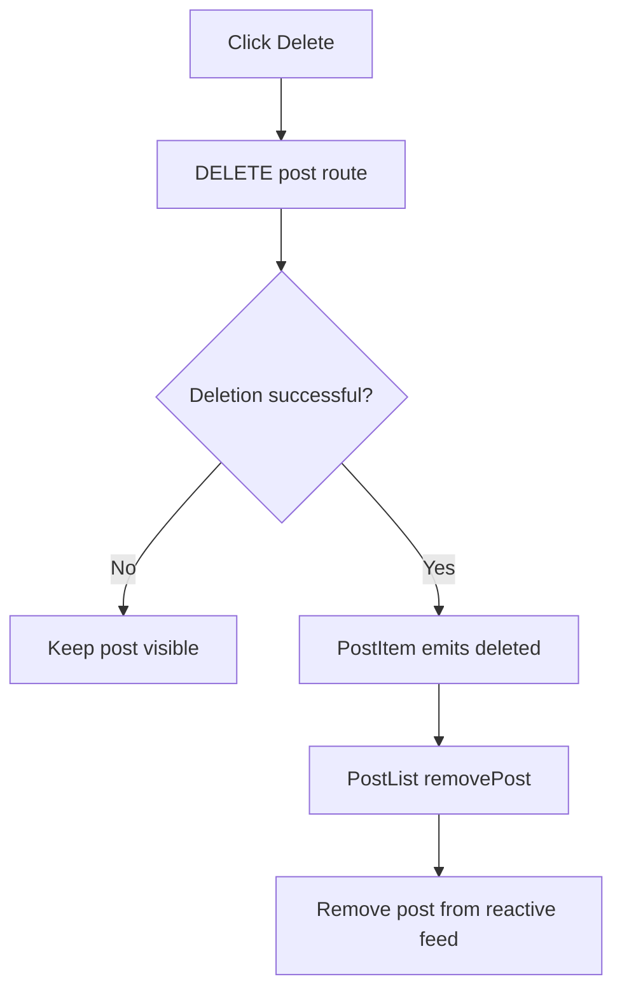
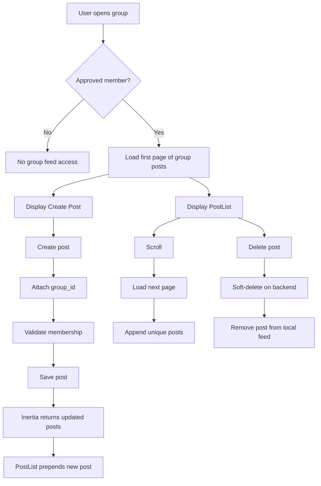

# Group Post Flow

## Overview

Poet-Web supports both normal timeline posts and posts that belong to a group.

Approved group members can:

```text
view posts inside the group
create posts inside the group
load additional group posts through pagination
```

Users who are not approved members cannot access the group's post feed or create posts inside that group.

---

## Main Files

The group post flow is implemented through:

```text
app/Http/Controllers/GroupController.php
app/Http/Controllers/HomeController.php
app/Http/Requests/StorePostRequest.php
app/Http/Resources/PostResource.php
app/Models/Group.php
app/Models/Post.php
resources/js/Components/app/CreatePost.vue
resources/js/Components/app/PostModal.vue
resources/js/Components/app/PostList.vue
resources/js/Pages/Group/View.vue
```

The existing `PostController` is reused for storing posts and attachments.

---

## Post and Group Relationship

The `posts` table contains a nullable `group_id`.

```text
group_id = null
    ↓
normal post

group_id = group ID
    ↓
group post
```

The `Post` model includes `group_id` in its fillable properties and defines a `group()` relationship.

---

## Approved Group Membership

The `Group` model contains `hasApprovedUser()`, which checks whether a user has an approved membership.

Conceptually:

```text
user_id
    ↓
group_users
    ↓
group_id
    ↓
status = approved
```

Pending or rejected memberships do not grant group-post access.

---

## Group Post Visibility

The group profile checks whether the current user is an approved member.



The rest of the group profile can still be displayed independently of post access.

---

## Loading Group Posts

Group posts reuse the shared timeline query:

```php
Post::postsForTimeline($userId)
```

The group controller then limits the result to:

```text
group_id = current group
```

Posts are paginated in groups of 10.

---

## Shared Timeline Query

`Post::postsForTimeline()` loads the data required by the post interface, including:

```text
post author
group
attachments
reaction count
current user's reaction
comments
comment reactions
```

The same query is reused by:

```text
HomeController
GroupController
```

This avoids duplicating post-loading logic.

---

## Protecting Group Posts in the Home Feed

Normal posts are visible through:

```text
group_id = null
```

Group posts are only included when the current user has an approved membership in the corresponding group.



This prevents group content from appearing for users who are not approved members.

---

## Group Post Creation

The group profile passes the current group to:

```text
CreatePost.vue
```

which passes it to:

```text
PostModal.vue
```

The modal includes:

```text
group_id = group.id
```

when creating the post.

`StorePostRequest` validates that the authenticated user has an approved membership before accepting a non-null `group_id`.



---

## Reactive Feed Synchronization

`PostList.vue` keeps the visible feed in normal Vue reactive state:

```text
feedState.posts
feedState.nextPageUrl
feedState.loadedBeyondFirstPage
```

The feed does not persist the complete post array with Inertia `useRemember()`.

When Inertia provides an updated `posts` prop after post creation, the component:

```text
receives the latest first-page posts
        ↓
refreshes posts already present in local state
        ↓
detects newly-created IDs
        ↓
prepends new posts to feedState.posts
```

This allows newly-created normal and group posts to appear immediately without requiring a full browser refresh.

---

## Infinite Scrolling

The group feed reuses `PostList.vue`.

An `IntersectionObserver` watches a marker at the bottom of the feed. When it becomes visible and a next page exists:

```text
nextPageUrl
    ↓
JSON request
    ↓
PostResource collection
    ↓
filter duplicate IDs
    ↓
append new posts
```

The group controller verifies approved membership for JSON pagination requests as well.

---

## Post Deletion and Feed State

Post deletion is handled by `PostItem.vue`.

After Laravel successfully deletes a post, `PostItem` emits:

```text
deleted(post.id)
```

`PostList.vue` then removes that ID from `feedState.posts`.



This is important because posts use Laravel soft deletion. A deleted post that remained in local frontend state would point to a model that route-model binding can no longer resolve and could produce a 404 on another edit or delete attempt.

---

## Group Posts Tab

### Approved Member

An approved member sees:

```text
Create Post
Group post feed
```

### Pending Member or Non-member

The post feed is not exposed and a permission message is shown instead.

---

## Attachments

Group posts reuse the same attachment system as normal posts, including:

```text
file count
allowed extensions
individual file size
combined attachment size
preview and download behavior
```

---

## Complete Group Post Flow



---

## Result

The group post system combines membership authorization with the existing social feed.

```text
approved membership
        ↓
view group posts
        ↓
create group posts
        ↓
immediate reactive feed update
        ↓
paginate additional posts
        ↓
remove deleted posts from local feed
        ↓
backend-protected access
```

This allows groups to function as protected publishing spaces while reusing Poet-Web's existing post, attachment, reaction, comment, pagination, and moderation systems.
