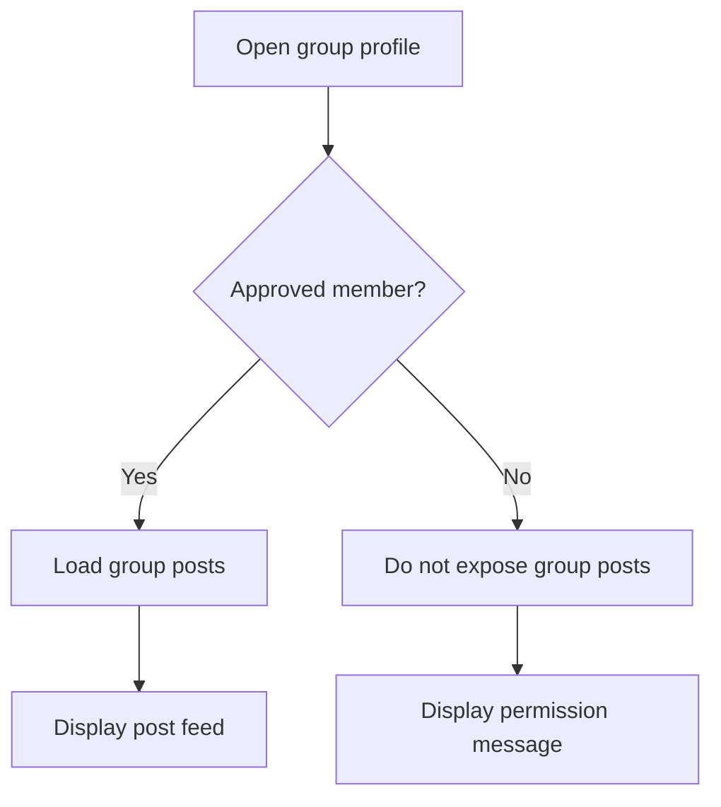
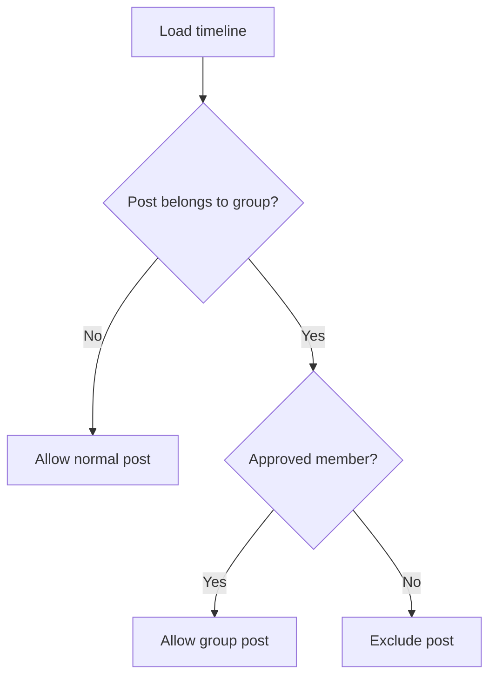
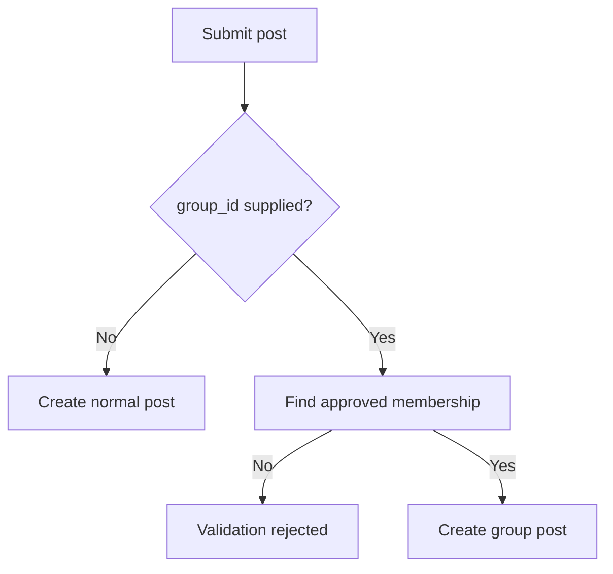
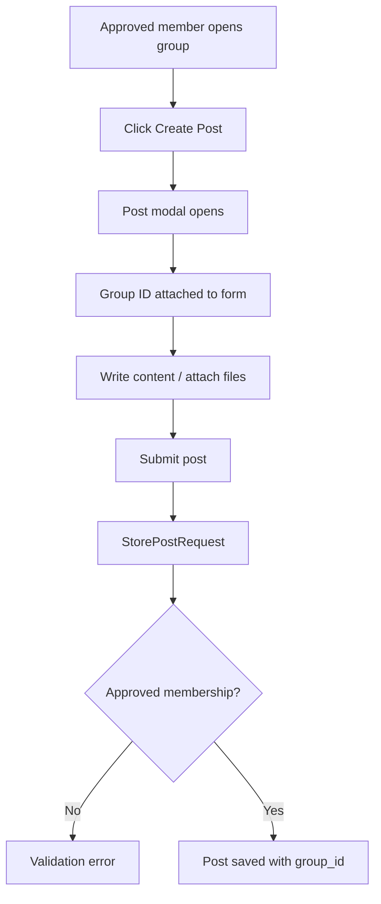
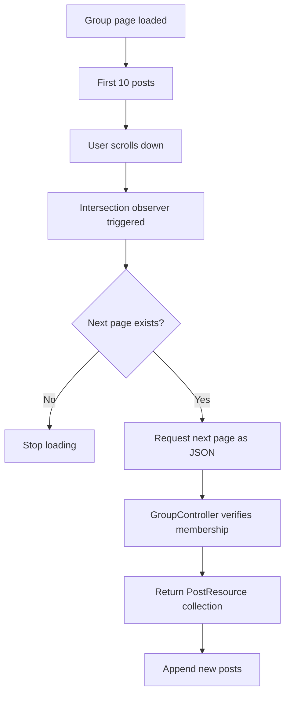
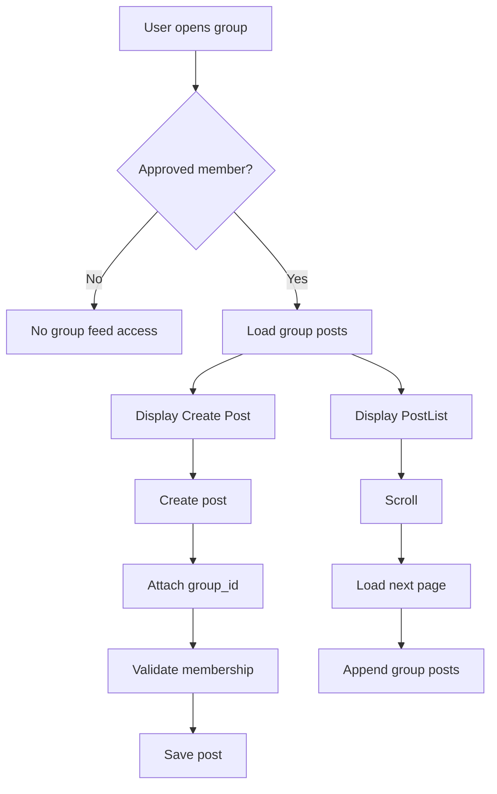

# Group Post Flow

## Overview

Poet-Web supports posts that belong to individual groups.

Approved group members can:

```text
view posts inside the group
create posts inside the group
load additional group posts through pagination
```

Users who are not approved members cannot access the group's post feed or create posts inside that group.

---

## Main Files

The group post flow is implemented through:

```text
app/Http/Controllers/GroupController.php
app/Http/Controllers/HomeController.php
app/Http/Requests/StorePostRequest.php
app/Models/Group.php
app/Models/Post.php
resources/js/Components/app/CreatePost.vue
resources/js/Components/app/PostModal.vue
resources/js/Components/app/PostList.vue
resources/js/Pages/Group/View.vue
```

The existing `PostController` is reused for storing posts and attachments.

---

## Post and Group Relationship

The `posts` table already contains:

```text
group_id
```

The value is nullable.

This allows Poet-Web to support two types of posts.

```text
group_id = null
    ↓
normal post

group_id = group ID
    ↓
group post
```

The `Post` model includes `group_id` in its fillable properties so it can be stored when creating a post.

---

## Post Model Relationship

A post belongs to a group through:

```text
Post
    ↓
group_id
    ↓
Group
```

The relationship allows the application to display which group a post belongs to and to filter posts by group.

---

## Approved Group Membership

The `Group` model contains a helper that determines whether a user has an approved membership.

Conceptually:

```text
user_id
    ↓
group_users
    ↓
group_id
    ↓
status = approved
```

Only users whose membership status is:

```text
approved
```

are allowed to view or create posts inside that group.

Pending or rejected memberships do not grant access.

---

## Group Post Visibility

The group profile checks whether the current user is an approved member.



The rest of the group profile can still be displayed independently of post access.

---

## Loading Group Posts

Group posts are loaded using the same timeline query used by the main feed.

The group controller then limits the query using:

```text
group_id = current group
```

Conceptually:

```text
shared post query
        ↓
current approved user
        ↓
filter by current group
        ↓
latest group posts
        ↓
paginate
```

Posts are loaded in pages of:

```text
10 posts
```

---

## Shared Timeline Query

The `Post` model contains a reusable timeline query.

This query loads the data required by the post interface, including:

```text
post author
group
attachments
reaction count
current user's reaction
comments
comment reactions
```

The same query can be reused by:

```text
HomeController
GroupController
```

This avoids duplicating the post-loading logic in multiple controllers.

---

## Protecting Group Posts in the Main Feed

The shared timeline query also checks access to posts that belong to groups.

Normal posts are available through:

```text
group_id = null
```

Group posts are only included when the current user has an approved membership in the corresponding group.

Conceptually:



This prevents private group content from leaking into another user's home feed.

---

## StorePostRequest

Group post permissions are also enforced during post creation.

The request accepts:

```text
group_id
```

as:

```text
nullable
integer
existing group ID
```

If a `group_id` is supplied, Poet-Web checks whether the authenticated user has an approved membership for that group.

If not, validation fails.

---

## Backend Security

Frontend controls alone are not trusted.

A user could manually attempt to submit:

```text
group_id = another group's ID
```

The backend checks the membership before the post is created.



This ensures group posting permissions are enforced by Laravel.

---

## Creating a Group Post

The group profile passes the current group into:

```text
CreatePost.vue
```

`CreatePost` then passes the group to:

```text
PostModal.vue
```

The modal adds the group's ID to the form:

```text
group_id = group.id
```

The existing post creation endpoint is then reused.

No separate group-post controller endpoint is required.

---

## Post Creation Flow



---

## Attachments

Group posts use the same attachment system as normal posts.

This includes existing validation for:

```text
file count
allowed extensions
individual file size
combined attachment size
```

Attachments are therefore not implemented separately for groups.

---

## Post Header

Because the `Post` model has a group relationship, group posts can display both:

```text
author
group
```

For example:

```text
John Doe • Poetry Group
```

The group name links back to the group profile.

---

## Group Posts Tab

The Posts tab on the group profile behaves differently based on membership.

### Approved Member

An approved member sees:

```text
Create Post
Group post feed
```

### Pending Member

A pending user sees a permission message instead of the feed.

### Non-member

A user who does not belong to the group also cannot view the group's posts.

---

## Infinite Scrolling

The group feed reuses:

```text
PostList.vue
```

which already supports loading additional paginated posts using an intersection observer.

When the bottom of the currently loaded feed is reached:

```text
current page
    ↓
next page URL
    ↓
JSON request
    ↓
new posts appended
```

The group controller returns `PostResource` pagination data for JSON requests.

---

## Feed State Isolation

The existing post list remembers loaded feed state.

The Home feed uses its own remember key.

Each group feed uses a separate key based on the group ID:

```text
group-post-feed-{group.id}
```

For example:

```text
home-post-feed

group-post-feed-1

group-post-feed-2
```

This prevents posts remembered from one feed from appearing in another feed.

---

## Pagination Flow



---

## JSON Requests

The same group profile route supports both:

```text
normal Inertia page requests
JSON pagination requests
```

For an approved member, a JSON request returns the next page of group posts.

If an unauthorized user requests the post pagination endpoint directly, access is rejected.

---

## Relationship With Home Feed

Group posts and normal posts use the same Post model and resource structure.

The Home feed can therefore contain:

```text
normal posts
group posts the user is allowed to see
```

while still excluding group content for groups where the user does not have approved membership.

---

## Current UI Behavior

Group posts are stored correctly and appear after the group page is refreshed.

At the current stage, publishing a new group post does not yet insert the new post into the already-rendered group feed immediately.

This is a frontend synchronization issue rather than a post persistence issue.

The post is already stored in the database correctly.

---

## Security Layers

The group post system uses several protections:

```text
authenticated post creation
        ↓
group_id validation
        ↓
existing group validation
        ↓
approved membership check
        ↓
timeline access filtering
        ↓
group-specific post query
```

This protects both post creation and post viewing.

---

## Complete Group Post Flow



---

## Result

The group post system connects group membership with the existing social feed functionality.

```text
Approved membership
        ↓
View group posts
        ↓
Create group posts
        ↓
Post stored with group_id
        ↓
Group feed paginated
        ↓
Access protected on backend
```

This allows groups to function as their own protected publishing spaces while continuing to reuse Poet-Web's existing post, attachment, reaction, comment, and pagination systems.