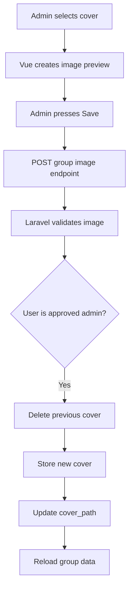

# Group Profile Flow

## Overview

Poet-Web provides every group with its own dedicated profile page.

Groups are accessed using their unique slug:

```text
/g/{group:slug}
```

For example:

```text
/g/adjucas
```

The group profile displays:

- group name;
- group description;
- cover image;
- thumbnail image;
- current user's membership role;
- group content tabs.

Group administrators can also update the cover and thumbnail images.

---

## Opening a Group

Groups displayed in the **My Groups** sidebar link to their profile page.

```text
My Groups
    ↓
adjucas
    ↓
/g/adjucas
    ↓
GroupController::profile()
    ↓
Group/View.vue
```

Laravel uses route model binding with the group's `slug` instead of its numeric ID.

---

## Group Profile Route

The group profile uses:

```text
GET /g/{group:slug}
```

Laravel automatically resolves the slug to the correct `Group` model.

---

## Group Membership

When a group page is opened, Poet-Web determines whether the authenticated user belongs to that group.

The user's membership can provide:

```text
status
role
```

Possible roles currently include:

```text
admin
member
```

Possible statuses include:

```text
approved
pending
```

The membership information is included in the group data sent to Vue.

---

## Administrator Authorization

Only approved group administrators are allowed to modify group images.

Authorization checks:

```text
User belongs to group
        +
role = admin
        +
status = approved
        ↓
Image modification allowed
```

This authorization is performed on the backend.

Hiding controls in Vue improves the interface, but Laravel provides the actual security protection.

---

## GroupResource

`GroupResource` converts the Group model into frontend data.

It includes:

```text
id
name
slug
status
role
thumbnail_url
cover_url
auto_approval
about
description
user_id
created_at
updated_at
```

Image URLs are generated dynamically using Laravel's public storage disk.

If no image exists, Vue displays a visual fallback.

---

## Group Profile Page

The group profile page is implemented in:

```text
resources/js/Pages/Group/View.vue
```

The page contains:

```text
Group Profile
│
├── Cover image
│
├── Thumbnail
│
├── Group name
│
├── Admin role indicator
│
├── Group description
│
└── Tabs
    ├── Posts
    ├── Members
    └── About
```

The Posts and Members tabs are prepared for later functionality.

---

## Cover Image Upload

Administrators can select a new group cover image.

The selected file is first previewed in the browser.



The user can cancel before saving.

---

## Thumbnail Upload

Thumbnail upload follows the same process.

The administrator selects an image, sees a preview, and either:

```text
Cancel
```

or:

```text
Save
```

The uploaded file is stored using Laravel's public storage disk.

---

## Image Validation

Group images are restricted to common image formats:

```text
jpg
jpeg
png
webp
```

Each uploaded image must also stay within the configured maximum file size.

This prevents unsupported files from being stored as group images.

---

## Existing Image Replacement

When a new image replaces an existing image:

```text
old image
    ↓
delete from storage
    ↓
store replacement
    ↓
update database path
```

This prevents unused old images from accumulating in storage.

---

## Group Image Storage

Images are stored under a directory associated with the group:

```text
storage/app/public/groups/{group_id}/
```

For example:

```text
storage/app/public/groups/1/
```

Laravel's public storage link exposes these files to the browser.

---

## Frontend Image Preview

Vue uses a local object URL to preview selected files before they are uploaded.

This allows the administrator to confirm the image before changing the stored version.

The database is only changed after Save is pressed.

---

## Group Navigation

`GroupItem.vue` uses an Inertia `Link`.

This allows users to navigate from:

```text
My Groups
```

to:

```text
Group Profile
```

without performing a traditional full-page browser reload.

---

## Main Files

### `Group.php`

Defines group fields, group memberships, and administrator authorization.

### `GroupController.php`

Loads group profile information and processes group image updates.

### `GroupResource.php`

Formats group data and generates image URLs.

### `GroupItem.vue`

Links sidebar groups to their profile pages.

### `Group/View.vue`

Displays the complete group profile interface.

### `web.php`

Defines group profile and image update routes.

---

## Result

After this feature, users can:

1. click groups from the sidebar;
2. open dedicated group profile pages;
3. view group names and descriptions;
4. see group membership role information;
5. see group cover and thumbnail images;
6. use fallback visuals when images do not exist.

Approved group administrators can additionally:

1. select new cover images;
2. preview covers before upload;
3. replace existing covers;
4. select new thumbnails;
5. preview thumbnails before upload;
6. replace existing thumbnails.

The group page also provides the foundation for later group posts, member management, invitations, and join requests.