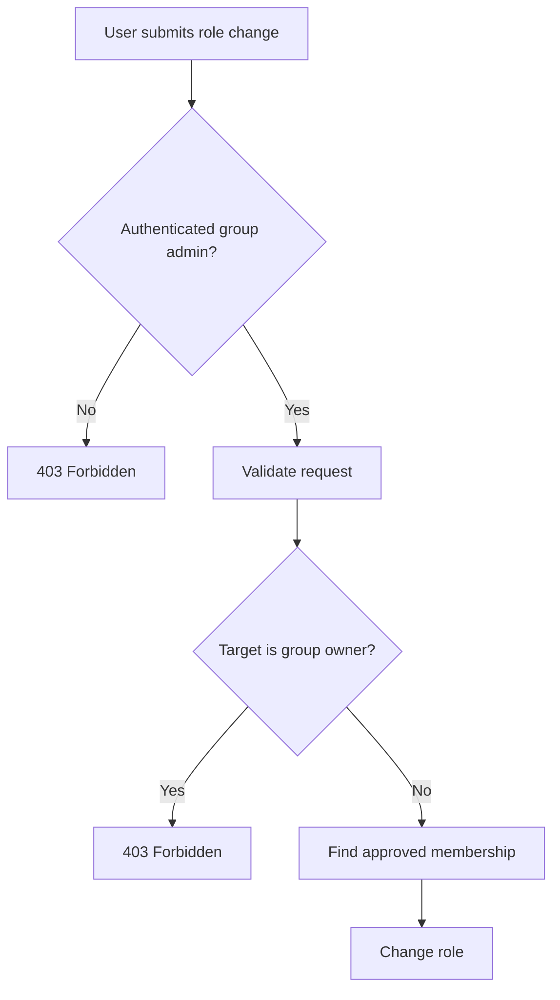
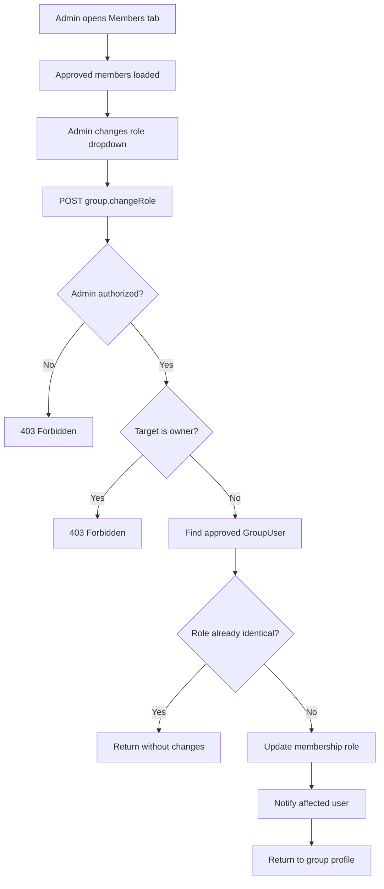
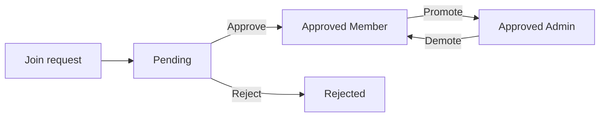

# Group Role Management

## Overview

Poet-Web allows approved group administrators to manage the roles of approved group members.

The supported roles are:

```text
admin
member
```

An administrator can promote a normal member to an administrator or demote another administrator back to a member.

The original group owner is protected and cannot have their role changed.

---

## Main Files

Group role management is implemented through:

```text
app/Http/Controllers/GroupController.php
app/Http/Resources/GroupMemberResource.php
app/Models/Group.php
app/Models/GroupUser.php
app/Notifications/GroupRoleChanged.php
resources/js/Components/app/UserListItem.vue
resources/js/Pages/Group/View.vue
routes/web.php
```

---

## Roles

Poet-Web currently supports two group roles.

### Admin

```text
admin
```

An administrator can perform group management actions such as:

- inviting users;
- approving or rejecting join requests;
- changing member roles;
- editing group images.

### Member

```text
member
```

A member belongs to the group but does not have administrative permissions.

---

## Group Owner

The group creator is stored in:

```text
groups.user_id
```

The `Group` model provides:

```php
public function isOwner(int $userId): bool
{
    return $this->user_id === $userId;
}
```

The owner is treated differently from other administrators.

Their role cannot be changed through the member role management endpoint.

This prevents another administrator from accidentally or intentionally removing the owner's administrative role.

---

## Loading Member Roles

Approved users are loaded through the `approvedUsers()` relationship.

The relationship includes information stored in the `group_users` pivot table:

```text
role
status
```

Conceptually:

```text
users
    ↓
group_users
    ├── group_id
    ├── user_id
    ├── role
    └── status
```

Only memberships where:

```text
status = approved
```

are displayed as active group members.

---

## GroupMemberResource

Group members are returned to the frontend through:

```text
app/Http/Resources/GroupMemberResource.php
```

The resource exposes information such as:

```text
id
name
username
avatar_url
role
status
```

The member's `role` and `status` come from the `group_users` pivot record.

Example:

```json
{
    "id": 2,
    "name": "John Doe",
    "username": "john",
    "avatar_url": null,
    "role": "member",
    "status": "approved"
}
```

---

## Role Change Route

Role changes are sent to:

```text
POST /groups/{group:slug}/members/role
```

Route name:

```text
group.changeRole
```

The route is inside the authenticated route group.

---

## Request Data

The role change request contains:

```text
user_id
role
```

Example:

```json
{
    "user_id": 2,
    "role": "admin"
}
```

The role is validated against the `GroupUserRole` enum.

Therefore only supported application roles can be submitted.

---

## Authorization

Before changing a member's role, Poet-Web checks whether the authenticated user is an approved group administrator.



The server performs these checks even though the frontend also hides role controls from users without permission.

---

## Approved Membership Requirement

The role change endpoint only searches memberships where:

```text
status = approved
```

This means administrators cannot promote:

```text
pending users
rejected users
unrelated users
```

to administrators.

The target must already be an active member of the group.

---

## Owner Protection

Before updating the membership, Poet-Web checks:

```text
group.user_id == target user
```

If the target user owns the group, the request is rejected.

The frontend also displays:

```text
Owner
```

instead of a role dropdown for this user.

---

## Members Interface

The Members tab separates pending membership requests from approved members.

```text
Members tab
│
├── Pending requests
│   ├── Approve
│   └── Reject
│
└── Members
    ├── Owner
    ├── Admin
    └── Member
```

Pending requests continue to use the existing:

```text
Approve
Reject
```

actions.

Role controls are only displayed for approved members.

---

## Role Dropdown

Approved group administrators see a role selector for members.

Possible values are:

```text
Member
Admin
```

For example:

```text
John Doe
@john
[ Member ▼ ]
```

Changing the value sends the selected user's ID and new role to the backend.

Normal users do not see this control.

---

## Role Change Flow



---

## No-op Role Changes

If the selected role is already equal to the member's current role:

```text
current role = member
requested role = member
```

no database update is required.

The frontend avoids submitting this request where possible, while the backend also protects against unnecessary updates.

---

## Role Change Notification

After a successful change, Poet-Web sends:

```text
GroupRoleChanged
```

to the affected user.

The email contains:

- the group name;
- the user's new role;
- a link to the group profile.

Example:

```text
Your role in "Poetry Group" has been changed to "admin".
```

During local development the email can be inspected through Mailpit:

```text
http://localhost:8025
```

---

## Permission Changes

Promoting a member:

```text
member
    ↓
admin
```

means that after the membership data is refreshed, the user passes the group's administrator authorization checks.

Demoting an administrator:

```text
admin
    ↓
member
```

removes those administrative permissions.

The group owner cannot be demoted.

---

## Security

The role-management flow uses several layers of protection:

```text
authenticated route
        ↓
approved administrator check
        ↓
validated user ID
        ↓
validated GroupUserRole enum
        ↓
group owner protection
        ↓
approved membership requirement
        ↓
role update
```

The frontend role selector is therefore only a user interface.

Authorization is enforced by Laravel on the server.

---

## Relationship With Membership Requests

Role management only applies after a user has become an approved member.

The membership lifecycle can therefore be represented as:



The group owner remains an administrator and cannot be demoted through this workflow.

---

## Result

The completed role-management flow allows group administrators to manage responsibility inside a group without directly editing database membership records.

```text
Approved member
      ↓
Admin changes role
      ↓
Backend validates permission
      ↓
Owner protected
      ↓
Role updated
      ↓
User notified
```

This extends the existing invitation, join-request, and membership approval systems with administrative role management.