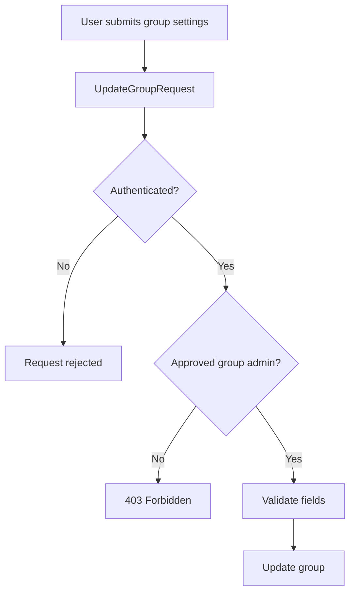
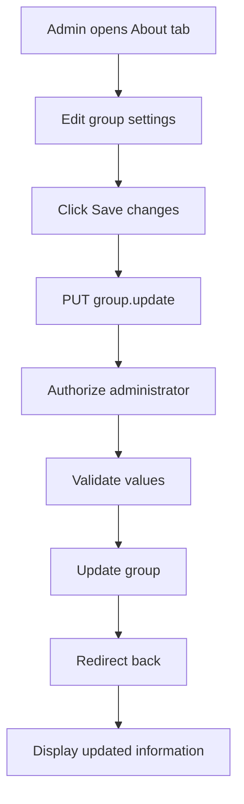
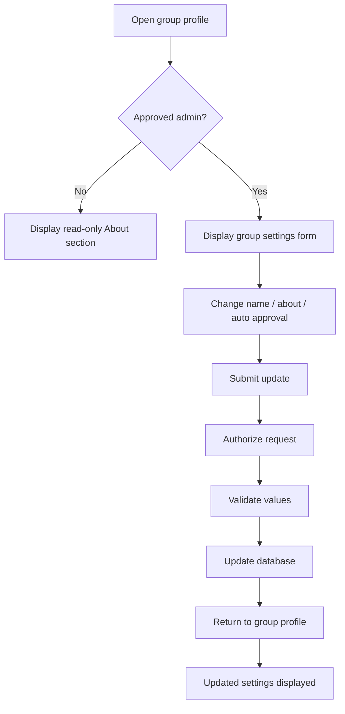

# Group Update Flow

## Overview

Poet-Web allows approved group administrators to update the main settings of a group.

Administrators can modify:

```text
group name
about text
automatic membership approval
```

The group profile continues to display the About information publicly, while editing controls are only available to approved administrators.

---

## Main Files

The group update functionality is implemented through:

```text
app/Http/Controllers/GroupController.php
app/Http/Requests/UpdateGroupRequest.php
resources/js/Pages/Group/View.vue
routes/web.php
```

The existing `Group` model is used to persist the updated values.

---

## Editable Fields

The update form supports:

```text
name
auto_approval
about
```

### Name

The group name is required.

```text
maximum length: 255 characters
```

### Automatic Approval

The `auto_approval` value determines whether users immediately become approved group members.

```text
true
    ↓
users join immediately

false
    ↓
users create pending join requests
```

### About

The About field contains the group description.

It is optional and supports up to:

```text
5000 characters
```

---

## Update Route

Group settings are updated through:

```text
PUT /groups/{group:slug}
```

Route name:

```text
group.update
```

The route is located inside the authenticated route group.

---

## UpdateGroupRequest

Group setting updates use:

```text
app/Http/Requests/UpdateGroupRequest.php
```

The request performs both:

```text
authorization
validation
```

---

## Authorization

The request retrieves the group from route model binding and checks whether the authenticated user is an approved group administrator.

Conceptually:



Authorization is therefore enforced on the backend and does not depend only on whether the frontend displays the edit form.

---

## Validation

The update request validates the group fields using rules equivalent to the group creation flow.

```text
name
    required
    string
    max 255

auto_approval
    required
    boolean

about
    nullable
    string
    max 5000
```

Invalid values are returned to the frontend as validation errors.

---

## Controller Update

The `GroupController::update()` method receives the validated request and group.

The update flow is:

```text
validated request
      ↓
group.update(...)
      ↓
database record updated
      ↓
redirect back
      ↓
success message
```

Only validated fields are passed to the model.

---

## Frontend Settings Form

The group profile creates an Inertia form containing the current group data:

```text
name
auto_approval
about
```

The initial values are loaded from the current group resource.

Example:

```js
const groupSettingsForm = useForm({
    name: props.group.name,
    auto_approval: Boolean(props.group.auto_approval),
    about: props.group.about ?? ''
});
```

This means the administrator edits the existing values rather than starting with an empty form.

---

## Submitting the Form

The frontend sends an Inertia `PUT` request to:

```text
group.update
```

Conceptually:



The request uses:

```text
preserveScroll = true
```

so updating the settings does not unnecessarily move the administrator away from the current section of the page.

---

## Administrator View

Approved administrators see an editable settings form.

The form includes:

```text
Group name
Automatic approval checkbox
About group textarea
Save changes button
```

Validation errors are displayed next to the corresponding input.

While the request is processing, the submit button is disabled.

---

## Public About View

Users who are not group administrators do not receive editing controls.

Instead, they see the normal About section containing:

```text
group description
automatic approval status
```

Conceptually:

```text
Administrator
    ↓
editable Group settings form

Normal member / visitor
    ↓
read-only About information
```

This keeps group information visible without exposing administrative actions.

---

## Automatic Approval Effect

Changing the automatic approval option directly affects the existing group joining workflow.

### Enabled

```text
auto_approval = true
```

New users become approved members immediately.

### Disabled

```text
auto_approval = false
```

New users create a pending membership request that must be reviewed by an administrator.

Therefore the group update feature is connected to the existing membership request system.

---

## Group Name Changes

The group name can be updated without changing the group URL.

Poet-Web uses a stored slug for route model binding, and the group model is configured not to regenerate the slug when the name changes.

This means:

```text
original name
    ↓
slug generated

later name change
    ↓
slug remains unchanged
```

Existing group links therefore continue to work after the display name is updated.

---

## Security

The update workflow protects group settings through several layers:

```text
authenticated route
        ↓
UpdateGroupRequest
        ↓
approved administrator check
        ↓
field validation
        ↓
validated data only
        ↓
Group model update
```

A normal group member cannot update group settings by manually sending a request to the endpoint.

---

## Relationship With Group Administration

The group settings feature extends the existing administrator functionality.

Approved administrators can now perform actions such as:

```text
update group images
invite users
approve membership requests
reject membership requests
change member roles
update group settings
```

All of these actions rely on the group's administrator membership checks.

---

## Complete Update Flow



---

## Result

The group update functionality allows group administrators to maintain group information without directly modifying database records.

```text
Administrator edits settings
        ↓
Laravel authorizes request
        ↓
Input is validated
        ↓
Group record updated
        ↓
New settings displayed
```

This completes the basic group settings management flow while keeping the public group profile readable for non-administrators.