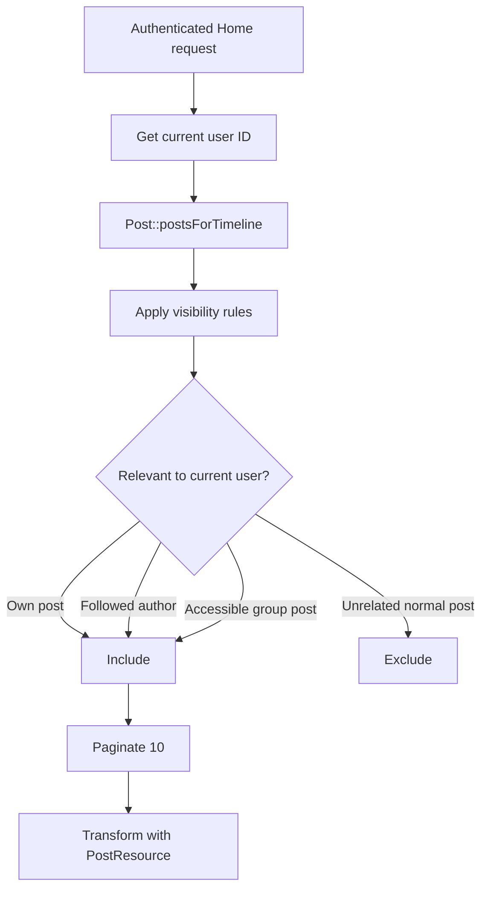
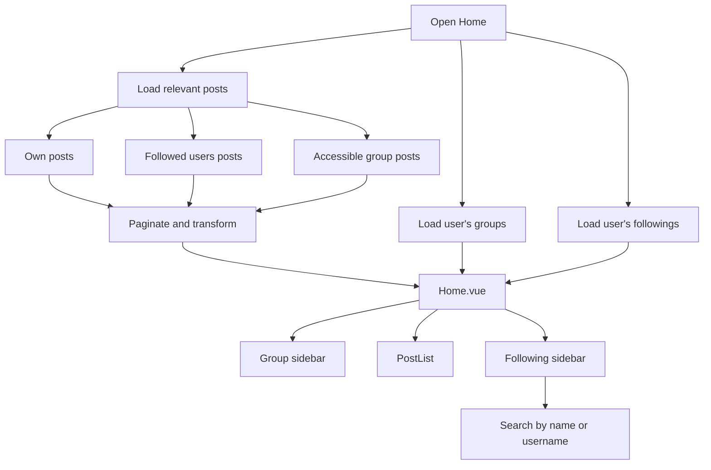

# Personalized Home Feed Flow

## Overview

Poet-Web personalizes the authenticated Home timeline so users mainly see content that is relevant to them.

The Home feed contains:

```text
the authenticated user's own posts
posts from users they follow
posts from groups where they are an approved member
```

Normal posts from unrelated users are excluded.

The Home page also displays the authenticated user's real Following list instead of placeholder users.

---

## Main Files

The personalized Home feed is implemented through:

```text
app/Http/Controllers/HomeController.php
app/Models/Post.php
app/Models/User.php
app/Http/Resources/PostResource.php
app/Http/Resources/UserResource.php
resources/js/Pages/Home.vue
resources/js/Components/app/FollowingList.vue
resources/js/Components/app/FollowingListItems.vue
resources/js/Components/app/UserListItem.vue
```

Post-publication notifications are connected through:

```text
app/Http/Controllers/PostController.php
app/Notifications/PostCreated.php
```

---

## Relevant Home Posts

`HomeController::index()` starts with:

```php
Post::postsForTimeline($userId)
```

This shared query already applies the normal post visibility rules, including approved group membership for group posts.

The Home controller then adds a relevance filter.

A post is included when at least one of these conditions is true:

```text
posts.user_id = current user ID

OR

posts.group_id is not null

OR

posts.user_id belongs to someone the current user follows
```

Because this filtering is applied after `postsForTimeline()`, a group post is only available when the current user is already allowed to see that group content.

---

## Home Feed Rules

### Own Posts

The authenticated user's own posts remain visible in their Home feed.

```text
post.user_id = current user
→ include
```

### Followed Users

For normal posts, Poet-Web checks the `followers` table.

The current user is a follower when:

```text
followers.follower_id = current user ID
```

The corresponding:

```text
followers.user_id
```

values identify the users whose normal posts are relevant to the current user.

### Group Posts

Group posts are included by the Home relevance filter, but `Post::postsForTimeline()` still controls whether the viewer is allowed to see them.

Therefore:

```text
approved group member
→ group post can appear

not approved / not a member
→ group post is excluded before Home relevance filtering
```

---

## Feed Query Flow



---

## Pagination and Infinite Scrolling

The personalized feed remains paginated with:

```text
paginate(10)
```

and preserves query parameters with:

```text
withQueryString()
```

After pagination, posts are transformed using:

```text
PostResource
```

For a normal Inertia page request, the controller continues loading groups and followings before rendering `Home.vue`.

For an infinite-scroll request with:

```http
Accept: application/json
```

the controller returns only the paginated post resource collection:

```php
if ($request->wantsJson()) {
    return $posts;
}
```

This allows the existing `PostList.vue` infinite-scroll implementation to continue working with the personalized feed.

---

## User Relationships

The `User` model exposes two self-referencing many-to-many relationships.

### Followers

```php
$user->followers()
```

returns users who follow that user.

Relationship direction:

```text
user_id
→ user being followed

follower_id
→ follower
```

### Followings

```php
$user->followings()
```

returns users that the user follows.

These relationships are reused by profile pages, the Home sidebar, and post-created notifications.

---

## Following Sidebar

The Home controller loads:

```php
$request->user()
    ->followings()
    ->orderBy('users.name')
    ->get();
```

The result is transformed with:

```text
UserResource
```

and passed to `Home.vue` as:

```text
followings
```

`Home.vue` passes the users into:

```text
FollowingList.vue
```

which forwards them to:

```text
FollowingListItems.vue
```

---

## Following Search

`FollowingListItems.vue` contains a local search field.

The typed keyword is normalized with:

```text
trim
lowercase
```

and users are filtered by:

```text
name
OR
username
```

The component therefore supports:

```text
empty keyword
→ show all followed users

matching keyword
→ show matching users

no match
→ show "No users found."

no followings
→ show "You are not following anyone yet."
```

Each result is displayed with `UserListItem.vue`, so clicking the user opens their profile.

---

## New Public Post Notifications

When a post is successfully created, file storage and database changes are completed inside the transaction first.

After the transaction succeeds, `PostController::store()` checks whether the post belongs to a group.

### Normal Post

If the post does not belong to a group:

```text
load author's followers
→ send PostCreated
```

Every follower receives an email announcing the author's new post.

The email links directly to:

```text
post.view
```

### Group Post

If the post belongs to a group:

```text
load approved group members
→ exclude post author
→ send PostCreated
```

Ordinary followers are not used as recipients for group posts.

This keeps group-post notification recipients aligned with group membership.

---

## Notification Timing

Post-created notifications are sent after:

```text
DB::commit()
```

and after the transaction error-handling block.

The transaction is therefore responsible only for:

```text
creating the post
storing attachment records
committing database changes
cleaning failed uploads on exception
```

Notification delivery happens after successful persistence.

---

## Complete Home Flow



---

## Example

Assume:

```text
User A follows User B
User A does not follow User C
User A is an approved member of Group X
```

Then User A's Home feed can contain:

```text
User A's own normal posts
User B's normal posts
posts from Group X that pass group visibility rules
```

It does not include User C's unrelated normal posts.

---

## Result

The Home page now acts as a personalized social feed rather than a global public timeline.

```text
current user
    ↓
own posts
+ followed users
+ approved groups
    ↓
paginated personalized timeline
```

The same follow relationships also drive the real Following sidebar and follower notifications for newly published normal posts.
