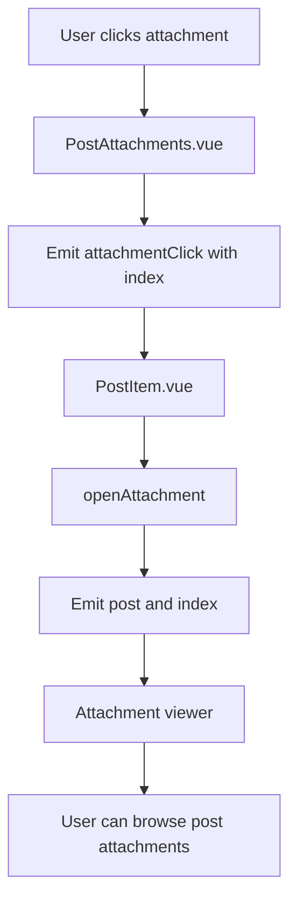

# Post Attachments Display Flow

## Overview

Poet-Web uses a dedicated `PostAttachments.vue` component to display files attached to posts.

Attachment rendering was previously handled directly inside `PostItem.vue`.

It was extracted into a separate component to reduce the responsibilities of `PostItem.vue` and keep attachment-specific rendering logic in one place.

The component supports:

- image previews;
- non-image file previews;
- attachment downloads;
- opening attachments in the existing attachment viewer;
- displaying a maximum of four attachments in the post feed;
- displaying a `+X more` overlay when a post contains more than four attachments.

---

## Component Structure

The attachment component is located at:

```text
resources/js/Components/app/PostAttachments.vue
```

`PostItem.vue` passes the post attachments to the component:

```vue
<PostAttachments
    :attachments="post.attachments"
    @attachmentClick="openAttachment"
/>
```

This creates the following component relationship:

```text
PostItem.vue
    |
    +-- PostAttachments.vue
            |
            +-- image preview
            +-- file preview
            +-- download action
            +-- attachment click
```

---

## Attachment Data

`PostAttachments.vue` receives attachments through a Vue prop:

```text
attachments
```

Each attachment may contain information such as:

```text
id
name
url
mime
size
```

The full attachment collection is still passed to the component even though only four attachments are displayed in the feed.

---

## Maximum Visible Attachments

The component only renders the first four attachments:

```js
attachments.slice(0, 4)
```

This prevents posts with many uploaded files from becoming excessively large in the feed.

For example, a post with seven attachments still contains all seven attachments, but only four are shown directly.

```text
Attachment 1
Attachment 2
Attachment 3
Attachment 4
Attachment 5
Attachment 6
Attachment 7
```

Feed preview:

```text
[ 1 ] [ 2 ]
[ 3 ] [ +3 more ]
```

The remaining attachments are not removed from the post.

They are only hidden from the initial feed preview.

---

## Remaining Attachment Indicator

When a post has more than four attachments, the fourth attachment displays an overlay.

For example:

```text
+3 more
```

The number is calculated using:

```text
attachments.length - 4
```

Examples:

```text
5 attachments -> +1 more
6 attachments -> +2 more
8 attachments -> +4 more
```

The overlay provides a compact indication that additional attachments are available.

---

## Attachment Grid

The attachment grid changes depending on the number of attachments.

A post containing one attachment can use a single-column layout:

```text
[        Attachment 1        ]
```

Posts containing multiple attachments use two columns:

```text
[ Attachment 1 ] [ Attachment 2 ]
[ Attachment 3 ] [ Attachment 4 ]
```

This creates a predictable feed layout even when many attachments exist.

---

## Image Detection

The component uses the existing:

```text
isImage()
```

helper.

If the attachment is an image, its URL is displayed as an image preview.

Conceptually:

```text
attachment
    |
    +-- image?
           |
           +-- yes -> render image preview
           |
           +-- no -> render generic file preview
```

---

## Non-Image Attachments

Files that are not images display:

- a file/paperclip icon;
- the original attachment name.

For example:

```text
📎
qualification-document.pdf
```

This allows documents and other supported attachment types to remain visible even when they cannot be displayed directly as images.

---

## Downloading Attachments

Each visible attachment contains a download action.

The download link uses the existing route:

```text
post.download
```

and passes the attachment ID.

Conceptually:

```text
User clicks download
        |
        v
post.download
        |
        v
Laravel download endpoint
        |
        v
File returned to user
```

The download button stops the click event from propagating to the attachment viewer.

This means clicking the download button downloads the file instead of opening it.

---

## Opening an Attachment

When the user clicks an attachment, `PostAttachments.vue` emits:

```text
attachmentClick
```

with the attachment index.

Example:

```text
attachmentClick(2)
```

means the third attachment was selected.

`PostItem.vue` receives the event using:

```vue
@attachmentClick="openAttachment"
```

The existing `openAttachment()` function then emits the selected post and attachment index to the parent component.

---

## Attachment Viewer Flow

The attachment click flow is:



Although only four attachments are shown in the feed, the original post still contains the complete attachment array.

This allows the attachment viewer to access attachments that are not directly visible in the post preview.

---

## Responsibilities

### `PostItem.vue`

Responsible for:

```text
post content
post reactions
comments
post controls
passing attachment data
handling attachment viewer events
```

### `PostAttachments.vue`

Responsible for:

```text
attachment preview layout
image detection
file previews
download buttons
visible attachment limit
+X more indicator
attachment click events
```

Separating these responsibilities keeps each component focused on a smaller part of the interface.

---

## Before Refactoring

Previously:

```text
PostItem.vue
    |
    +-- post content
    +-- reactions
    +-- comments
    +-- attachment loop
    +-- image detection
    +-- file icons
    +-- download links
    +-- attachment click handling
```

Attachment-related markup was directly embedded inside the already large post component.

---

## After Refactoring

Now:

```text
PostItem.vue
    |
    +-- post content
    +-- reactions
    +-- comments
    |
    +-- PostAttachments.vue
            |
            +-- previews
            +-- downloads
            +-- visible limit
            +-- +X more overlay
```

This reduces duplication and makes future attachment changes easier to implement without modifying the main post component.

---

## Main Files

### `resources/js/Components/app/PostAttachments.vue`

Responsible for rendering attachments, limiting the visible preview to four files, displaying the remaining attachment count, and emitting attachment click events.

### `resources/js/Components/app/PostItem.vue`

Passes attachment data to `PostAttachments.vue` and connects attachment selection to the existing attachment viewer.

### `resources/js/helpers.js`

Provides the `isImage()` helper used to determine whether an attachment should be rendered as an image.

---

## Result

After this refactor:

1. attachment rendering is separated from `PostItem.vue`;
2. posts display at most four attachment previews;
3. posts with additional files display a `+X more` indicator;
4. images continue to display as previews;
5. non-image files continue to display with file information;
6. visible attachments can still be downloaded;
7. attachment clicks continue to open the existing viewer;
8. the complete attachment collection remains available even when only four files are shown in the feed.

The result is a smaller `PostItem.vue` component and a more compact attachment layout for posts containing many files.