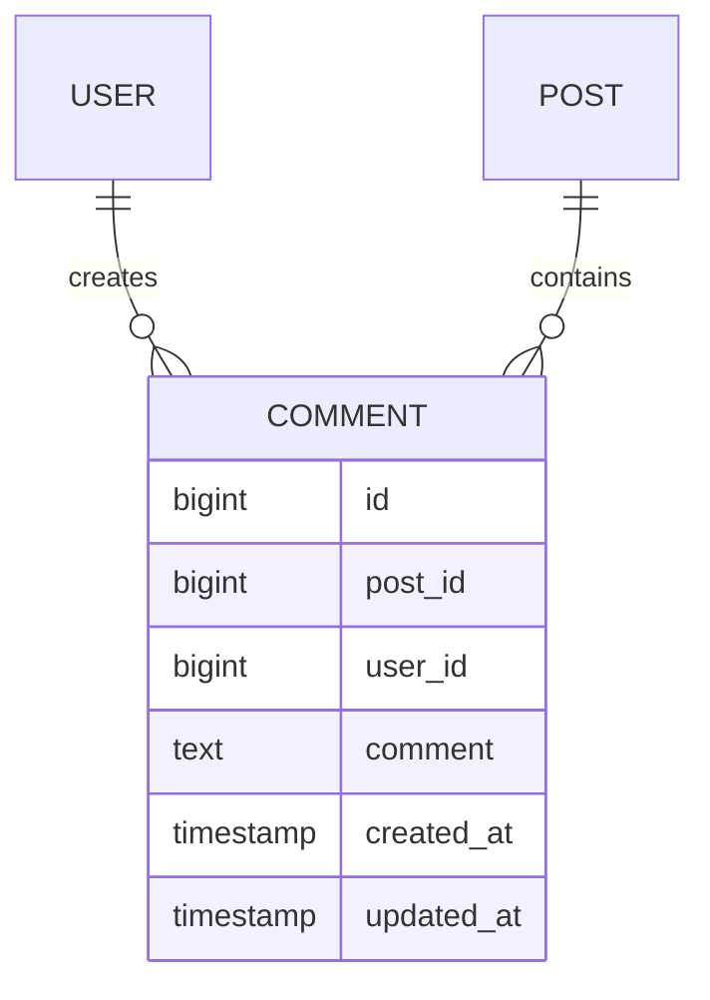
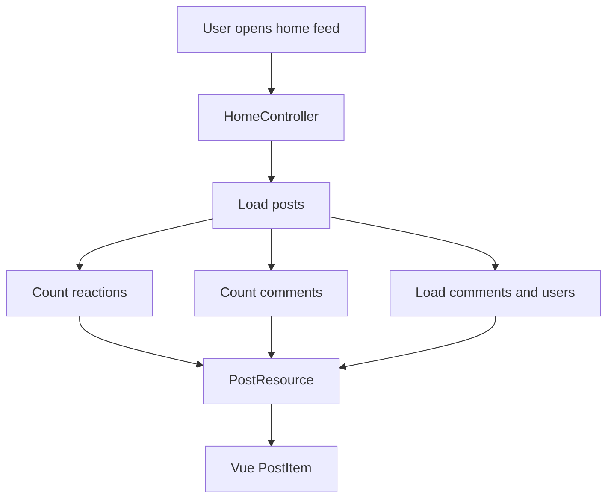
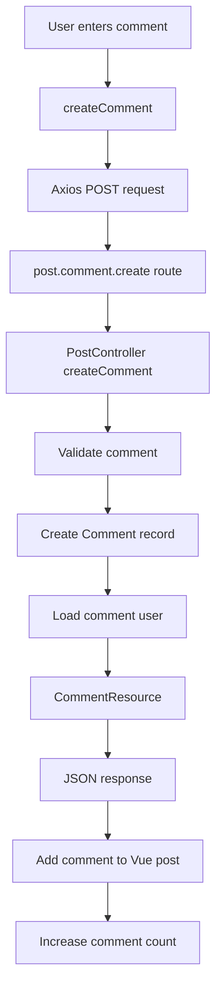
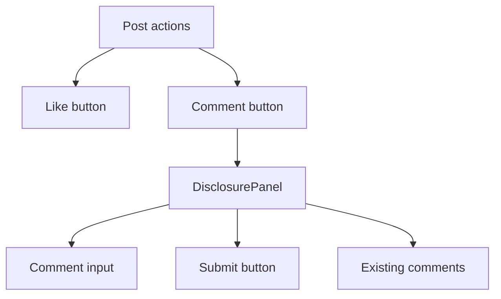

# Post Comments Flow

## Overview

Poet-Web allows authenticated users to comment on posts directly from the post feed.

Comments are loaded together with posts, displayed inside an expandable comment section, and new comments are submitted asynchronously without reloading the page.

Each comment belongs to:

- one post;
- one user.

A post can contain multiple comments.

---

## Data relationships



The `comments` table stores the comment text together with references to the post and user.

The `Comment` model defines the corresponding `user()` and `post()` relationships.

The `Post` model defines a `comments()` relationship for retrieving comments belonging to a post.

---

## Loading comments

When the home feed is requested, `HomeController` loads the posts together with:

- the total reaction count;
- the authenticated user's reaction;
- the total comment count;
- the comments belonging to each post;
- the user belonging to each comment.



`PostResource` exposes the comment information to Vue using:

- `num_of_comments`;
- `comments`.

Each comment is transformed through `CommentResource`.

---

## Creating a comment

The comment form is located inside `PostItem.vue`.

The user opens the comment section, enters text, and submits the comment.



The route used for comment creation is:

```text
POST /posts/{post}/comment
```

The route uses Laravel route model binding to resolve `{post}` into the corresponding `Post` model.

---

## Validation

Comment creation validates that the submitted value:

- is present;
- is a string;
- does not exceed the configured maximum comment length.

Empty comments are also prevented on the frontend before the request is sent.

The frontend disables repeated submissions while a comment request is already processing.

---

## Immediate UI update

After Laravel creates the comment, the server returns the newly created comment through `CommentResource`.

Vue then adds the returned comment to the beginning of the post's comment array:

```text
post.comments.unshift(newComment)
```

and increases:

```text
post.num_of_comments
```

This means the new comment appears immediately without refreshing or reloading the home feed.

---

## Comment panel

The Like and Comment controls are contained inside a Headless UI `Disclosure`.

The Like button remains an independent action.

The Comment button acts as the `DisclosureButton`, while the comment input and existing comment list are contained inside the `DisclosurePanel`.



---

## Main responsibilities

### `Comment.php`

Represents a comment stored in the database and defines its relationships with the post and user.

### `Post.php`

Provides the `comments()` relationship used to retrieve comments belonging to the post.

### `HomeController.php`

Loads comment counts and comment data for posts displayed in the feed.

### `PostController.php`

Validates and creates new comments.

### `CommentResource.php`

Defines the comment data returned to the frontend, including information about the comment author.

### `PostResource.php`

Includes the number of comments and the comment collection in each serialized post.

### `PostItem.vue`

Displays the comment count, opens and closes the comment section, submits comments asynchronously, and immediately inserts newly created comments into the interface.

### `web.php`

Defines the authenticated endpoint used to create comments.

---

## Result

The comment system allows an authenticated user to:

1. see the number of comments on a post;
2. open the post's comment section;
3. view existing comments;
4. write a new comment;
5. submit it without refreshing the page;
6. immediately see the new comment and updated comment count.