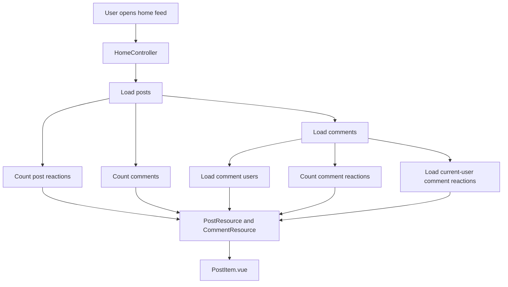
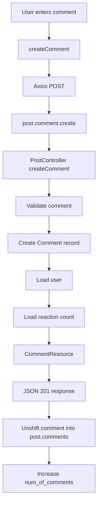
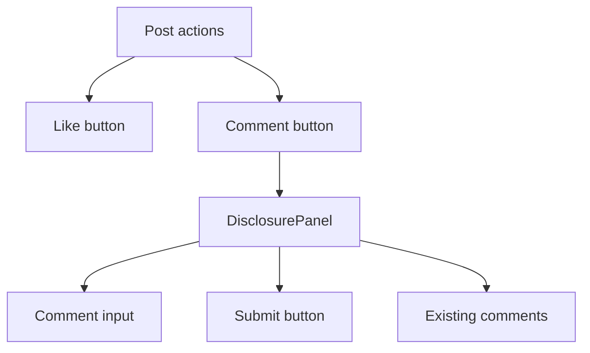

# Post Comments Flow

## Overview

Poet-Web allows authenticated users to comment on posts directly from the post feed.

Comments are loaded together with posts, displayed inside an expandable comment section, and created asynchronously without reloading the page.

Each current top-level comment belongs to:

- one post;
- one user.

The `comments` table also contains a nullable `parent_id` column that references another comment. This prepares the database for threaded replies, but reply creation and nested reply rendering are not implemented yet.

---

## Data Relationships

```mermaid
erDiagram
    USER ||--o{ COMMENT : creates
    POST ||--o{ COMMENT : contains
    COMMENT ||--o{ COMMENT : parent_of

    COMMENT {
        bigint id
        bigint parent_id nullable
        bigint post_id
        bigint user_id
        text comment
        timestamp created_at
        timestamp updated_at
    }
```

The current `Comment` model defines:

```text
user()
post()
reactions()
```

The database is already capable of storing a parent comment ID, but `parent()` / `replies()` Eloquent relationships have not been added yet.

The `Post` model defines `comments()` for retrieving comments belonging to a post.

---

## Loading Comments

When the home feed is requested, `HomeController` loads posts together with:

- total post reaction count;
- the authenticated user's post reaction;
- total comment count;
- comments belonging to each post;
- the author of each comment;
- total reaction count for each comment;
- the authenticated user's reaction on each comment.


```mermaid
flowchart TD
    A[User opens home feed]
    B[HomeController]
    C[Load posts]
    D[Count post reactions]
    E[Count comments]
    F[Load comments]
    G[Load comment users]
    H[Count comment reactions]
    I[Load current-user comment reactions]
    J[PostResource and CommentResource]
    K[PostItem.vue]

    A --> B
    B --> C
    C --> D
    C --> E
    C --> F
    F --> G
    F --> H
    F --> I
    D --> J
    E --> J
    G --> J
    H --> J
    I --> J
    J --> K
```

`PostResource` exposes:

```text
num_of_comments
comments
```

Each comment is transformed through `CommentResource`.

---

## Creating a Comment

The comment form is located inside `PostItem.vue`.

When the user submits a comment, Vue sends:

```text
POST /posts/{post}/comments
```

The route is named:

```text
post.comment.create
```

Laravel route model binding resolves `{post}` into the corresponding `Post` model.

### Request Flow


```mermaid
flowchart TD
    A[User enters comment]
    B[createComment]
    C[Axios POST]
    D[post.comment.create]
    E[PostController createComment]
    F[Validate comment]
    G[Create Comment record]
    H[Load user]
    I[Load reaction count]
    J[CommentResource]
    K[JSON 201 response]
    L[Unshift comment into post.comments]
    M[Increase num_of_comments]

    A --> B
    B --> C
    C --> D
    D --> E
    E --> F
    F --> G
    G --> H
    H --> I
    I --> J
    J --> K
    K --> L
    L --> M
```

---

## Validation

Comment creation currently requires:

```text
required
string
max:2000
```

The frontend also prevents submission when the trimmed comment is empty.

While a create request is in progress, `commentPending` prevents repeated submissions.

---

## Immediate UI Update

After Laravel creates the comment, the controller returns a `CommentResource` response with HTTP status `201`.

Vue inserts the returned comment at the beginning of the comment collection:

```js
props.post.comments.unshift(data);
```

and increments:

```js
props.post.num_of_comments++;
```

No page reload is required.

---

## Comment Reaction State

New and loaded comments include:

```text
num_of_reactions
current_user_has_reaction
```

A newly created comment has no reactions, so its reaction count is normally `0` and the authenticated-user state is false.

Existing comments load both the total reaction count and the authenticated user's filtered reaction relationship.

See: [Reaction system flow](reaction-system-flow.md)

---

## Comment Panel

The Like and Comment controls are contained inside a Headless UI `Disclosure`.

The post Like button remains an independent action.

The Comment button is the `DisclosureButton`, while the comment form and comment list are rendered inside the `DisclosurePanel`.


```mermaid
flowchart TD
    A[Post actions]
    B[Like button]
    C[Comment button]
    D[DisclosurePanel]
    E[Comment input]
    F[Submit button]
    G[Existing comments]

    A --> B
    A --> C
    C --> D
    D --> E
    D --> F
    D --> G
```

---

## Parent Comment Support

The migration adds:

```text
parent_id
```

as a nullable self-referencing foreign key:

```text
comments.parent_id -> comments.id
```

Top-level comments use:

```text
parent_id = null
```

A future reply could use:

```text
parent_id = ID of another comment
```

The foreign key uses cascade deletion, so if a parent comment is physically removed from the database, dependent replies cannot remain orphaned.

At the current stage, this is database preparation only. Poet-Web does not yet submit `parent_id` from the frontend and does not render nested replies.

---

## Main Responsibilities

### `Comment.php`

Represents comments and currently defines user, post, and polymorphic reaction relationships.

### `Post.php`

Defines `comments()` and retrieves comments newest first.

### `HomeController.php`

Loads comment counts, comment authors, and comment reaction state for the feed.

### `PostController.php`

Creates, updates, deletes, and reacts to comments.

### `CommentResource.php`

Returns comment text, timestamps, author data, reaction count, and authenticated-user reaction state.

### `PostResource.php`

Includes the comment count and serialized comment collection in each post.

### `PostItem.vue`

Displays comments, creates comments asynchronously, handles editing/deleting, and provides comment reaction controls.

### `web.php`

Defines authenticated create, update, delete, and reaction endpoints for comments.

---

## Current Result

Authenticated users can currently:

1. see the number of comments on a post;
2. open the comment section;
3. view existing comments;
4. create a comment;
5. immediately see the new comment without refreshing;
6. edit their own comments;
7. delete their own comments;
8. like and unlike comments.

The database is also prepared for future threaded replies through `parent_id`, but the reply feature itself is not yet implemented.
