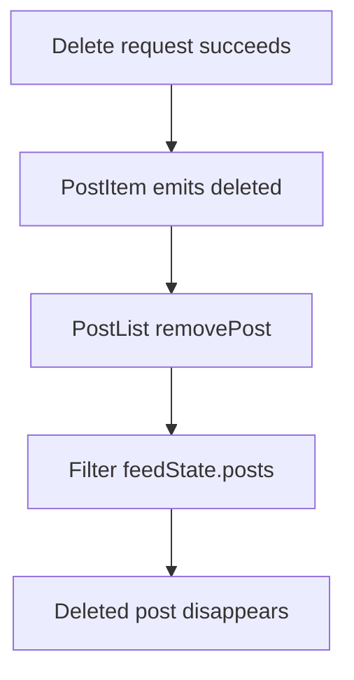
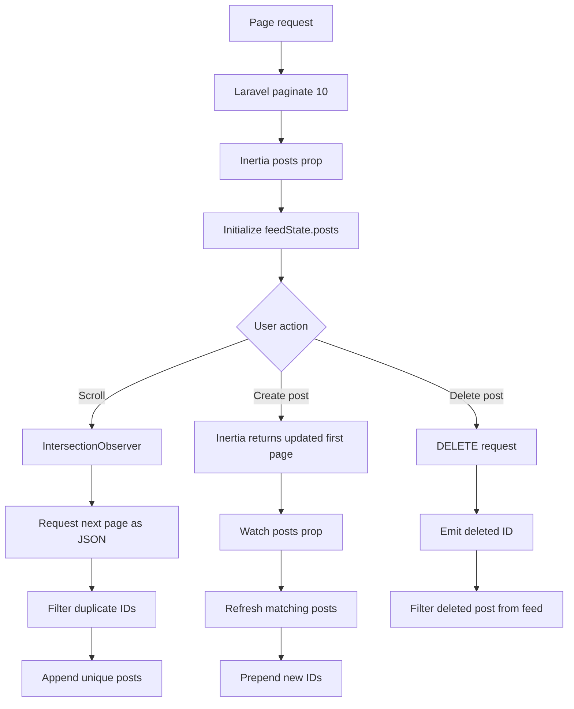

# Post Load More Flow

## Overview

Poet-Web uses automatic incremental loading for both the Home feed and group post feeds.

Laravel returns a paginated post collection. The first page is delivered through Inertia, while later pages are requested as JSON when the user approaches the bottom of the current feed.

```text
Initial request
↓
Laravel pagination
↓
First page through Inertia
↓
PostList.vue
↓
IntersectionObserver
↓
JSON request for next page
↓
Append unique posts
```

---

## Backend Pagination

The shared post query is ordered newest first and paginated with:

```text
paginate(10)
```

The Home feed uses `HomeController`.

Group feeds use `GroupController`, which additionally limits posts to the current group and verifies approved membership.

Each post is serialized through `PostResource`.

---

## Initial Paginator

The `posts` prop contains the standard Laravel paginator resource structure:

```text
posts
├── data
├── links
│   ├── first
│   ├── last
│   ├── prev
│   └── next
└── meta
```

`data` contains the current page.

`links.next` contains the URL used to fetch the next page.

---

## Reactive Local Feed State

`PostList.vue` stores visible feed state with Vue `reactive()`:

```js
const feedState = reactive({
    posts: [...(props.posts.data ?? [])],
    nextPageUrl: props.posts.links?.next ?? null,
    loadedBeyondFirstPage: false
});
```

The complete post array is not persisted with Inertia `useRemember()`.

This avoids restoring stale post data after an Inertia redirect.

---

## Synchronizing New and Updated First-Page Posts

`PostList.vue` watches the incoming `posts` prop.

When Inertia supplies new page data, the component:

```text
builds a map of incoming posts by ID
        ↓
replaces matching posts already in feedState.posts
        ↓
finds IDs that are not yet present
        ↓
prepends newly-created posts
```

This lets a newly-published post appear immediately after the create request completes.

The same synchronization is used by the Home feed and group feeds.

---

## Loading Additional Pages

`loadMore()` first checks:

```text
feedState.nextPageUrl exists
AND
loadingMore is false
```

It then requests the URL with:

```http
Accept: application/json
```

The returned post IDs are compared with IDs already stored in `feedState.posts`.

Only posts that are not already present are appended.

```text
existing IDs
    +
next page response
    ↓
filter duplicates
    ↓
feedState.posts.push(...)
```

After the request:

```text
feedState.nextPageUrl = response.links.next
feedState.loadedBeyondFirstPage = true
```

---

## Intersection Observer

A small marker is rendered after the post list.

`IntersectionObserver` watches that marker relative to the feed's scroll container.

The observer uses a bottom `rootMargin` so loading can begin shortly before the user reaches the actual end.

```text
posts
posts
posts
[observer marker]
```

When the marker becomes visible, `loadMore()` is called.

---

## Duplicate Request Protection

`loadingMore` prevents simultaneous load-more requests.

Returned posts are also filtered by ID before being appended.

These two checks prevent duplicate requests and duplicate visible posts.

---

## Pagination State After Inertia Updates

The first-page prop can change after actions such as creating or editing a post.

When no later page has been loaded yet, `PostList.vue` refreshes:

```text
feedState.nextPageUrl
```

from the latest incoming paginator.

Once later pages have been loaded, the component keeps the existing pagination state instead of replacing the extended feed with only the new first page.

---

## Deleting a Post From Local State

Post deletion uses a separate explicit synchronization step.

After `PostItem.vue` receives a successful response from the delete route, it emits:

```text
deleted(post.id)
```

`PostList.vue` handles this through:

```text
removePost(postId)
```

which filters the deleted ID out of `feedState.posts`.



This prevents soft-deleted posts from remaining visible and later causing 404 responses if the user tries to edit or delete them again.

---

## End of Feed

When Laravel returns:

```text
links.next = null
```

the component stores:

```text
feedState.nextPageUrl = null
```

and no further pagination request is made.

---

## Component Responsibilities

### HomeController.php

```text
load timeline posts
paginate first and later pages
return Inertia for normal request
return JSON for pagination request
```

### GroupController.php

```text
verify approved membership
load current group's posts
paginate first and later pages
return JSON for group pagination requests
```

### PostList.vue

```text
maintain reactive feedState
synchronize incoming first-page posts
prepend newly-created posts
track next page URL
load additional pages
prevent duplicate posts
remove successfully deleted posts
render PostItem components
```

### PostItem.vue

```text
render individual post
request post deletion
emit deleted post ID after successful deletion
```

---

## Complete Feed Flow



---

## Result

Poet-Web loads only the first page initially and fetches additional posts when needed.

The current feed implementation also keeps local reactive state synchronized with newly-created posts and successful deletions, avoiding both unnecessary full-page refreshes and stale soft-deleted post entries.
