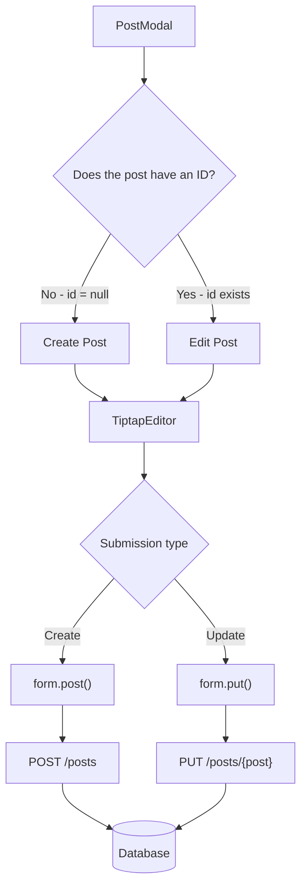

# Post creation and editing flow

`PostModal` is reused for both creating and editing posts.

The presence of a post ID determines which operation is performed.

## Purpose

Instead of maintaining separate editors for post creation and post editing,
Poet-Web uses one reusable `PostModal` component and one `TiptapEditor`.

When `post.id` is `null`, the modal creates a new post using a POST request.

When `post.id` exists, the modal updates that post using a PUT request.