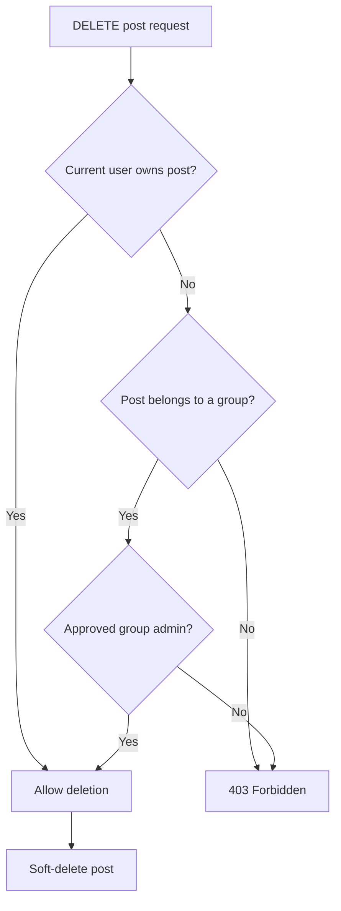
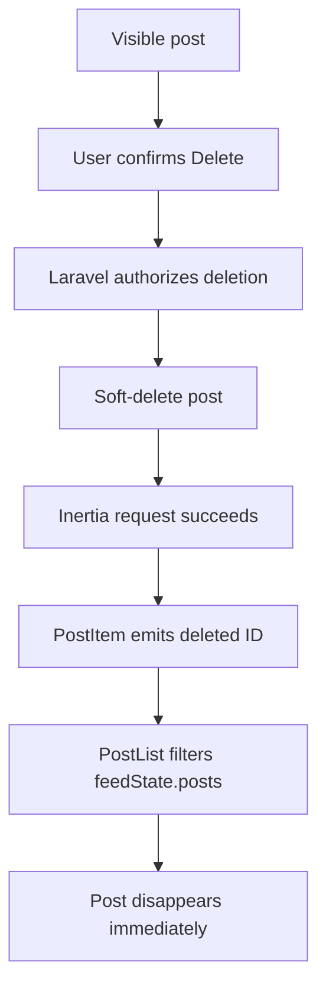
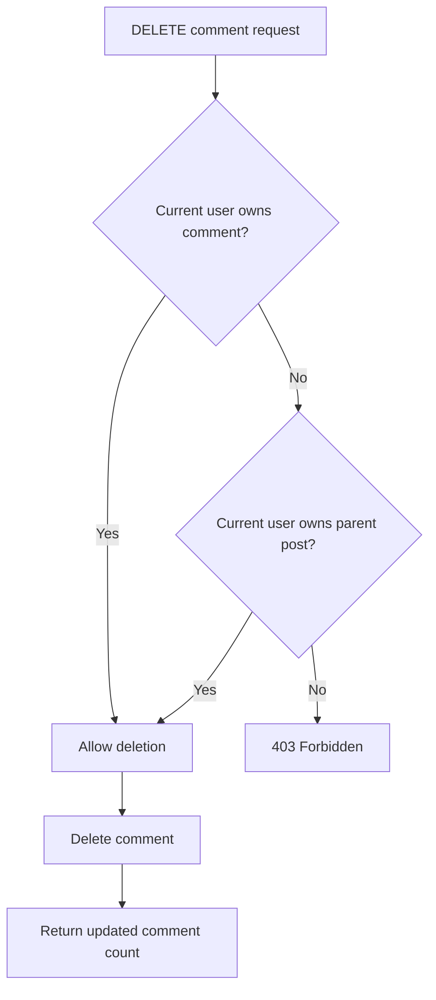
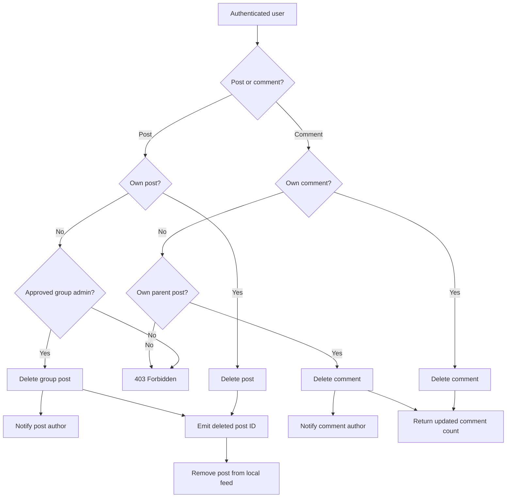

# Post and Comment Moderation Flow

## Overview

Poet-Web provides ownership and moderation rules for posts and comments.

The system allows:

- post authors to edit and delete their own posts;
- approved group administrators to delete posts published by other users inside their groups;
- comment authors to edit and delete their own comments;
- post authors to delete comments published on their posts;
- affected users to receive email notifications when their content is removed by another authorized user.

Moderation permissions do not grant editing rights.

A group administrator may delete another user's group post, but may not edit it. A post owner may delete another user's comment on their post, but may not edit that comment.

---

## Main Files

```text
app/Http/Controllers/PostController.php
app/Http/Resources/PostResource.php
app/Models/Group.php
app/Notifications/PostDeleted.php
app/Notifications/CommentDeleted.php
resources/js/Components/app/EditDeleteDropdown.vue
resources/js/Components/app/PostItem.vue
resources/js/Components/app/PostList.vue
resources/js/Components/app/CommentList.vue
```

---

## Post Deletion Authorization

A post may be deleted when the authenticated user is either:

```text
post owner
OR
approved administrator of the post's group
```

The backend checks both conditions in `PostController::destroy()`.



The group-admin check uses:

```php
$group->isAdmin($userId)
```

which requires an approved membership with the `admin` role.

---

## Backend-Calculated Delete Permission

`PostResource` exposes:

```json
{
    "can_delete": true
}
```

The value is calculated from the authenticated user and is true when the user owns the post or is an approved administrator of its group.

The frontend uses this value to decide whether a delete action should be displayed for a post.

The backend still repeats the authorization check when the actual DELETE request is sent. The frontend is therefore not the security boundary.

---

## Edit and Delete Controls

`EditDeleteDropdown.vue` receives:

```text
user
post
comment
```

and calculates separate edit and delete permissions.

The authenticated user is read reactively from Inertia page props through `usePage()`.

```text
editAllowed
deleteAllowed
showMenu
```

The intended behavior is:

| Situation | Edit | Delete |
|---|---:|---:|
| Own normal post | Yes | Yes |
| Own group post | Yes | Yes |
| Another user's group post as approved group admin | No | Yes |
| Another user's group post as regular member | No | No |
| Another user's normal post | No | No |
| Own comment | Yes | Yes |
| Another user's comment on own post | No | Yes |
| Another user's comment on another post | No | No |

---

## Post Removal Notification

If a user deletes their own post, no moderation notification is sent.

If a group administrator deletes another user's group post:

```text
group administrator
        ↓
deletes member post
        ↓
PostDeleted notification
        ↓
post author receives email
```

The notification contains the group name and links back to the group profile.

---

## Removing Deleted Posts From the Local Feed

Posts use Laravel soft deletion.

After the backend successfully deletes a post, `PostItem.vue` emits a `deleted` event containing the post ID.

```text
PostItem
    ↓
DELETE request succeeds
    ↓
emit deleted(post.id)
    ↓
PostList
    ↓
removePost(post.id)
    ↓
feedState.posts filters out the deleted ID
```

This keeps the visible feed synchronized with backend state.

Without this step, a soft-deleted post could remain visible in the local array. A later edit or delete attempt would target a post that Laravel route-model binding no longer resolves, producing a 404.



---

## Comment Deletion

A comment may be deleted by either:

1. the comment author;
2. the owner of the post containing the comment.

An unrelated user cannot delete the comment.



The response includes the current comment count so the frontend can update the post without a page refresh.

---

## Comment Removal Notification

A user deleting their own comment does not receive a notification.

When a post owner deletes another user's comment:

```text
post owner
    ↓
deletes another user's comment
    ↓
CommentDeleted notification
    ↓
comment author receives email
```

For a group post, the notification links to the group. For a normal timeline post, it links to the dashboard.

---

## Component Integration

### PostItem.vue

```vue
<EditDeleteDropdown
    :user="post.user"
    :post="post"
/>
```

The post component also emits `deleted` after a successful delete request.

### PostList.vue

`PostList.vue` listens for the delete event and removes the post from reactive local state.

### CommentList.vue

```vue
<EditDeleteDropdown
    :user="comment.user"
    :post="post"
    :comment="comment"
/>
```

This gives the dropdown enough context to distinguish between the comment author, post owner, and unrelated users.

---

## Security Layers

```text
frontend visibility rules
        ↓
backend ownership check
        ↓
group admin check when applicable
        ↓
Laravel model binding
        ↓
soft deletion
        ↓
notification when another user removed the content
```

Hiding a button is only a user-interface decision. Authorization is enforced in Laravel.

---

## Complete Moderation Flow



---

## Result

The moderation system separates content ownership from moderation authority.

Post and comment authors retain control over their own content, group administrators can moderate posts inside their groups without receiving edit rights, and post owners can moderate comments on their own posts.

Successful post deletions are also reflected immediately in the reactive feed so deleted records do not remain as stale UI entries.
