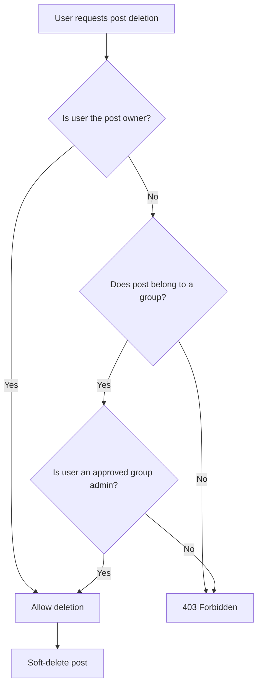
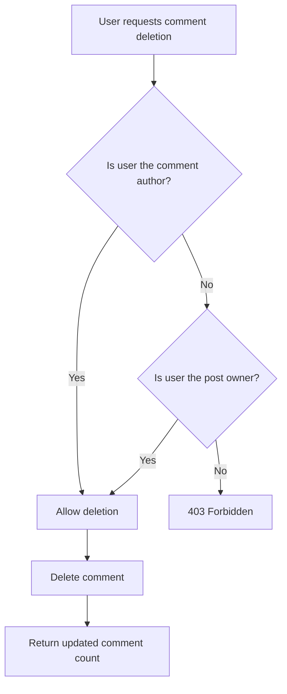
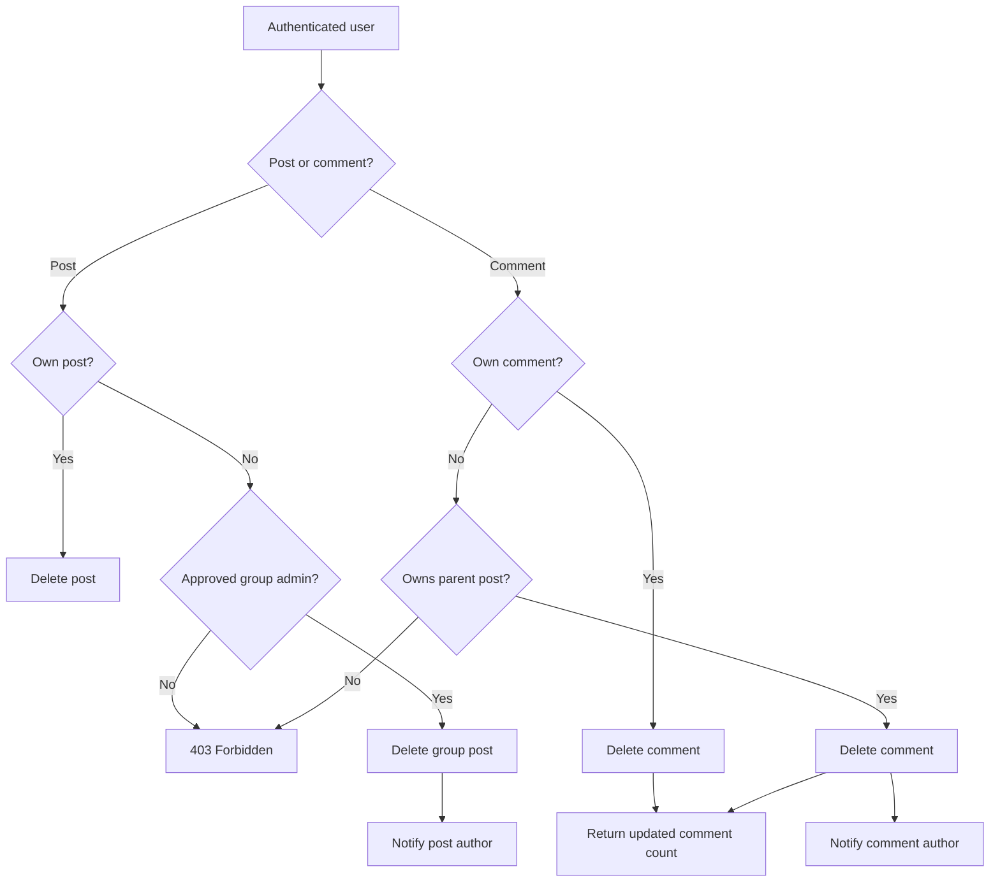

# Post and Comment Moderation Flow

## Overview

Poet-Web provides moderation rules for posts and comments.

The system allows:

- post authors to delete their own posts;
- approved group administrators to delete posts published inside their groups;
- comment authors to delete their own comments;
- post authors to delete comments published on their posts;
- affected users to receive email notifications when their content is removed by another user.

Editing permissions are not expanded by moderation permissions.

A group administrator may therefore delete another user's group post, but may
not edit that post.

Likewise, a post owner may delete another user's comment on their post, but may
not edit that comment.

---

## Main Files

The moderation functionality is implemented mainly in:

```text
app/Http/Controllers/PostController.php
app/Http/Resources/PostResource.php

app/Notifications/PostDeleted.php
app/Notifications/CommentDeleted.php

resources/js/Components/app/EditDeleteDropdown.vue
resources/js/Components/app/PostItem.vue
resources/js/Components/app/CommentList.vue
```

Existing group authorization is also used through:

```text
app/Models/Group.php
```

---

# Post Deletion

## Post Owner

A user may always delete a post that they created.

The backend verifies this using the authenticated user ID and the `user_id`
stored on the post.

```text
authenticated user
        |
        v
post.user_id == user.id
        |
       yes
        |
        v
post may be deleted
```

---

## Group Administrator

Posts associated with a group may additionally be deleted by an approved group
administrator.

The permission is checked through:

```php
$group->isAdmin($userId)
```

The `isAdmin()` method verifies that the user has:

- an existing group membership;
- the `admin` role;
- the `approved` membership status.

This check is performed on the backend and does not rely on frontend data.

---

## Post Deletion Permission Flow



Posts use Laravel soft deletion, therefore the record is not immediately
permanently removed from the database.

---

# Post Removal Notification

If the post author deletes their own post, no moderation notification is sent.

If a group administrator deletes another user's post:

```text
group administrator
        |
        v
deletes member post
        |
        v
PostDeleted notification
        |
        v
post author receives email
```

The notification contains the group name and provides a link back to the group
profile.

The implementation is located in:

```text
app/Notifications/PostDeleted.php
```

---

# Comment Deletion

A comment may be deleted by either:

1. the author of the comment;
2. the owner of the post containing the comment.

A different unrelated user cannot delete the comment.

---

## Comment Permission Flow



The backend returns the current number of comments after deletion so that the
frontend can update the displayed post comment count without requiring a page
refresh.

---

# Comment Removal Notification

A user deleting their own comment does not receive a notification.

When the post owner deletes another user's comment:

```text
post owner
    |
    v
deletes another user's comment
    |
    v
CommentDeleted notification
    |
    v
comment author receives email
```

The notification includes a shortened version of the removed comment.

For a group post, the notification links back to the group.

For a normal timeline post, it links back to the dashboard.

The implementation is located in:

```text
app/Notifications/CommentDeleted.php
```

---

# Backend-Calculated Delete Permission

Post deletion permission is also exposed through `PostResource`.

Example:

```json
{
    "can_delete": true
}
```

The value is calculated by the backend using the authenticated user.

A post can be deleted when the current user is either:

```text
post owner
OR
approved administrator of the post's group
```

This is safer than determining group administration only in Vue because the
server remains the authoritative source for permissions.

The frontend permission is only used to decide whether the Delete button should
be displayed.

The backend repeats the authorization check when the delete request is actually
sent.

---

# Edit and Delete Controls

`EditDeleteDropdown.vue` receives information about the current:

```text
user
post
comment
```

The component calculates two separate permissions:

```text
editAllowed
deleteAllowed
```

This separation is important because moderation does not grant editing rights.

For example:

```text
Post author
    Edit   ✅
    Delete ✅

Group administrator viewing another user's group post
    Edit   ❌
    Delete ✅

Comment author
    Edit   ✅
    Delete ✅

Post owner viewing another user's comment
    Edit   ❌
    Delete ✅
```

---

# Post Component Integration

`PostItem.vue` supplies the complete post to the dropdown:

```vue
<EditDeleteDropdown
    :user="post.user"
    :post="post"
/>
```

This allows the component to read the backend-generated `can_delete`
permission.

---

# Comment Component Integration

`CommentList.vue` supplies both the post and comment:

```vue
<EditDeleteDropdown
    :user="comment.user"
    :post="post"
    :comment="comment"
/>
```

This allows the component to distinguish between:

```text
comment author
post owner
unrelated user
```

---

# Permission Matrix

| Action | Content author | Post owner | Group admin | Other user |
|---|---:|---:|---:|---:|
| Edit own post | Yes | — | No | No |
| Delete own post | Yes | — | Yes if applicable | No |
| Delete another user's group post | No | — | Yes | No |
| Edit own comment | Yes | — | No | No |
| Delete own comment | Yes | — | No | No |
| Delete comment on own post | — | Yes | No | No |
| Edit another user's comment | No | No | No | No |

---

# Security

The frontend does not provide the final authorization decision.

Even if a user manually sends a DELETE request, Laravel checks the authenticated
user before deleting the resource.

Therefore hiding the Delete button is only a user-interface feature.

Actual security is enforced by:

```text
PostController
        +
authenticated user
        +
post ownership
        +
group membership and role
```

---

# Complete Moderation Flow



---

# Result

The moderation system allows content owners and group administrators to manage
content without giving moderators unnecessary editing permissions.

Authorization is verified on the backend, while the Vue interface displays only
the actions available to the authenticated user.

Users whose content is removed by another authorized user receive an email
notification explaining what happened.