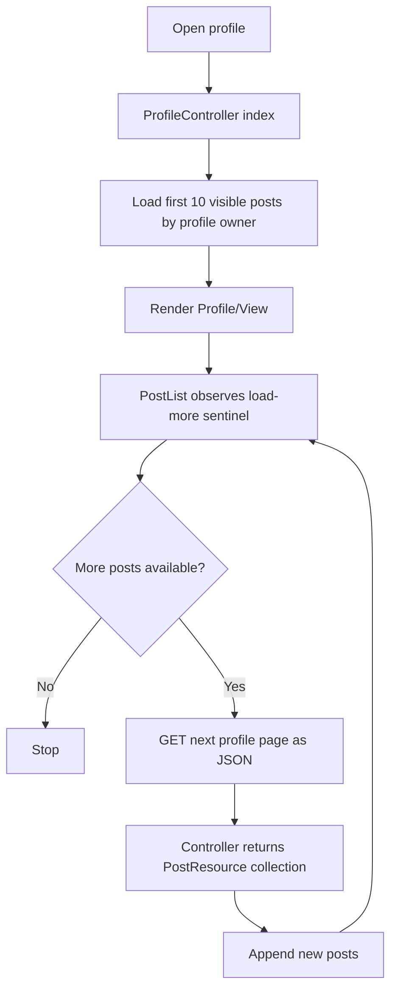

# Profile Content Tabs Flow

## Overview

Poet-Web profile pages now display a user's own content and social connections instead of placeholder tabs.

The profile page contains:

```text
Posts
Followers
Following
Photos
My Profile
```

The Posts, Followers, Following, and Photos tabs are populated from backend data.

The `My Profile` tab is only available when the authenticated user is viewing their own profile.

---

## Main Files

The profile content flow is implemented through:

```text
app/Http/Controllers/ProfileController.php
app/Http/Resources/PostResource.php
app/Http/Resources/UserResource.php
app/Models/Post.php
app/Models/Follower.php
resources/js/Pages/Profile/View.vue
resources/js/Components/app/PostList.vue
resources/js/Components/app/UserListItem.vue
resources/js/Components/app/CreatePost.vue
```

The existing profile route remains:

```text
GET /u/{user:username}
```

Route name:

```text
profile
```

---

## Profile Controller

`ProfileController::index()` receives both the request and the user whose profile is being viewed.

It prepares:

```text
current follow state
follower count
visible posts by profile owner
followers
followings
profile user data
visible image attachments
```

These values are passed to:

```text
resources/js/Pages/Profile/View.vue
```

---

## Profile Posts

The profile does not query all posts by the profile owner directly.

Instead, it starts from:

```php
Post::postsForTimeline($currentUserId)
```

and then adds:

```text
user_id = viewed profile user ID
```

This keeps the same visibility rules used by the main timeline.

### Normal Posts

Normal posts by the profile owner are visible to the authenticated viewer.

### Group Posts

A group post by the profile owner is only included if the viewer is an approved member of that group.

Therefore, opening a profile does not bypass group-post access rules.

Conceptually:

```text
view profile
    ↓
load posts visible to current viewer
    ↓
filter to posts authored by profile owner
    ↓
paginate
    ↓
render profile Posts tab
```

---

## Guest Behavior

The profile route itself is public, but profile posts are only prepared when there is an authenticated user.

For unauthenticated visitors:

```text
posts = null
```

The Posts tab therefore displays:

```text
Log in to view posts.
```

Follower and following lists are still loaded from the profile data.

This avoids passing guest users into post interaction components that currently expect an authenticated user.

---

## Pagination and Infinite Scrolling

Profile posts are paginated in groups of 10:

```text
paginate(10)
```

The existing `PostList.vue` component handles infinite scrolling.

When it requests the next page with:

```text
Accept: application/json
```

`ProfileController::index()` detects the JSON request and returns the paginated `PostResource` collection directly.

Flow:



---

## Own Profile Post Creation

The Posts tab includes `CreatePost` only when:

```text
isMyProfile = true
```

This means:

```text
view own profile
→ Create Post available

view another user's profile
→ Create Post hidden
```

This prevents the interface from suggesting that a user can publish content as another profile owner.

---

## Followers Tab

The followers query joins:

```text
followers.follower_id
→ users.id
```

and filters:

```text
followers.user_id
= viewed profile user ID
```

The result is the list of users who follow the viewed profile.

Each user is transformed with:

```text
UserResource
```

and displayed with:

```text
UserListItem.vue
```

Each item links to that user's profile.

If the list is empty, the profile displays:

```text
No followers yet.
```

---

## Following Tab

The following query joins:

```text
followers.user_id
→ users.id
```

and filters:

```text
followers.follower_id
= viewed profile user ID
```

The result is the list of users followed by the profile owner.

The users are displayed with the same reusable:

```text
UserListItem.vue
```

If the list is empty, the page displays:

```text
Not following anyone yet.
```

---

## Social Relationship Meaning

The `followers` table uses:

```text
user_id
→ user being followed

follower_id
→ user who follows them
```

Therefore:

```text
Followers tab
→ users whose IDs appear as follower_id

Following tab
→ users whose IDs appear as user_id
   for rows where the profile owner is follower_id
```

---

## Profile Page Data Flow

```mermaid
flowchart TD
    A[GET /u/{username}] --> B[Resolve profile User]
    B --> C[Check current follow state]
    B --> D[Count followers]
    B --> E[Load followers]
    B --> F[Load followings]

    C --> G{Authenticated viewer?}
    G -- No --> H[posts = null]
    G -- Yes --> I[Load postsForTimeline]
    I --> J[Filter by profile owner]
    J --> K[Paginate 10]

    D --> L[Inertia props]
    E --> L
    F --> L
    H --> L
    K --> L
    L --> M[Profile/View.vue]
```

---

## Frontend Tabs

### Posts

Displays:

```text
CreatePost on own profile
PostList for visible posts
No posts yet when empty
Log in to view posts for guests
```

### Followers

Displays all users following the profile owner.

### Following

Displays all users followed by the profile owner.

### Photos

Displays image attachments from posts authored by the profile owner that the current viewer is allowed to see.

The backend first builds the visible post set through:

```php
Post::postsForTimeline($currentUserId)
```

then limits that query to the viewed profile owner and loads only attachments where:

```text
mime LIKE image/%
```

This means private group images are not exposed through a user's profile unless the viewer already has access to those group posts.

Unauthenticated visitors receive:

```text
photos = null
```

and the Photos tab displays:

```text
Log in to view photos.
```

Authenticated viewers receive a photo array rendered through `TabPhotos.vue`.

### My Profile

Only appears on the authenticated user's own profile and contains the existing profile-editing interface.

---

## Reused Components

The feature reuses existing components instead of implementing separate profile-specific versions.

### `PostList.vue`

Provides:

```text
post rendering
infinite scrolling
local feed updates
post deletion handling
edit modal
attachment preview
```

### `UserListItem.vue`

Provides a consistent user row containing:

```text
avatar
name
username
profile link
```

### `CreatePost.vue`

Provides the existing post creation modal on the authenticated user's own profile.

### `TabPhotos.vue`

Displays visible image attachments in a responsive grid, opens them in the shared attachment preview modal, and exposes the existing attachment download route.

---

## Visibility Summary

```text
Own normal post
→ visible

Another user's normal post
→ visible to authenticated viewer

Group post
→ visible only when viewer is approved in that group

Guest profile visitor
→ profile visible
→ followers/following visible
→ posts not loaded
→ photos not loaded

Create Post
→ own profile only
```

---

## Result

The profile page now functions as a real content and social overview instead of showing placeholder tabs.

Users can:

```text
open a profile
    ↓
view that user's accessible posts
    ↓
scroll through paginated content
    ↓
inspect followers
    ↓
inspect followed users
    ↓
browse visible post photos
    ↓
preview or download images
    ↓
navigate to connected profiles
```

The implementation preserves existing timeline visibility rules and reuses the same post and user components used elsewhere in Poet-Web.
