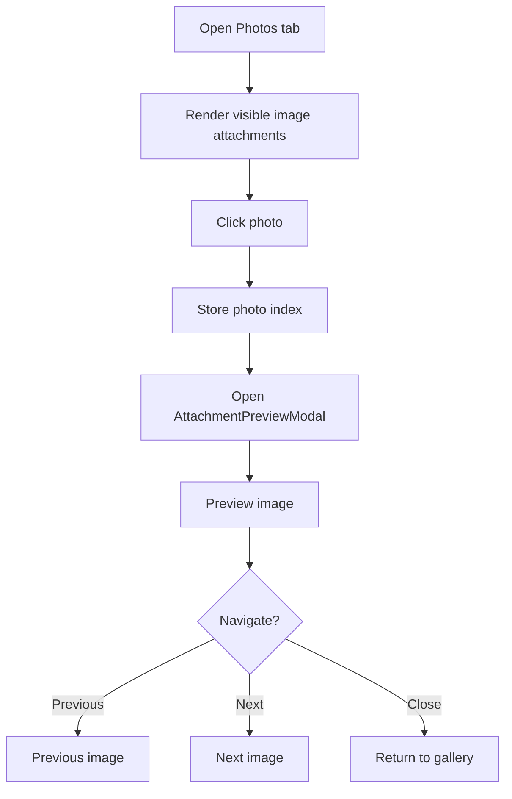

# Profile Photo Gallery Flow

## Overview

Poet-Web collects image attachments from visible posts and exposes them through Photos tabs on user and group profile pages.

The feature reuses the existing post attachment system instead of storing a separate photo-gallery entity.

```text
post
└── post attachments
    ├── images
    └── other files

Photos tab
└── only image attachments
```

---

## Main Files

```text
app/Http/Controllers/ProfileController.php
app/Http/Controllers/GroupController.php
app/Http/Resources/PostAttachmentResource.php
app/Models/PostAttachment.php
resources/js/Pages/Profile/View.vue
resources/js/Pages/Group/View.vue
resources/js/Pages/Profile/TabPhotos.vue
resources/js/Components/app/AttachmentPreviewModal.vue
routes/web.php
```

---

## Image Selection

Photo galleries only include attachments whose MIME type matches:

```text
image/%
```

Examples include:

```text
image/jpeg
image/png
image/webp
```

Non-image attachments are not included in the Photos tabs.

The selected attachments are transformed with:

```text
PostAttachmentResource
```

which provides:

```text
id
name
mime
size
url
created_at
```

---

## User Profile Photos

A user profile does not simply load every attachment created by that user.

Instead, when a viewer is authenticated, `ProfileController::index()` first creates a query for posts that are visible to the current viewer:

```php
Post::postsForTimeline($currentUserId)
```

The query is then limited to posts authored by the profile owner.

The resulting visible post IDs are used to load image attachments.

```text
authenticated viewer
        ↓
postsForTimeline(viewer)
        ↓
filter by profile owner
        ↓
visible post IDs
        ↓
image attachments only
        ↓
Photos tab
```

This preserves group privacy.

If the profile owner posted an image in a private group, that image only appears when the viewer can already see the underlying group post.

For unauthenticated visitors:

```text
photos = null
```

and the profile displays:

```text
Log in to view photos.
```

---

## Group Profile Photos

Group photos follow the group's existing post visibility rules.

`GroupController::profile()` only loads photo attachments when:

```text
isApprovedMember = true
```

It derives the visible post IDs through:

```php
Post::postsForTimeline($userId)
```

and restricts them to:

```text
posts.group_id = current group ID
```

Only image attachments from those posts are returned.

For users who are not approved members:

```text
photos = []
```

and the frontend displays:

```text
Join the group to view photos.
```

---

## Reusable Photo Tab

Both profile types reuse:

```text
resources/js/Pages/Profile/TabPhotos.vue
```

The component receives:

```text
photos: Array
```

and renders them in a responsive grid.

Each gallery item uses the attachment's public URL and name.

If there are no images, the component displays:

```text
No photos yet.
```

---

## Preview Flow

Clicking a photo sets its index and opens the existing:

```text
AttachmentPreviewModal.vue
```

Flow:



The gallery therefore inherits the same fullscreen preview, backdrop closing, previous/next navigation, and close controls already used by post attachments.

---

## Download Flow

Each photo also exposes the existing route:

```text
post.download
```

The download button stops click propagation so that:

```text
click image
→ preview

click download icon
→ download attachment
→ do not open preview
```

No separate gallery download endpoint is required.

---

## Visibility Summary

```text
User profile normal-post image
→ visible to authenticated profile viewer

User profile private-group image
→ only visible when viewer can access that group post

User profile guest viewer
→ photos not loaded

Group profile approved member
→ visible group-post images loaded

Group profile guest / pending / non-member
→ no group photos returned
```

---

## Result

Poet-Web now turns existing post images into profile galleries without duplicating attachment data.

```text
visible posts
    ↓
image attachments
    ↓
Photos tab
    ↓
grid
    ↓
preview or download
```

The implementation keeps photo visibility aligned with the same post-access rules used elsewhere in the application.
