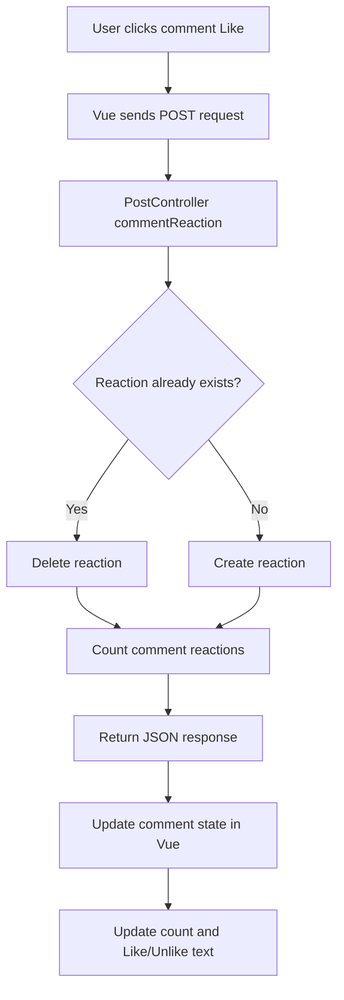

# Reaction System Flow

## Overview

Poet-Web uses a shared reaction system that allows authenticated users to like both posts and comments.

Originally, reactions were stored only for posts using the `post_reactions` table and `PostReaction` model.

The system was refactored into a polymorphic reaction architecture using:

```text
Reaction
```

This allows the same database table and model to represent reactions belonging to different types of content.

Currently supported reaction targets are:

- posts;
- comments.

The currently supported reaction type is:

```text
like
```

---

## Why the Reaction System Was Refactored

The original implementation connected each reaction directly to a post using:

```text
post_id
```

That design worked for posts but could not be reused for comments without creating another separate reaction table.

Instead, Poet-Web now stores:

```text
object_id
object_type
```

These fields identify both:

1. which record received the reaction;
2. what type of model the record belongs to.

For example:

```text
object_id = 5
object_type = App\Models\Post
```

means that the reaction belongs to Post 5.

A comment reaction may contain:

```text
object_id = 5
object_type = App\Models\Comment
```

Although both objects have the ID `5`, they are treated as completely different reaction targets because their model types differ.

---

## Reaction Database Structure

The original table:

```text
post_reactions
```

was converted into:

```text
reactions
```

The main columns are:

```text
id
object_id
object_type
user_id
type
created_at
```

### `object_id`

Stores the ID of the object receiving the reaction.

### `object_type`

Stores the Laravel model class of the object receiving the reaction.

Examples:

```text
App\Models\Post
App\Models\Comment
```

### `user_id`

Stores the user who created the reaction.

### `type`

Stores the reaction type.

Currently:

```text
like
```

---

## Unique Reaction Constraint

The reactions table uses a unique constraint containing:

```text
object_id
object_type
user_id
```

This means the same user cannot have multiple reaction records for the same object.

For example:

```text
User 1
+
Post 4
+
App\Models\Post
```

may only have one reaction record.

However:

```text
Post 4
```

and:

```text
Comment 4
```

are different objects because their `object_type` values differ.

---

## Reaction Model

The shared reaction model is:

```text
app/Models/Reaction.php
```

It contains a polymorphic relationship:

```php
public function object(): MorphTo
```

This means Laravel can determine whether the reaction belongs to a post, comment, or another supported model.

Conceptually:

```text
Reaction
    |
    +---- Post
    |
    +---- Comment
```

---

## Post Reactions

The `Post` model defines:

```php
public function reactions(): MorphMany
```

Laravel automatically associates reactions with:

```text
object_id = post ID
object_type = App\Models\Post
```

The application does not need to manually assign these values when creating a reaction through the relationship.

For example:

```php
$post->reactions()->create(...)
```

automatically identifies the reaction as belonging to that post.

---

## Comment Reactions

The `Comment` model uses the same relationship:

```php
public function reactions(): MorphMany
```

Laravel therefore associates comment reactions with:

```text
object_id = comment ID
object_type = App\Models\Comment
```

This allows posts and comments to share the same reaction table without conflicting with each other.

---

## Reaction Enum

Reaction values are defined using:

```text
app/Enums/ReactionEnum.php
```

The current reaction type is:

```text
LIKE = like
```

Previously the enum was called:

```text
PostReactionEnum
```

It was renamed to:

```text
ReactionEnum
```

because reactions are no longer limited to posts.

---

## Post Reaction Request

Post reactions use:

```text
POST /posts/{post}/reaction
```

The frontend sends:

```json
{
    "reaction": "like"
}
```

The request is handled by:

```text
PostController::postReaction()
```

The controller checks whether the authenticated user already has a reaction on the post.

If a reaction exists:

```text
delete reaction
```

If no reaction exists:

```text
create reaction
```

The response contains:

```text
num_of_reactions
current_user_has_reaction
```

This allows the frontend to immediately update the Like/Unlike button without reloading the page.

---

## Comment Reaction Request

Comment reactions use:

```text
POST /comments/{comment}/reaction
```

The route is named:

```text
post.comment.reaction
```

The request is handled by:

```text
PostController::commentReaction()
```

The same toggle logic is used:

```text
existing reaction
    -> delete
    -> Unlike becomes Like

no reaction
    -> create
    -> Like becomes Unlike
```

---

## Comment Reaction Flow



---

## Loading Reaction State

The home feed loads both:

```text
reaction count
```

and:

```text
current authenticated user's reaction
```

for each post and comment.

For comments, the query loads:

```text
comments
comments.user
comments.reactions_count
comments.reactions
```

The reactions relationship is filtered to the authenticated user.

This means Poet-Web does not need to load every reaction record just to determine whether the current user liked a comment.

---

## CommentResource

`CommentResource` exposes:

```text
num_of_reactions
current_user_has_reaction
```

alongside the normal comment information.

Example:

```json
{
    "id": 8,
    "comment": "Great poem",
    "num_of_reactions": 3,
    "current_user_has_reaction": true
}
```

This tells Vue:

```text
3 people liked this comment
```

and:

```text
the currently logged-in user is one of them
```

---

## Creating Comments

When a new comment is created, Poet-Web loads its reaction count before returning `CommentResource`.

A newly created comment normally returns:

```text
num_of_reactions = 0
current_user_has_reaction = false
```

This ensures the new comment immediately has the same frontend structure as comments loaded with the page.

---

## Updating Comments

When an existing comment is edited, its reaction count and the current user's reaction are loaded again before returning the updated resource.

This prevents editing a liked comment from temporarily removing its Like state in Vue.

---

## Frontend Comment Reactions

Comment reaction controls are located in:

```text
resources/js/Components/app/PostItem.vue
```

Each comment displays:

```text
reaction count
Like / Unlike
```

Example