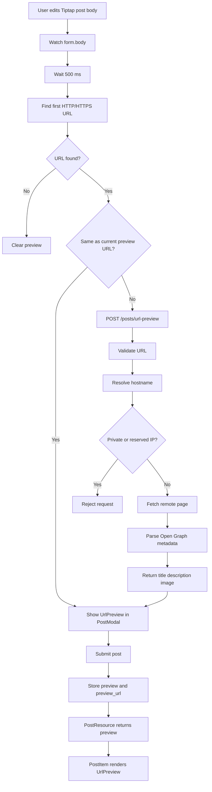

# URL Preview Flow

## Overview

Poet-Web can detect the first HTTP or HTTPS link in a post and display a reusable URL preview card.

The feature is integrated into both post creation/editing and post display.

The main flow is:

```text
post body changes
        ↓
detect first URL
        ↓
request Open Graph metadata
        ↓
show preview in PostModal
        ↓
save preview + preview_url
        ↓
return values through PostResource
        ↓
render UrlPreview in PostItem
```

---

## Main Files

### `resources/js/Components/app/PostModal.vue`

Detects the first URL in the Tiptap body, debounces preview requests, stores preview state in the Inertia form, and displays the preview while composing or editing a post.

### `resources/js/Components/app/UrlPreview.vue`

Reusable component for rendering the URL preview card.

It is used by both:

```text
PostModal.vue
PostItem.vue
```

### `app/Http/Controllers/PostController.php`

Provides the preview metadata endpoint through:

```text
fetchUrlPreview()
```

and persists preview values when posts are updated.

### `app/Http/Requests/StorePostRequest.php`

Validates URL preview data when creating posts.

### `app/Http/Requests/UpdatePostRequest.php`

Validates URL preview data when updating posts.

### `app/Models/Post.php`

Allows `preview` and `preview_url` to be mass assigned and casts the JSON preview field to an array.

### `app/Http/Resources/PostResource.php`

Returns preview metadata to Vue.

---

## Database Structure

The posts table contains two URL-preview columns:

```text
preview
preview_url
```

`preview` is a nullable JSON column.

It stores metadata such as:

```text
title
description
image
```

`preview_url` is a nullable string with a maximum database length of 2000 characters.

Conceptually:

```text
posts
├── body
├── preview
│   ├── title
│   ├── description
│   └── image
└── preview_url
```

The `Post` model casts:

```php
'preview' => 'array'
```

so JSON data is exposed to the application as an array.

---

## Request Validation

Both create and update requests accept:

```text
preview      nullable array
preview_url  nullable valid URL, max 2000 characters
```

This keeps the preview fields compatible with both post creation and editing.

---

## URL Detection in the Editor

`PostModal.vue` watches:

```text
form.body
```

Because the Tiptap editor stores HTML, URL detection supports two cases.

### Linked URL

The first check looks for an `href` containing an HTTP or HTTPS URL.

Example:

```html
<a href="https://example.com">Example</a>
```

### Plain URL

If no linked URL is found, HTML tags are removed and the remaining text is searched for a plain HTTP or HTTPS URL.

Example:

```text
Read this: https://example.com/article
```

Only the first detected URL is used for preview generation.

---

## Debouncing

Preview lookup is delayed by:

```text
500 ms
```

after the post body changes.

Conceptually:

```text
user types
    ↓
body changes
    ↓
cancel previous timer
    ↓
wait 500 ms
    ↓
find first URL
    ↓
fetch preview if needed
```

This prevents a preview request from being sent after every individual keystroke.

---

## Avoiding Duplicate Requests

If the detected URL is already equal to:

```text
form.preview_url
```

no new request is made.

This avoids repeatedly requesting metadata for the same URL while the user continues editing unrelated text.

---

## Clearing a Preview

If the post body no longer contains a detectable URL:

```text
form.preview = null
form.preview_url = null
```

The preview therefore follows the current post content instead of remaining attached after its source URL has been removed.

---

## Preview Endpoint

The authenticated route is:

```text
POST /posts/url-preview
```

with route name:

```text
post.fetchUrlPreview
```

The request contains:

```json
{
    "url": "https://example.com"
}
```

The controller validates the value as:

```text
required
valid URL
maximum 2000 characters
```

---

## Remote URL Safety Check

Before fetching the page, the controller extracts the hostname and resolves it to an IP address.

The resolved IP is rejected when it belongs to private or reserved ranges.

Conceptually:

```text
submitted URL
    ↓
extract host
    ↓
resolve host to IP
    ↓
private/reserved?
├── yes → reject with 422
└── no  → continue
```

This prevents the normal preview flow from directly fetching hosts that resolve to local or reserved addresses.

---

## Remote Page Request

The server uses Laravel's HTTP client.

The request uses:

```text
timeout: 5 seconds
User-Agent: Poet-Web URL Preview
```

If the remote response is unsuccessful, the endpoint returns a 422 response instead of creating preview metadata.

---

## Open Graph Extraction

The returned HTML is loaded into `DOMDocument`.

The controller scans `meta` elements whose `property` begins with:

```text
og:
```

Relevant values are returned as:

```json
{
    "title": "...",
    "description": "...",
    "image": "..."
}
```

Missing Open Graph values are returned as `null`.

---

## Editor Preview

After a successful response:

```text
form.preview = response data
```

The editor displays:

```vue
<UrlPreview
    :preview="form.preview"
    :url="form.preview_url"
/>
```

This lets the user see the card before publishing the post.

---

## Saving the Preview

### Create

`StorePostRequest` validates the preview fields and `PostController::store()` creates the post from the validated data.

Because the `Post` model includes:

```text
preview
preview_url
```

in `$fillable`, both values are stored with the new post.

### Update

`PostController::update()` explicitly updates:

```text
body
preview
preview_url
```

This allows editing a post to:

```text
keep the current preview
replace it with another URL preview
remove the preview
```

---

## Post Resource

`PostResource` returns:

```text
preview
preview_url
```

with the rest of the post data.

This means the same values are available in timeline posts, search results, dedicated post views, and other interfaces using the post resource.

---

## Preview Rendering

`PostItem.vue` renders:

```vue
<UrlPreview
    :preview="post.preview"
    :url="post.preview_url"
/>
```

The preview component has two display modes.

### Open Graph Preview

When:

```text
preview.title exists
```

the card may display:

```text
preview image
title
description
URL
```

The whole card links to the original URL and opens in a new browser tab.

### URL Fallback

If a URL exists but no preview title was obtained, the component displays the URL itself as a clickable fallback.

External links use:

```text
target="_blank"
rel="noopener noreferrer"
```

---

## Complete Flow



---

## Result

The URL preview feature allows Poet-Web posts to preserve richer information about linked pages without replacing the original post body.

The implementation:

1. detects the first HTTP or HTTPS URL in Tiptap content;
2. debounces preview requests by 500 ms;
3. avoids repeated requests for the same detected URL;
4. requests Open Graph metadata through an authenticated backend route;
5. rejects directly resolved private or reserved IP addresses;
6. uses a five-second remote request timeout;
7. stores preview metadata and its source URL with the post;
8. restores preview state when editing existing posts;
9. exposes preview data through `PostResource`;
10. reuses `UrlPreview.vue` in both the editor and post feed;
11. falls back to a clickable URL when Open Graph title metadata is unavailable.
