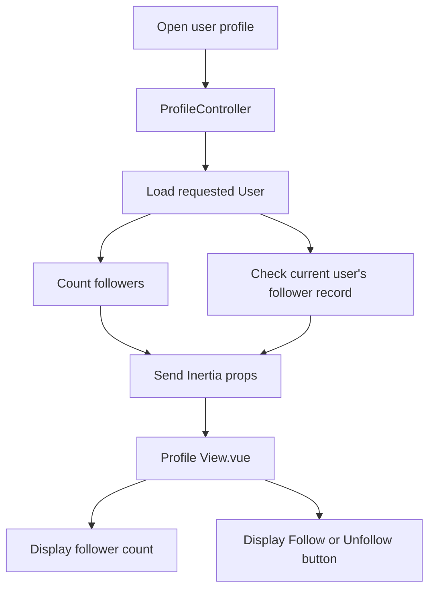

# User Follow and Unfollow Flow

## Overview

Poet-Web allows authenticated users to follow and unfollow other users from their profile pages.

Users can reach another user's profile by clicking the author's name or avatar on a post.

The feature provides:

- navigation from posts to user profiles;
- follower count display;
- Follow and Unfollow buttons;
- persistent follower relationships;
- protection against following yourself;
- protection against duplicate follows.

---

## Profile Navigation

Post authors are displayed using `PostUserHeader.vue`.

The author's name and avatar link to the user's profile using the existing profile route:

```text
/u/{user:username}
```

Example:

```text
/u/adrians
```

The navigation flow is:

```text
Timeline
    ↓
Post
    ↓
Author name/avatar
    ↓
User profile
    ↓
Follow / Unfollow
```

Inertia's `Link` component is used so navigation happens without a traditional full-page reload.

---

## Followers Table

Follower relationships are stored in the `followers` table.

The important columns are:

```text
user_id
follower_id
```

Their meanings are different:

```text
user_id
    = the user being followed

follower_id
    = the user who is following
```

For example:

```text
user_id = 2
follower_id = 1
```

means:

```text
User 1 follows User 2
```

---

## Follower Model

`Follower.php` allows the relationship fields to be assigned:

```text
user_id
follower_id
```

The table only stores `created_at`, so the model disables Laravel's normal `updated_at` handling.

---

## Loading a User Profile

When a profile is opened, `ProfileController` determines two additional values.

### Follower Count

The controller counts all rows where:

```text
user_id = profile user ID
```

This gives the number of people following the displayed user.

### Current User Follow State

If a user is authenticated, Poet-Web checks whether a follower record exists containing:

```text
user_id = profile user ID
follower_id = authenticated user ID
```

The result is sent to Vue as:

```text
isCurrentUserFollower
```

The profile also receives:

```text
followerCount
```

---

## Profile Data Flow



---

## Follow Button

The Follow button is displayed when:

```text
the viewed profile is not the current user's profile
```

and:

```text
isCurrentUserFollower = false
```

The interface shows:

```text
[ Follow ]
```

When the user already follows the profile, the interface instead shows:

```text
[ Unfollow ]
```

The button is hidden on the authenticated user's own profile.

---

## Follow Request

Clicking Follow creates an Inertia form containing:

```text
follow = true
```

Clicking Unfollow sends:

```text
follow = false
```

Both requests use:

```text
POST /users/{user}/follow
```

and are handled by:

```text
UserController::follow()
```

---

## Creating a Follow

When:

```text
follow = true
```

the controller creates a follower relationship containing:

```text
user_id = target user
follower_id = authenticated user
```

`firstOrCreate()` is used rather than blindly inserting a new row.

This prevents repeated Follow requests from unnecessarily creating duplicate relationships.

---

## Removing a Follow

When:

```text
follow = false
```

the controller finds the relationship matching both users:

```text
user_id = target user ID
follower_id = authenticated user ID
```

and deletes it.

After the request returns, the profile is rendered again and the updated follower state and follower count are displayed.

---

## Self-Follow Protection

Users are not allowed to follow themselves.

The backend compares:

```text
authenticated user ID
```

with:

```text
target profile user ID
```

If both IDs are the same, the follow operation is rejected.

The frontend also hides the Follow button on the current user's own profile.

This means the restriction exists both in the interface and in backend