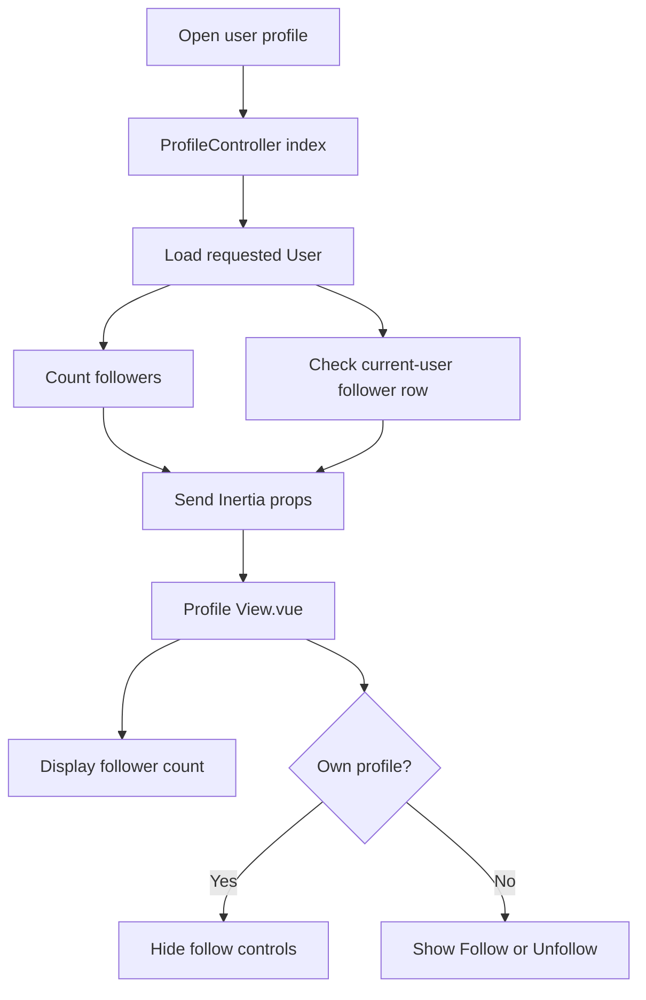
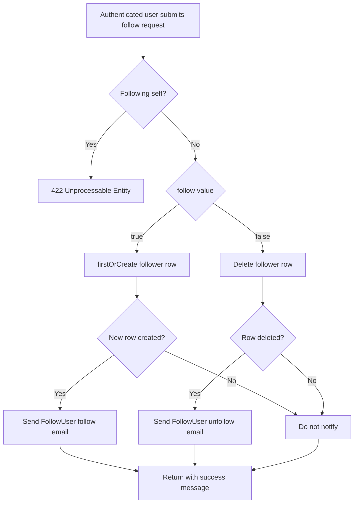

# User Follow and Unfollow Flow

## Overview

Poet-Web allows authenticated users to follow and unfollow other users from profile pages.

Users can reach another user's profile by clicking the author's name or avatar on a post.

The feature provides:

- navigation from posts to user profiles;
- follower count display;
- Follow and Unfollow controls;
- persistent follower relationships;
- backend protection against following yourself;
- application-level duplicate avoidance through `firstOrCreate()`;
- email notifications when another user follows or unfollows a profile;
- duplicate-notification avoidance when the follower state does not actually change.

---

## Profile Navigation

Post authors are displayed through `PostUserHeader.vue`.

The author's name and avatar link to:

```text
/u/{user:username}
```

Example:

```text
/u/adrians
```

Navigation flow:

```text
Timeline
    ↓
Post
    ↓
Author name/avatar
    ↓
User profile
    ↓
Follow / Unfollow
```

Inertia's `Link` component is used so navigation does not require a traditional full-page reload.

---

## Followers Table

Follower relationships are stored in the `followers` table.

Important columns:

```text
user_id
follower_id
created_at
```

Their meanings are:

```text
user_id
└── user being followed

follower_id
└── user who is following
```

Example:

```text
user_id = 2
follower_id = 1
```

means:

```text
User 1 follows User 2
```

---

## Follower Model

`Follower.php` allows mass assignment of:

```text
user_id
follower_id
```

The table stores `created_at` but not `updated_at`, so the model disables Laravel's normal updated timestamp using:

```php
const UPDATED_AT = null;
```

---

## User Model Relationships

The `User` model exposes reusable self-referencing relationships:

```text
followers()
followings()
```

`followers()` returns the users who follow the current user.

`followings()` returns the users the current user follows.

These relationships are reused by profile pages, the personalized Home feed, the Following sidebar, and normal-post follower notifications.

---

## Loading a Profile

When a profile is opened, `ProfileController::index()` calculates two follow-related values.

### Follower Count

Rows are counted where:

```text
user_id = viewed profile user ID
```

This gives the number of users following that profile.

### Current User Follow State

If a user is authenticated, Poet-Web checks whether this pair exists:

```text
user_id = viewed profile user ID
follower_id = authenticated user ID
```

The result is sent to Vue as:

```text
isCurrentUserFollower
```

The follower total is sent as:

```text
followerCount
```

---

## Profile Data Flow


```mermaid
flowchart TD
    A[Open user profile]
    B[ProfileController index]
    C[Load requested User]
    D[Count followers]
    E[Check current-user follower row]
    F[Send Inertia props]
    G[Profile View.vue]
    H[Display follower count]
    I{Own profile?}
    J[Hide follow controls]
    K[Show Follow or Unfollow]

    A --> B
    B --> C
    C --> D
    C --> E
    D --> F
    E --> F
    F --> G
    G --> H
    G --> I
    I -- Yes --> J
    I -- No --> K
```

---

## Follow and Unfollow Controls

The profile hides follow controls when the viewed profile belongs to the authenticated user.

For another user's profile:

```text
isCurrentUserFollower = false
└── Follow

isCurrentUserFollower = true
└── Unfollow
```

The follower count is displayed beside the profile information.

The profile now also exposes dedicated `Followers` and `Following` tabs.

The Followers tab lists users whose `follower_id` points to the viewed profile through a follower relationship, while the Following tab lists users the profile owner follows. Both lists use `UserListItem.vue`, so each displayed user links directly to their profile.

The full profile-content implementation is documented in:

```text
docs/profile-content-flow.md
```

---

## Follow Request

Both operations use:

```text
POST /users/{user}/follow
```

The route is named:

```text
user.follow
```

and is handled by:

```text
UserController::follow()
```

The request validates:

```text
follow = boolean
```

Conceptually:

```text
follow = true
└── follow target user

follow = false
└── unfollow target user
```

---

## Creating a Follow

When `follow = true`, the controller uses:

```php
Follower::firstOrCreate([
    'user_id' => $user->id,
    'follower_id' => $currentUser->id,
]);
```

This means repeated normal Follow requests for the same pair reuse the existing row instead of intentionally inserting another one.

### Important database note

The current `followers` migration does **not** define a database-level unique constraint on:

```text
(user_id, follower_id)
```

Therefore, duplicate avoidance is currently provided by the application logic using `firstOrCreate()`, not by a hard database uniqueness guarantee.

A unique index could be added later for stronger database-level enforcement.

---

## Removing a Follow

When `follow = false`, the controller deletes rows matching both:

```text
user_id = target user ID
follower_id = authenticated user ID
```

This ensures the unfollow operation targets the relationship between those two users.

After the request returns, the profile data is refreshed and the updated follower count/state are displayed.

---

## Follow and Unfollow Notifications

Poet-Web sends the target user an email when another user actually changes their follower relationship.

The notification class is:

```text
app/Notifications/FollowUser.php
```

It receives:

```text
the acting user
follow = true or false
```

### Follow Notification

When a new follower row is created, the target user receives:

```text
subject: New follower
message: @username started following you.
```

The email contains a link to the follower's profile.

### Unfollow Notification

When an existing follower row is deleted, the target user receives:

```text
subject: Follower update
message: @username unfollowed you.
```

The email also links to the acting user's profile.

### Avoiding Duplicate Notifications

A Follow request uses:

```php
Follower::firstOrCreate(...)
```

The notification is only sent when:

```php
$follower->wasRecentlyCreated
```

is true.

Therefore, submitting Follow again while the relationship already exists does not send another email.

For Unfollow, the delete query returns the number of rows removed.

The notification is only sent when:

```text
deleted rows > 0
```

Therefore, submitting Unfollow when no follower relationship exists does not send a false notification.

The resulting behavior is:

```text
new follow relationship
→ create row
→ send FollowUser notification

duplicate follow request
→ reuse row
→ no notification

existing relationship unfollowed
→ delete row
→ send FollowUser notification

unfollow without relationship
→ delete nothing
→ no notification
```

---

## Notification Flow


```mermaid
flowchart TD
    A[Authenticated user submits follow request] --> B{Following self?}
    B -- Yes --> C[422 Unprocessable Entity]
    B -- No --> D{follow value}

    D -- true --> E[firstOrCreate follower row]
    E --> F{New row created?}
    F -- Yes --> G[Send FollowUser follow email]
    F -- No --> H[Do not notify]

    D -- false --> I[Delete follower row]
    I --> J{Row deleted?}
    J -- Yes --> K[Send FollowUser unfollow email]
    J -- No --> H

    G --> L[Return with success message]
    K --> L
    H --> L
```

---

## Self-Follow Protection

The controller rejects attempts to follow yourself:

```php
if ($currentUser->id === $user->id) {
    abort(
        422,
        'You cannot follow yourself.'
    );
}
```

The frontend also hides the follow controls on the authenticated user's own profile.

This gives:

```text
frontend
└── avoids presenting an invalid action

backend
└── enforces the restriction
```

---

## Main Files

### `ProfileController.php`

Loads follower count, current-user follow state, follower and following lists, and the profile owner's visible posts.

### `UserController.php`

Validates and processes follow/unfollow requests.

### `Follower.php`

Represents the follower relationship.

### `User.php`

Defines the reusable `followers()` and `followings()` many-to-many relationships used throughout the application.

### `FollowUser.php`

Builds follow and unfollow email notifications and links the recipient back to the acting user's profile.

### `Profile/View.vue`

Displays follower count and Follow/Unfollow controls.

### `PostUserHeader.vue`

Links post authors to their profile pages.

### `routes/web.php`

Defines the profile and authenticated follow routes.

---

## Result

Authenticated users can:

1. navigate from a post author to their profile;
2. see that user's follower count;
3. follow another user;
4. unfollow a user they currently follow;
5. keep the relationship persisted in the database;
6. avoid self-following through backend validation;
7. notify the target user when a real follow or unfollow state change occurs;
8. avoid duplicate emails when the requested follower state is already in effect.

Repeated ordinary Follow requests are handled safely by `firstOrCreate()`, while database-level uniqueness remains a possible future improvement.

Follow relationships now also affect the Home experience: followed users can appear in the personalized timeline, followed accounts are listed in the Home sidebar, and followers receive `PostCreated` emails when an author publishes a normal post.
